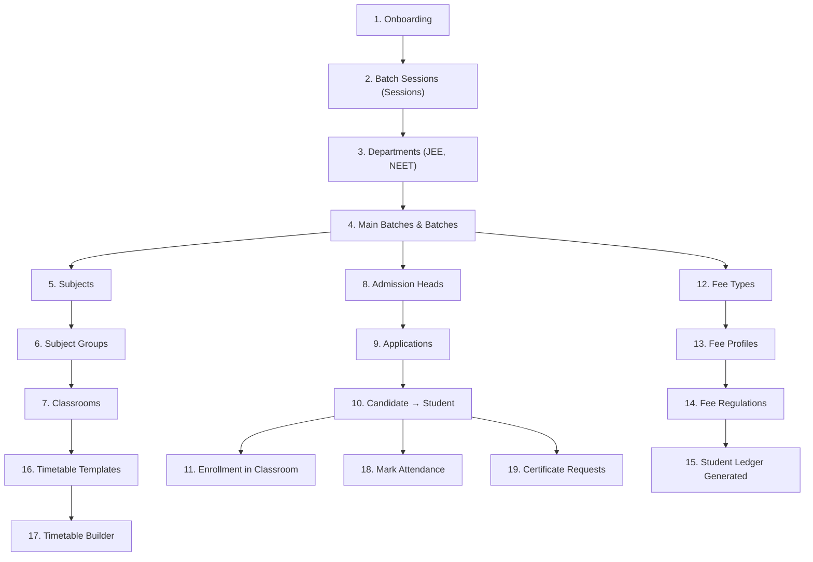

# 🎯 Coaching Centre Workflow Guide

> **Scope Type:** `coaching` | **Platform:** PDS Education Education System Management
> 
> Complete step-by-step documentation of every admin and student workflow available for a **coaching** institution type.

---
> [!TIP]
> **Developing for PDS Education?** Check out the [🛠️ Developer Guide](./developer-guide.md) for architectural flows, logic diagrams, and implementation patterns.
---

## Table of Contents

1. [Onboarding & Initial Setup](#1-onboarding--initial-setup)
2. [Academic Setup (Batches & Subjects)](#2-academic-setup-batches--subjects)
3. [Admission & Student Registry](#3-admission--student-registry)
4. [Treasury & Fee Management](#4-treasury--fee-management)
5. [Attendance](#5-attendance)
6. [Timetable & Scheduling](#6-timetable--scheduling)
7. [LMS (Classes & Content)](#7-lms-classes--content)
8. [Certificate Management](#8-certificate-management)
9. [Library](#9-library)
10. [Inventory](#10-inventory)
11. [Transport](#11-transport)
12. [Website & Public Relations](#12-website--public-relations)
13. [Redressal & Grievances](#13-redressal--grievances)
14. [Analytics & Admin Desk](#14-analytics--admin-desk)
15. [System Console](#15-system-console)
16. [Settings & Configuration](#16-settings--configuration)
17. [Student Portal](#17-student-portal)
18. [Parent Portal](#18-parent-portal)

---

## Coaching vs School vs College — Key Differences

| Concept | School | College | **Coaching** |
|---------|--------|---------|:------------:|
| **Stream** label | Class | Stream | **Batch** |
| **Semester** label | Term | Semester | **Term** |
| **Main Stream** label | Main Class | Main Stream | **Main Batch** |
| **Head** label | Principal | Principal | **Director** |
| Departments | Optional (Primary/Secondary) | Many (CSE, ECE) | **Optional (JEE, NEET)** |
| Sessions | Manual | Manual | **Manual (Batch Sessions)** |
| Admission flow | Simple | Application + merit | **Application + merit** |
| Fee structure | Annual/Monthly | Semester-wise | **Flexible (monthly/term/full)** |
| Workflow variant | `_school` suffix | Base variant | **Base variant (same as college)** |
| Permission scope | `scope_type = school` | `scope_type = college` | **`scope_type = coaching`** |

> [!IMPORTANT]
> Coaching uses the **same higher-ed workflow variants** as college/university:
> `admission_cell`, `office_registry`, `accounts_room`, `academic_setup`, `service_branch`, `system_console`, `student_portal`, `parent_portal`.
> It does NOT use the `_school` suffix variants.

---

## 1. Onboarding & Initial Setup

The onboarding flow creates a new organisation and institution of type `coaching`.

### Steps

| # | Screen | Route | Description |
|---|--------|-------|-------------|
| 1 | **Account Registration** | `/register` | Enter name, email, mobile, password. Creates inactive user + sends verification email. |
| 2 | **Email Verification** | `/onboarding/verify-notice` | "Check your inbox" page. Frontend polls for verification. Auto-redirects on verify. |
| 3 | **Plan Selection** | `/onboarding/plan` | Choose plan (Starter / Professional / Enterprise / Plus) + billing cycle (monthly/annual). |
| 4 | **Card Details** | `/onboarding/card` | Enter card info (AES-256 encrypted) or **Skip** to proceed without payment. |
| 5 | **Organisation & Institution Setup** | `/onboarding/setup` | Enter organisation name, institution name, select type = **"Coaching"**, workspace slug. |
| 6 | **Data Import** | `/onboarding/data-import` | Auto-seed departments (JEE, NEET), subjects, fee types for coaching, or upload CSV. |
| 7 | **Platform Setup** | `/onboarding/platform-setup` | Automated setup: seeds roles, permissions, workflows (higher-ed variants), and coaching defaults. |

### Key Behaviour (Coaching Scope)
- Roles seeded: `institution_admin`, `principal` (Director), `staff`, `librarian`, `student`, `candidate`, `parent`
- Workflows: Uses **base/higher-ed** variants (`admission_cell`, `accounts_room`, `academic_setup`, etc.)
- Permissions include: fee heads CRUD, admission heads, departments, sessions, subject groups, certificates, staff links
- Content labels auto-resolve: Stream → **Batch**, Semester → **Term**, Main Stream → **Main Batch**
- Landing page sections: **ProgramShowcase**, **ResultsHighlight**, **FacultySpotlight**, **BatchesTable**, **Testimonials**

---

## 2. Academic Setup (Batches & Subjects)

> **Sidebar Group:** Academic | **Permission Group:** `academic_setup`

Foundation data that all other modules depend on. Set these up first after onboarding.

### 2.1 Sessions (Batch Sessions)
| Action | Route | Details |
|--------|-------|---------|
| List sessions | `/organization/sessions` | View all batch sessions (e.g., 2025-26, 2026-27) |
| Create session | `/organization/sessions/create` | Set name, start date, end date, mark as current |
| Edit session | `/organization/sessions/{id}/edit` | Modify session details |

### 2.2 Departments (Course Categories)
| Action | Route | Details |
|--------|-------|---------|
| List departments | `/organization/departments` | View all course categories (JEE, NEET, Foundation, Board Prep) |
| Create department | `/organization/departments/create` | Set name, code, HOD |
| View department | `/organization/departments/{id}` | Department detail with faculty & batches |

### 2.3 Main Batches & Batches
| Action | Route | Details |
|--------|-------|---------|
| List main batches | `/organization/main-streams` | Top-level groupings (e.g., "JEE Programs", "NEET Programs") |
| Create main batch | `/organization/main-streams/create` | Set name, department |
| List batches | `/organization/streams` | Individual batches (e.g., "JEE-2026 Morning", "NEET-2026 Evening") |
| Create batch | `/organization/streams/create` | Set name, main batch, capacity, class teacher, duration |

### 2.4 Subjects & Subject Groups
| Action | Route | Details |
|--------|-------|---------|
| Manage subjects | `/organization/subject` | List/create/edit subjects (Physics, Chemistry, Maths, Biology) |
| Subject groups | `/organization/subject-groups` | Group subjects (e.g., "PCM" = Physics + Chemistry + Maths) |
| Subject categories | `/organization/subject-category` | Categories: Core, Elective, Practical |
| Category mapping | `/organization/subject-category-mapping` | Map subjects to categories |

### 2.5 Classrooms (LMS)
| Action | Route | Details |
|--------|-------|---------|
| List classes | `/lms/classes` | All classrooms with enrollments |
| View by batch | `/lms/classes/stream/{streamId}` | Classes for a specific batch |
| Class detail | `/lms/classes/{id}` | Subject allocations, enrolled students, rooms |
| Subject detail | `/lms/classes/{id}/subjects/{allocationId}` | Subject-specific materials, syllabus |
| Room detail | `/lms/classes/{id}/rooms/{roomId}` | Real-time classroom (discussion, materials) |

---

## 3. Admission & Student Registry

> **Sidebar Group:** Admission & Registry | **Permission Groups:** `admission_cell`, `office_registry`

Coaching gets the **full** admission cell (same as college): admission heads, candidates, verification.

### 3.1 Candidates
| Action | Route | Details |
|--------|-------|---------|
| Candidate list | `/students/candidate` | Prospective students who haven't been admitted yet |

### 3.2 Admission Heads
| Action | Route | Details |
|--------|-------|---------|
| List heads | `/admission/heads` | Admission batches (e.g., "JEE-2026 Admission", "NEET-2026 Registration") |
| Create head | `/admission/heads/create` | Set name, session, batch, capacity, fee structure |
| View head | `/admission/heads/{id}` | Applications under this admission head |

### 3.3 Admission Applications
| Action | Route | Details |
|--------|-------|---------|
| List applications | `/admission/applications` | All applications with status filters |
| New application | `/admission/applications/new/{step}` | Multi-step: identity → address/guardian → medical/documents → program → services → payment → review |
| View application | `/admission/applications/{id}` | Full detail with approve/reject actions |
| Payment | `/admission/applications/{id}/pay` | Process admission fee payment |

### 3.4 Student Management
| Action | Route | Details |
|--------|-------|---------|
| Analytics | `/students/analytics` | Student statistics and demographics |
| Student list | `/students/manage` | All enrolled students with search (batch, session filters) |
| Student profile | `/students/manage/{id}` | Full detail (personal, academic, fee, attendance) |
| Edit student | `/students/manage/{id}/edit` | Update student information |

### 3.5 Promotions
| Action | Route | Details |
|--------|-------|---------|
| Promotions | `/admission/promotions` | Batch-end promotions (e.g., Foundation → Target batch) |
| Promotion analytics | `/admission/analytics/promotions` | Promotion statistics |

### 3.6 Re-Admissions
| Action | Route | Details |
|--------|-------|---------|
| Re-admissions | `/admission/readmissions` | Re-admit previously withdrawn students |
| Re-admission analytics | `/admission/analytics/readmissions` | Re-admission statistics |

---

## 4. Treasury & Fee Management

> **Sidebar Group:** Treasury & Fees | **Permission Group:** `accounts_room`

Coaching gets the **full** accounts room: fee heads CRUD + all fee management features.

### 4.1 Fee Heads
| Action | Route | Details |
|--------|-------|---------|
| Manage fee heads | `/fee-payment/manage-fee-head` | Top-level fee categories (Tuition, Study Material, Test Series, Lab) |

### 4.2 Fee Types
| Action | Route | Details |
|--------|-------|---------|
| Manage fee types | `/accounts/fee-hub/fee-types` | Define fee items with amounts and frequencies (monthly, quarterly, one-time) |

### 4.3 Fee Profiles
| Action | Route | Details |
|--------|-------|---------|
| Manage profiles | `/accounts/fee-hub/profiles` | Group fee types into profiles (e.g., "JEE Premium" = Tuition + Study Material + Test Series) |

### 4.4 Fee Regulations
| Action | Route | Details |
|--------|-------|---------|
| List regulations | `/accounts/fee-hub/regulations` | Assign fee profiles to batches for a session |
| Batch regulation | `/accounts/fee-hub/regulations/{id}` | View/edit fee rules for a specific batch |

### 4.5 Student Ledgers
| Action | Route | Details |
|--------|-------|---------|
| Student ledgers | `/accounts/fee-hub/students` | Per-student fee ledger with payment history |

### 4.6 Dues & Overdue
| Action | Route | Details |
|--------|-------|---------|
| Dues dashboard | `/accounts/fee-hub/dues` | Students with pending/overdue fees, send reminders |

### 4.7 Collection Settings
| Action | Route | Details |
|--------|-------|---------|
| Settings | `/accounts/fee-hub/collection-settings` | Configure payment modes, late fee rules, receipt format |

---

## 5. Attendance

> **Permission Group:** `attendance`

| Action | Route | Details |
|--------|-------|---------|
| Overview | `/attendance` | Attendance dashboard |
| Mark attendance | `/attendance/mark` | Select batch, date, mark present/absent/late for each student |
| Daily report | `/attendance/reports/daily` | Day-wise attendance breakdown |
| Summary report | `/attendance/reports/summary` | Monthly/session attendance summary |

---

## 6. Timetable & Scheduling

> **Sidebar Group:** Timetable & Scheduling | **Permission Group:** `timetable`

| Action | Route | Details |
|--------|-------|---------|
| Overview | `/timetable` | Master timetable view |
| Templates | `/timetable/templates` | Define period structures (e.g., 6 periods × 1 hour) |
| Rooms | `/timetable/rooms` | Room inventory (Classroom 1, Lab, Test Hall) |
| Daily view | `/timetable/daily` | Today's timetable across all batches |
| Substitutions | `/timetable/substitutions` | Teacher substitutions |
| Builder | `/timetable/{id}/builder` | Drag-and-drop timetable builder |

---

## 7. LMS (Classes & Content)

> **Sidebar Group:** LMS | **Permission Group:** `lms`

| Action | Route | Details |
|--------|-------|---------|
| All classes | `/lms/classes` | All batch classrooms with enrollment counts |
| Classes by batch | `/lms/classes/stream/{streamId}` | Classes for a specific batch |
| Class detail | `/lms/classes/{id}` | Materials, assignments, tests, live sessions, announcements |
| Subject content | `/lms/classes/{id}/subjects/{allocationId}` | Subject-specific resources |
| Live room | `/lms/classes/{id}/rooms/{roomId}` | Real-time classroom |
| Subject allocation | `/lms/classes/{classId}/allocations` | Assign subjects to teachers |
| Courses | `/lms/courses` | Course catalog (optional structured curriculum) |

### Content Types in LMS
- **Materials**: Study notes, PDFs, video links
- **Assignments**: With due dates, max marks, submission tracking
- **Tests/Quizzes**: MCQ with time limits, auto-grading
- **Announcements**: Batch-wide notices
- **Live Sessions**: Scheduled live classes with recording support
- **Recordings**: Recorded lecture videos (YouTube links)

---

## 8. Certificate Management

> **Permission Group:** `service_branch`

Coaching gets the **full** service branch: certificate heads, applications, and issuance.

| Action | Route | Details |
|--------|-------|---------|
| Certificate heads | `/certificates/manage-certificate-head` | Define types: Course Completion, Merit Certificate, Attendance Certificate. Set fee and processing days. |
| Applications | `/certificates/applications` | All certificate requests with status |
| Application detail | `/certificates/applications/{id}` | Review and issue/reject |
| ID Cards | (via Service Branch) | Generate student ID cards |

---

## 9. Library

> **Permission Group:** `library`

| Action | Route | Details |
|--------|-------|---------|
| Books catalogue | `/library/books` | List all books (reference books, practice books, formula sheets) |
| Book detail | `/library/books/{id}` | Book info with copies and issue history |
| Issues & Returns | `/library/issues` | Issue to students, process returns |

---

## 10. Inventory

> **Permission Group:** `inventory`

| Action | Route | Details |
|--------|-------|---------|
| Categories | `/inventory/categories` | Study material, stationery, lab equipment |
| Items | `/inventory/items` | Item master with stock levels |
| Movements | `/inventory/movements` | Stock in/out transactions |
| Sales | `/inventory/sales` | Items sold to students (books, test papers, uniform) |
| Low Stock | `/inventory/reports/low-stock` | Items below reorder level |

---

## 11. Transport

> **Permission Group:** `transport`

| Action | Route | Details |
|--------|-------|---------|
| Stops | `/transport/stops` | Pickup/drop locations |
| Routes | `/transport/routes` | Route definitions |
| Vehicles | `/transport/vehicles` | Vehicle fleet |
| Drivers | `/transport/drivers` | Driver profiles |
| Assignments | `/transport/assignments` | Assign students to routes |
| Manifest | `/transport/reports/manifest` | Route-wise passenger list |
| Occupancy | `/transport/reports/occupancy` | Vehicle capacity utilisation |

---

## 12. Website & Public Relations

> **Permission Group:** `info_pr_hub`

| Action | Route | Details |
|--------|-------|---------|
| Notices | `/notice-management` | Create announcements for students, parents, faculty |
| Sliders | `/website/sliders` | Hero banners for the coaching website |
| Galleries | `/website/galleries` | Photo albums (events, toppers, campus) |
| Tickers | `/website/tickers` | Scrolling updates |
| News | `/website/news` | News articles and press releases |
| Faculties | `/website/faculties` | Faculty profiles on public website |

### Coaching-Specific Landing Sections
- **ProgramShowcase** — JEE/NEET/Foundation programs with fees and duration
- **ResultsHighlight** — Topper results, selection rates, AIR ranks
- **FacultySpotlight** — Faculty expertise and qualifications
- **BatchesTable** — Current batches with timings and availability
- **Testimonials** — Student success stories

---

## 13. Redressal & Grievances

> **Permission Group:** `redressal_cell`

| Action | Route | Details |
|--------|-------|---------|
| Grievance board | `/grievances` | All grievances with status tracking |
| Support tickets | `/grievances/support-ticket` | IT/admin support |
| Feedback | `/grievances/feedback` | Student and parent feedback |
| Contacts | `/grievances/contacts` | Website enquiries |

---

## 14. Analytics & Admin Desk

> **Permission Group:** `admin_desk`

| Action | Route | Details |
|--------|-------|---------|
| Dashboard | `/dashboard` | Institution overview (enrollment, fee collection, attendance) |
| Analytics | `/analytics` | Charts and KPIs across all modules |
| Student analytics | `/students/analytics` | Student demographics, batch-wise enrollment |
| Audit logs | `/admin/audit-logs` | System activity log |
| Data import | `/admin/data-import` | Bulk import students, faculty via Excel/CSV |

---

## 15. System Console

> **Permission Group:** `system_console`

Coaching gets the **full** system console: roles, workflows, settings, institutional departments & academics.

| Action | Route | Details |
|--------|-------|---------|
| Staff directory | `/settings/staff-directory` | Manage teaching and non-teaching staff + dept/subject links |
| Security roles | `/admin/roles` | Custom role management |
| Workflows | `/admin/workflows` | Approval workflows |

---

## 16. Settings & Configuration

### 16.1 Personal Settings
| Action | Route | Details |
|--------|-------|---------|
| My Profile | `/settings/profile` | Update name, email, avatar |
| Change Password | `/settings/password` | Update password |
| Two-Factor Auth | `/settings/two-factor` | Enable/disable 2FA |

> [!NOTE]
> **Forced Password Reset:** Users created via seeders (with system-generated passwords) are automatically redirected to `/settings/password` on first login. An amber banner explains the requirement. The flag (`system_generated_password`) is cleared after the password is changed.

### 16.2 Institute Identity
| Action | Route | Details |
|--------|-------|---------|
| Institution Profile | `/settings/institution` | Coaching name, address, contact, logo |
| Digital Branding | `/settings/digital-presence` | Colors, favicon, subdomain |
| SEO | `/settings/seo` | Meta title, description, OG image |
| Landing Content | `/settings/landing-page-content` | Customise public website: Director's Desk, vision, results |
| Departments | `/settings/institutional-departments` | Department descriptions for website |

### 16.3 Operational Rules
| Action | Route | Details |
|--------|-------|---------|
| Admission Policy | `/settings/admission` | Process, terms, required documents |
| Batch Hierarchy | `/settings/stream-form` | Configure batch naming conventions |
| Admission Documents | `/settings/admission-certificate-head` | Documents required at admission |
| Verification | `/settings/admission-verification` | Verification checklist |
| Fee Settings | `/accounts/fee-hub/collection-settings` | Payment modes, late fees |

---

## 17. Student Portal

> **Route:** `/student-portal/*` | **Permission Group:** `student_portal`

Accessible to students, candidates, guardians, and teaching staff (for My Classes).

| Action | Route | Details |
|--------|-------|---------|
| Dashboard | `/student-portal/dashboard` | Personal dashboard with quick stats |
| My Classes | `/student-portal/my-classes` | Enrolled batch classes with subjects |
| Class detail | `/student-portal/my-classes/{id}` | Subject list, materials, assignments |
| Subject detail | `/student-portal/my-classes/{id}/subjects/{allocationId}` | Subject content |
| Room | `/student-portal/my-classes/{id}/rooms/{roomId}` | Live classroom |
| Fees | `/student-portal/fees` | Current fee status and payment |
| Fee History | `/student-portal/fees/history` | Past payments |
| My Certificates | `/student-portal/my-certificates` | Request and track certificates |
| My Applications | `/student-portal/my-applications` | Admission application status |
| Support | `/student-portal/tickets` | Submit and track support tickets |
| Admission | `/student-portal/admission` | New admission application (for candidates) |
| Re-Admission | `/student-portal/readmission` | Re-admission application |

---

## 18. Parent Portal

> **Permission Group:** `parent_portal`

Parents can view their child's data. Coaching gets the **full** parent portal.

| Action | Route | Details |
|--------|-------|---------|
| My Students | (Parent dashboard) | View linked children with batch info |
| Fees | Via student ledger | View child's fee status |
| Classes | Via student portal | View child's batch & subjects |
| Certificates | Via student portal | Track Certificate requests |
| Applications | Via student portal | Track admission status |
| Support | Via student portal | Submit tickets on child's behalf |

---

## Workflow Dependency Order (Recommended Setup Sequence)

> **Note:** Library, Inventory, Transport, Website, and Redressal are independent modules — set up in any order.

---

## Permission & Workflow Summary

### Workflows Assigned to Coaching

| Workflow | Key | Permissions Count |
|----------|-----|:-:|
| Account | `account` | 2 |
| Admin Desk | `admin_desk` | 6 |
| My Organisation | `my_organisation` | 4 |
| Admission Cell | `admission_cell` | 20 |
| Office Registry | `office_registry` | 11 |
| Info & PR Hub | `info_pr_hub` | 14 |
| Accounts Room | `accounts_room` | 18 |
| Academic Setup | `academic_setup` | 28 |
| Service Branch | `service_branch` | 6 |
| Redressal Cell | `redressal_cell` | 10 |
| System Console | `system_console` | 12 |
| Inventory | `inventory` | 18 |
| Transport | `transport` | 21 |
| Library | `library` | 13 |
| Attendance | `attendance` | 5 |
| LMS | `lms` | 11 |
| Timetable | `timetable` | 11 |
| Student Portal | `student_portal` | 12 |
| Parent Portal | `parent_portal` | 12 |
| **Total** | | **~234** |

---

### Links & Resources
- [🛠️ Developer Guide](./developer-guide.md)
- [🎓 School Workflow Guide](./school-workflows.md)
