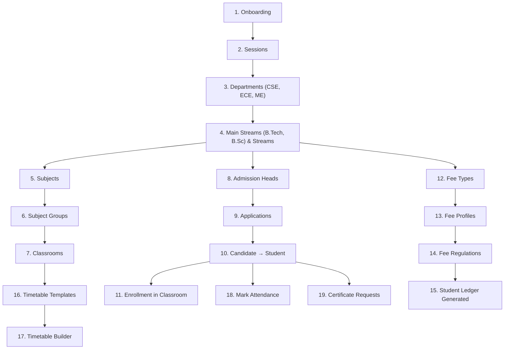

# 🏫 College Workflow Guide

> **Scope Type:** `college` | **Platform:** PDS Education Education System Management
> 
> Complete step-by-step documentation of every admin and student workflow available for a **college** institution type.

---
> [!TIP]
> **Developing for PDS Education?** Check out the [🛠️ Developer Guide](./developer-guide.md) for architectural flows, logic diagrams, and implementation patterns.
---

## Table of Contents

1. [Onboarding & Initial Setup](#1-onboarding--initial-setup)
2. [Academic Setup](#2-academic-setup)
3. [Admission & Student Registry](#3-admission--student-registry)
4. [Treasury & Fee Management](#4-treasury--fee-management)
5. [Attendance](#5-attendance)
6. [Timetable & Scheduling](#6-timetable--scheduling)
7. [LMS (Classes & Content)](#7-lms-classes--content)
8. [Certificate Management](#8-certificate-management)
9. [Library](#9-library)
10. [Inventory](#10-inventory)
11. [Transport](#11-transport)
12. [Website & Public Relations](#12-website--public-relations)
13. [Redressal & Grievances](#13-redressal--grievances)
14. [Analytics & Admin Desk](#14-analytics--admin-desk)
15. [System Console](#15-system-console)
16. [Settings & Configuration](#16-settings--configuration)
17. [Student Portal](#17-student-portal)
18. [Parent Portal](#18-parent-portal)

---

## College vs School vs Coaching — Key Differences

| Concept | School | **College** | Coaching |
|---------|--------|:-----------:|----------|
| **Stream** label | Class | **Stream** | Batch |
| **Semester** label | Term | **Semester** | Term |
| **Main Stream** label | Main Class | **Main Stream** | Main Batch |
| **Head** label | Principal | **Principal** | Director |
| Departments | Optional | **Many (CSE, ECE, ME, CE)** | Optional (JEE, NEET) |
| Sessions | Manual | **Manual** | Manual |
| Admission flow | Simple | **Application + merit + entrance** | Application + merit |
| Fee structure | Annual/Monthly | **Semester-wise** | Flexible |
| Workflow variant | `_school` suffix | **Base variant** | Base variant |
| Permission scope | `scope_type = school` | **`scope_type = college`** | `scope_type = coaching` |

> [!IMPORTANT]
> College uses the **base (higher-ed) workflow variants**:
> `admission_cell`, `office_registry`, `accounts_room`, `academic_setup`, `service_branch`, `system_console`, `student_portal`, `parent_portal`.
> These are the same variants used by coaching and university. It does NOT use the `_school` suffix variants.

---

## 1. Onboarding & Initial Setup

The onboarding flow creates a new organisation and institution of type `college`.

### Steps

| # | Screen | Route | Description |
|---|--------|-------|-------------|
| 1 | **Account Registration** | `/register` | Enter name, email, mobile, password. Creates inactive user + sends verification email. |
| 2 | **Email Verification** | `/onboarding/verify-notice` | "Check your inbox" page. Frontend polls for verification. Auto-redirects on verify. |
| 3 | **Plan Selection** | `/onboarding/plan` | Choose plan (Starter / Professional / Enterprise / Plus) + billing cycle (monthly/annual). |
| 4 | **Card Details** | `/onboarding/card` | Enter card info (AES-256 encrypted) or **Skip** to proceed without payment. |
| 5 | **Organisation & Institution Setup** | `/onboarding/setup` | Enter organisation name, institution name, select type = **"College"**, workspace slug. |
| 6 | **Data Import** | `/onboarding/data-import` | Auto-seed departments (CSE, ECE, ME), subjects, fee types for college, or upload CSV. |
| 7 | **Platform Setup** | `/onboarding/platform-setup` | Automated setup: seeds roles, permissions, workflows (higher-ed variants), and college defaults. |

### Key Behaviour (College Scope)
- Roles seeded: `institution_admin`, `principal`, `hod`, `teaching_staff`, `accountant`, `office_clerk`, `librarian`, `student`, `candidate`, `parent`
- Workflows: Uses **base/higher-ed** variants (`admission_cell`, `accounts_room`, `academic_setup`, etc.)
- Permissions include: fee heads CRUD, admission heads with entrance papers, departments, sessions, subject groups, certificates, staff links
- Landing page sections: **ProgramShowcase**, **PlacementHighlight**, **FacultySpotlight**, **DepartmentTable**, **CampusTour**, **Affiliations**

---

## 2. Academic Setup

> **Sidebar Group:** Academic | **Permission Group:** `academic_setup`

Foundation data that all other modules depend on. Set these up first after onboarding.

### 2.1 Sessions
| Action | Route | Details |
|--------|-------|---------|
| List sessions | `/organization/sessions` | View all academic sessions (e.g., 2025-26) |
| Create session | `/organization/sessions/create` | Set name, start date, end date, mark as current |
| Edit session | `/organization/sessions/{id}/edit` | Modify session details |

### 2.2 Departments
| Action | Route | Details |
|--------|-------|---------|
| List departments | `/organization/departments` | All departments (CSE, ECE, ME, CE, EE, IT, MBA, BBA, etc.) |
| Create department | `/organization/departments/create` | Set name, code, HOD, description |
| View department | `/organization/departments/{id}` | Department detail with faculty, streams, and subject allocations |
| Edit department | `/organization/departments/{id}/edit` | Modify department |

### 2.3 Main Streams & Streams
| Action | Route | Details |
|--------|-------|---------|
| List main streams | `/organization/main-streams` | Top-level programs (e.g., "B.Tech", "B.Sc", "BBA", "MBA") |
| Create main stream | `/organization/main-streams/create` | Set name, department, duration (years) |
| List streams | `/organization/streams` | Individual sections (e.g., "B.Tech CSE - Semester 3 Section A") |
| Create stream | `/organization/streams/create` | Set name, main stream, semester, capacity, class teacher |

### 2.4 Subjects & Subject Groups
| Action | Route | Details |
|--------|-------|---------|
| Manage subjects | `/organization/subject` | List/create/edit subjects (Data Structures, Engineering Math, etc.) |
| Subject groups | `/organization/subject-groups` | Group subjects (e.g., "Core CSE" = DSA + OS + DBMS + CN) |
| Subject categories | `/organization/subject-category` | Categories: Core, Elective, Open Elective, Lab, Project |
| Category mapping | `/organization/subject-category-mapping` | Map subjects to categories |

### 2.5 Classrooms (LMS)
| Action | Route | Details |
|--------|-------|---------|
| List classes | `/lms/classes` | All classrooms with enrollments |
| View by stream | `/lms/classes/stream/{streamId}` | Classes for a specific stream/semester |
| Class detail | `/lms/classes/{id}` | Subject allocations, enrolled students, rooms |
| Subject detail | `/lms/classes/{id}/subjects/{allocationId}` | Subject-specific materials, syllabus |
| Room detail | `/lms/classes/{id}/rooms/{roomId}` | Real-time classroom (discussion, materials, recordings) |
| Courses | `/lms/courses` | Course templates for structured curriculum |

---

## 3. Admission & Student Registry

> **Sidebar Group:** Admission & Registry | **Permission Groups:** `admission_cell`, `office_registry`

College gets the **full** admission cell with entrance papers, merit lists, and document verification.

### 3.1 Candidates
| Action | Route | Details |
|--------|-------|---------|
| Candidate list | `/students/candidate` | Prospective students who haven't been admitted yet |

### 3.2 Admission Heads
| Action | Route | Details |
|--------|-------|---------|
| List heads | `/admission/heads` | Admission batches (e.g., "B.Tech CSE 2025-26", "MBA 2025-26") |
| Create head | `/admission/heads/create` | Set name, session, stream, capacity, fee structure, entrance papers |
| View head | `/admission/heads/{id}` | Applications under this admission head with merit ranking |

### 3.3 Admission Applications
| Action | Route | Details |
|--------|-------|---------|
| List applications | `/admission/applications` | All applications with status filters |
| New application | `/admission/applications/new/{step}` | Multi-step: identity → address/guardian → medical/documents → program/papers → services → payment → review |
| View application | `/admission/applications/{id}` | Full detail with approve/reject, merit position, entrance scores |
| Payment | `/admission/applications/{id}/pay` | Process admission fee payment |

### 3.4 Student Management
| Action | Route | Details |
|--------|-------|---------|
| Analytics | `/students/analytics` | Student statistics by department, stream, semester |
| Student list | `/students/manage` | All enrolled students with search/filter (department, stream, semester) |
| Student profile | `/students/manage/{id}` | Full detail (personal, academic, fee, attendance, placement) |
| Edit student | `/students/manage/{id}/edit` | Update student information |

### 3.5 Promotions
| Action | Route | Details |
|--------|-------|---------|
| Promotions | `/admission/promotions` | Semester-end promotions (Semester 3 → Semester 4) |
| Promotion analytics | `/admission/analytics/promotions` | Promotion and backlog statistics |

### 3.6 Re-Admissions
| Action | Route | Details |
|--------|-------|---------|
| Re-admissions | `/admission/readmissions` | Re-admit previously withdrawn or year-back students |
| Re-admission analytics | `/admission/analytics/readmissions` | Re-admission statistics |

---

## 4. Treasury & Fee Management

> **Sidebar Group:** Treasury & Fees | **Permission Group:** `accounts_room`

College gets the **full** accounts room: fee heads CRUD + semester-wise fee management.

### 4.1 Fee Heads
| Action | Route | Details |
|--------|-------|---------|
| Manage fee heads | `/fee-payment/manage-fee-head` | Top-level fee categories (Tuition, Lab, Hostel, Library, Examination, Development) |

### 4.2 Fee Types
| Action | Route | Details |
|--------|-------|---------|
| Manage fee types | `/accounts/fee-hub/fee-types` | Define fee items with amounts and frequencies (semester-wise, annual, one-time) |

### 4.3 Fee Profiles
| Action | Route | Details |
|--------|-------|---------|
| Manage profiles | `/accounts/fee-hub/profiles` | Group fee types (e.g., "B.Tech Profile" = Tuition + Lab + Library + Exam) |

### 4.4 Fee Regulations
| Action | Route | Details |
|--------|-------|---------|
| List regulations | `/accounts/fee-hub/regulations` | Assign fee profiles to streams for a session/semester |
| Stream regulation | `/accounts/fee-hub/regulations/{id}` | View/edit fee rules for a specific stream |

### 4.5 Student Ledgers
| Action | Route | Details |
|--------|-------|---------|
| Student ledgers | `/accounts/fee-hub/students` | Per-student fee ledger with semester-wise payment history |

### 4.6 Dues & Overdue
| Action | Route | Details |
|--------|-------|---------|
| Dues dashboard | `/accounts/fee-hub/dues` | Students with pending/overdue fees, send reminders |

### 4.7 Collection Settings
| Action | Route | Details |
|--------|-------|---------|
| Settings | `/accounts/fee-hub/collection-settings` | Configure payment modes, late fee rules, receipt format, scholarship discounts |

---

## 5. Attendance

> **Permission Group:** `attendance`

| Action | Route | Details |
|--------|-------|---------|
| Overview | `/attendance` | Attendance dashboard |
| Mark attendance | `/attendance/mark` | Select stream/section, date, mark present/absent/late |
| Daily report | `/attendance/reports/daily` | Day-wise attendance breakdown |
| Summary report | `/attendance/reports/summary` | Monthly/semester attendance summary with minimum % alerts |

---

## 6. Timetable & Scheduling

> **Sidebar Group:** Timetable & Scheduling | **Permission Group:** `timetable`

| Action | Route | Details |
|--------|-------|---------|
| Overview | `/timetable` | Master timetable view |
| Templates | `/timetable/templates` | Define period structures (6 lectures × 55 min + labs) |
| Rooms | `/timetable/rooms` | Room inventory (Lecture Hall, Smart Classroom, Computer Lab, Workshop) |
| Daily view | `/timetable/daily` | Today's timetable across all streams |
| Substitutions | `/timetable/substitutions` | Faculty substitutions |
| Builder | `/timetable/{id}/builder` | Drag-and-drop timetable builder |

---

## 7. LMS (Classes & Content)

> **Sidebar Group:** LMS | **Permission Group:** `lms`

| Action | Route | Details |
|--------|-------|---------|
| All classes | `/lms/classes` | All classrooms with semester-wise enrollment counts |
| Classes by stream | `/lms/classes/stream/{streamId}` | Classes for a specific stream/semester |
| Class detail | `/lms/classes/{id}` | Materials, assignments, tests, live sessions, announcements, recordings |
| Subject content | `/lms/classes/{id}/subjects/{allocationId}` | Subject-specific resources |
| Live room | `/lms/classes/{id}/rooms/{roomId}` | Real-time classroom |
| Subject allocation | `/lms/classes/{classId}/allocations` | Assign subjects to faculty |
| Courses | `/lms/courses` | Course catalog with structured curriculum |

### Content Types in LMS
- **Materials**: Lecture notes, PDFs, slides, video lectures
- **Assignments**: With due dates, max marks, plagiarism check, submission tracking
- **Tests/Quizzes**: MCQ + subjective with time limits, auto/manual grading
- **Announcements**: Stream-wide notices
- **Live Sessions**: Scheduled live classes with recording support
- **Recordings**: Recorded video lectures via Video Engine (HLS streaming)
- **Lab Manuals**: Practical-specific materials and rubrics

---

## 8. Certificate Management

> **Permission Group:** `service_branch`

| Action | Route | Details |
|--------|-------|---------|
| Certificate heads | `/certificates/manage-certificate-head` | Define types: Transfer Certificate, Migration, Bonafide, Character, Provisional Degree. Set fee and processing days. |
| Applications | `/certificates/applications` | All certificate requests with status |
| Application detail | `/certificates/applications/{id}` | Review and issue/reject |
| Types | `/certificates/types` | Certificate template types |
| ID Cards | (via Service Branch) | Generate student/staff ID cards |

---

## 9. Library

> **Permission Group:** `library`

| Action | Route | Details |
|--------|-------|---------|
| Books catalogue | `/library/books` | List all books with title, author, ISBN, category, edition |
| Book detail | `/library/books/{id}` | Book info with copies and issue history |
| Copies | `/library/copies` | Accession register with barcodes |
| Issues & Returns | `/library/issues` | Issue books to students/faculty, process returns |
| Overdue report | `/library/reports/overdue` | Books past due with fine calculation |

---

## 10. Inventory

> **Permission Group:** `inventory`

| Action | Route | Details |
|--------|-------|---------|
| Categories | `/inventory/categories` | Lab equipment, stationery, electronics, furniture |
| Locations | `/inventory/locations` | Main Store, CSE Lab, Electronics Lab, Library |
| Items | `/inventory/items` | Item master with stock levels |
| Item detail | `/inventory/items/{id}` | Item history, movements, current stock |
| Movements | `/inventory/movements` | Stock in/out transactions |
| Sales | `/inventory/sales` | Items sold to students (lab kits, uniform) |
| Low Stock | `/inventory/reports/low-stock` | Items below reorder level |

---

## 11. Transport

> **Permission Group:** `transport`

| Action | Route | Details |
|--------|-------|---------|
| Stops | `/transport/stops` | Bus stop locations |
| Routes | `/transport/routes` | Route definitions with stop ordering |
| Route detail | `/transport/routes/{id}` | Stops, assigned vehicles, passengers |
| Vehicles | `/transport/vehicles` | Vehicle fleet (registration, capacity) |
| Drivers | `/transport/drivers` | Driver profiles with license info |
| Assignments | `/transport/assignments` | Assign students/staff to routes |
| Manifest | `/transport/reports/manifest` | Route-wise passenger list |
| Occupancy | `/transport/reports/occupancy` | Vehicle capacity utilisation |

---

## 12. Website & Public Relations

> **Permission Group:** `info_pr_hub`

| Action | Route | Details |
|--------|-------|---------|
| Notices | `/notice-management` | Create announcements to students, parents, faculty |
| Sliders | `/website/sliders` | Hero banner images for the college website |
| Galleries | `/website/galleries` | Photo albums (events, seminars, campus, placements) |
| Tickers | `/website/tickers` | Scrolling updates |
| News | `/website/news` | News articles and press releases |
| Faculties | `/website/faculties` | Faculty profiles on website |

### College-Specific Landing Sections
- **ProgramShowcase** — Department-wise programs with duration, fees, eligibility
- **PlacementHighlight** — Placement stats, top recruiters, highest packages
- **FacultySpotlight** — Faculty publications, research, qualifications
- **DepartmentTable** — Departments with HODs and specializations
- **CampusTour** — Infrastructure gallery with descriptions
- **Affiliations** — AICTE, UGC, NBA approvals and rankings

---

## 13. Redressal & Grievances

> **Permission Group:** `redressal_cell`

| Action | Route | Details |
|--------|-------|---------|
| Grievance board | `/grievances` | All grievances with status tracking |
| Support tickets | `/grievances/support-ticket` | IT/admin support tickets |
| Feedback | `/grievances/feedback` | Student and parent feedback |
| Contacts | `/grievances/contacts` | Website enquiries |
| Contact detail | `/grievances/contacts/{id}` | Individual enquiry with response |

---

## 14. Analytics & Admin Desk

> **Permission Group:** `admin_desk`

| Action | Route | Details |
|--------|-------|---------|
| Dashboard | `/dashboard` | Institution overview (enrollment, fee collection, attendance, placements) |
| Analytics | `/analytics` | Charts and KPIs across all modules |
| Student analytics | `/students/analytics` | Department-wise, semester-wise demographics |
| Audit logs | `/admin/audit-logs` | System activity log |
| Import logs | `/admin/analytics/import-logs` | Data import history |
| Data import | `/admin/data-import` | Bulk import students, faculty via Excel/CSV |

---

## 15. System Console

> **Permission Group:** `system_console`

College gets the **full** system console: roles, workflows, staff management with department/subject linking.

| Action | Route | Details |
|--------|-------|---------|
| Staff directory | `/settings/staff-directory` | Manage teaching and non-teaching staff with department/subject links |
| Create staff | `/settings/staff-directory/create` | Add new staff with role, department, subject specialization |
| Security roles | `/admin/roles` | Custom role management (beyond defaults) |
| Workflows | `/admin/workflows` | Approval workflows (e.g., leave, fee waiver, certificate) |

---

## 16. Settings & Configuration

### 16.1 Personal Settings
| Action | Route | Details |
|--------|-------|---------|
| My Profile | `/settings/profile` | Update name, email, avatar |
| Change Password | `/settings/password` | Update password |
| Two-Factor Auth | `/settings/two-factor` | Enable/disable 2FA |
| Appearance | `/settings/appearance` | Theme preferences |

> [!NOTE]
> **Forced Password Reset:** Users created via seeders (with system-generated passwords) are automatically redirected to `/settings/password` on first login. An amber banner explains the requirement. The flag (`system_generated_password`) is cleared after the password is changed.

### 16.2 Institute Identity
| Action | Route | Details |
|--------|-------|---------|
| Institution Profile | `/settings/institution` | College name, address, contact, accreditation details, logo |
| Digital Branding | `/settings/digital-presence` | Colors, favicon, subdomain |
| SEO & Favicon | `/settings/seo` | Meta title, description, OG image |
| Landing Content | `/settings/landing-page-content` | Customise: Principal's Message, Vision, History, Rankings |
| Academics | `/settings/institutional-academics` | Academic programs for website |
| Departments | `/settings/institutional-departments` | Department descriptions for website |
| Facilities | `/settings/institutional-facilities` | Facility listings (labs, library, hostel, sports) |
| Placements | `/settings/institutional-placement` | Placement statistics for website |
| Approvals | `/settings/institutional-approvals` | AICTE, UGC, NBA approvals |

### 16.3 Operational Rules
| Action | Route | Details |
|--------|-------|---------|
| Admission Policy | `/settings/admission` | Process, eligibility criteria, required documents |
| Stream Hierarchy | `/settings/stream-form` | Configure stream/semester naming conventions |
| Admission Documents | `/settings/admission-certificate-head` | Documents required at admission |
| Admission Verification | `/settings/admission-verification` | Verification checklist |
| Student Verification | `/settings/student-verification` | Document verification for enrolled students |
| Fee Settings | `/accounts/fee-hub/collection-settings` | Payment modes, late fees, scholarship rules |

---

## 17. Student Portal

> **Route:** `/student-portal/*` | **Permission Group:** `student_portal`

| Action | Route | Details |
|--------|-------|---------|
| Dashboard | `/student-portal/dashboard` | Personal dashboard with semester stats |
| My Classes | `/student-portal/my-classes` | Enrolled classes with subjects |
| Class detail | `/student-portal/my-classes/{id}` | Subject list, materials, assignments |
| Subject detail | `/student-portal/my-classes/{id}/subjects/{allocationId}` | Subject content |
| Room | `/student-portal/my-classes/{id}/rooms/{roomId}` | Live classroom |
| Fees | `/student-portal/fees` | Semester-wise fee status and payment |
| Fee History | `/student-portal/fees/history` | Past payments |
| My Certificates | `/student-portal/my-certificates` | Request and track certificates |
| My Applications | `/student-portal/my-applications` | Admission application status |
| Support | `/student-portal/tickets` | Submit and track support tickets |
| Admission | `/student-portal/admission` | New admission application (for candidates) |
| Re-Admission | `/student-portal/readmission` | Re-admission / year-back application |

---

## 18. Parent Portal

> **Permission Group:** `parent_portal`

| Action | Route | Details |
|--------|-------|---------|
| My Students | (Parent dashboard) | View linked children with stream/semester info |
| Fees | Via student ledger | View child's semester fee status |
| Classes | Via student portal | View child's subjects & academic progress |
| Certificates | Via student portal | Track certificate requests |
| Applications | Via student portal | Track admission status |
| Support | Via student portal | Submit tickets on child's behalf |

---

## Workflow Dependency Order (Recommended Setup Sequence)

> **Note:** Library, Inventory, Transport, Website, and Redressal are independent modules — set up in any order.

---

## Permission & Workflow Summary

### Workflows Assigned to College

| Workflow | Key | Permissions Count |
|----------|-----|:-:|
| Account | `account` | 2 |
| Admin Desk | `admin_desk` | 6 |
| My Organisation | `my_organisation` | 4 |
| Admission Cell | `admission_cell` | 20 |
| Office Registry | `office_registry` | 11 |
| Info & PR Hub | `info_pr_hub` | 14 |
| Accounts Room | `accounts_room` | 18 |
| Academic Setup | `academic_setup` | 28 |
| Service Branch | `service_branch` | 6 |
| Redressal Cell | `redressal_cell` | 10 |
| System Console | `system_console` | 12 |
| Inventory | `inventory` | 18 |
| Transport | `transport` | 21 |
| Library | `library` | 13 |
| Attendance | `attendance` | 5 |
| LMS | `lms` | 11 |
| Timetable | `timetable` | 11 |
| Student Portal | `student_portal` | 12 |
| Parent Portal | `parent_portal` | 12 |
| **Total** | | **~234** |

---

### Links & Resources
- [🛠️ Developer Guide](./developer-guide.md)
- [🎓 School Workflow Guide](./school-workflows.md)
- [🎯 Coaching Workflow Guide](./coaching-workflows.md)
- [🏛️ University Workflow Guide](./university-workflows.md)
