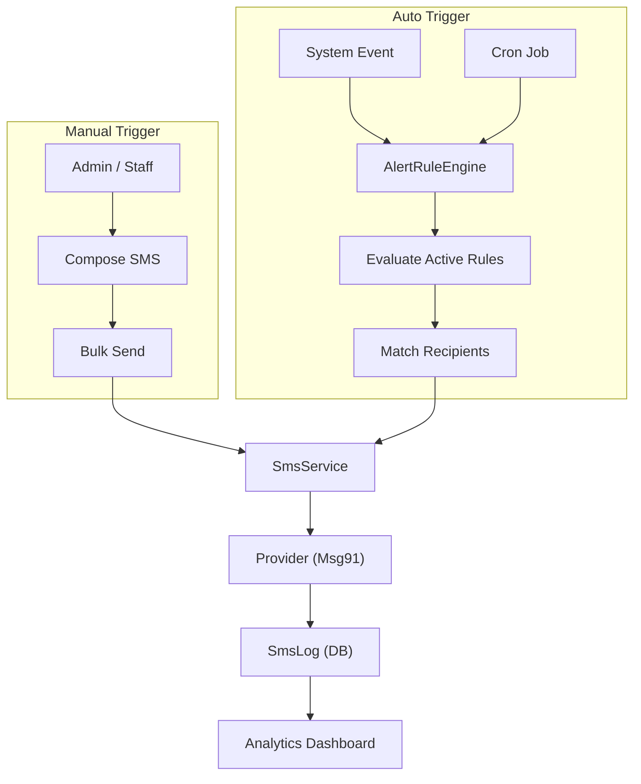
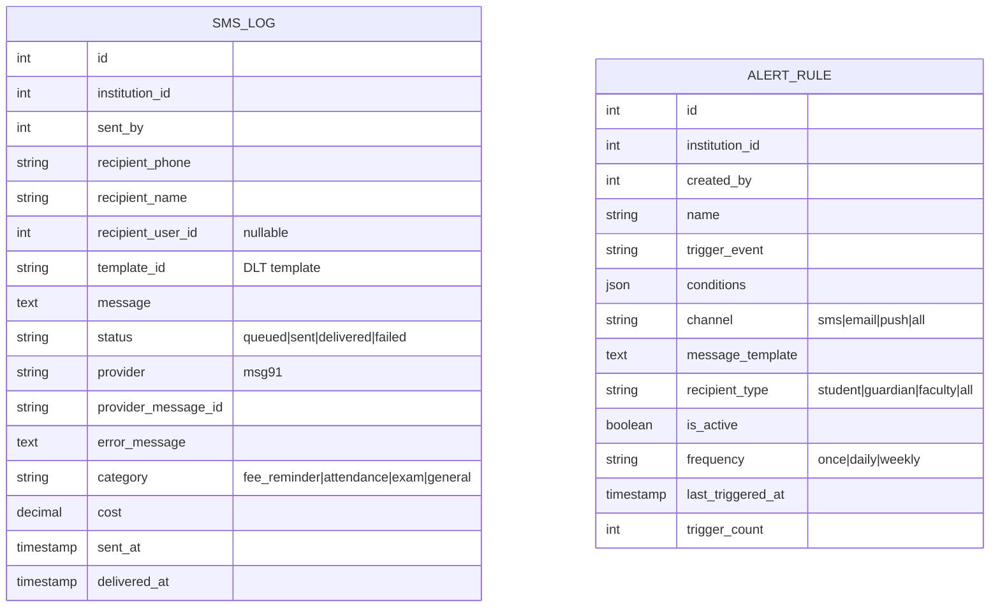

# 📡 Communications & Alerts

> **Module:** `communications`
> **Scope:** All institution types
> **Permissions Workflow:** `communications` (4 permissions)

---

## Overview

Centralized communication platform for SMS sending, delivery tracking, and automated alerts. Supports provider-agnostic SMS dispatch (currently Msg91), bulk messaging, and configurable auto-alert rules that trigger based on events (fee overdue, attendance, exam scores).

---

## Architecture



---

## Data Model



---

## SmsService

**File:** `app/Services/SmsService.php`

| Method | Description |
|--------|-------------|
| `send()` | Single SMS — creates log, dispatches to provider |
| `sendBulk()` | Array of recipients → sequential sends |
| `processAlertRule()` | Renders template variables, sends to recipients |
| `getStats()` | Aggregate stats (total, sent, delivered, failed, cost, by category) |

### Provider Configuration

```env
# .env
SMS_PROVIDER=msg91
MSG91_AUTH_KEY=your_auth_key
MSG91_DEFAULT_TEMPLATE=your_template_id
```

---

## AlertRuleEngine

**File:** `app/Services/AlertRuleEngine.php`

### Trigger Events

| Event | Description |
|-------|-------------|
| `fee_overdue` | Student has unpaid fees past due date |
| `attendance_absent` | Student absent for N consecutive days |
| `exam_score_low` | Score below threshold |
| `assignment_due` | Assignment deadline approaching |
| `fee_payment_received` | Confirmation after payment |
| `enrollment_confirmed` | New enrollment success |
| `custom` | User-defined trigger |

### Message Templates

Templates support `{{variable}}` placeholders:

```
Dear {{name}}, your fee of ₹{{amount}} for {{month}} is overdue.
Please pay by {{due_date}} to avoid late charges.
```

### Frequency Control

| Frequency | Behavior |
|-----------|----------|
| `once` | Triggers once, never again |
| `daily` | At most once per day |
| `weekly` | At most once per week |

---

## API Endpoints

| Method | Endpoint | Action |
|--------|----------|--------|
| `GET` | `/api/v1/communications/sms-logs` | List logs (filter by status, category) |
| `POST` | `/api/v1/communications/sms/send` | Send bulk SMS |
| `GET` | `/api/v1/communications/sms/stats` | Usage statistics |
| `GET` | `/api/v1/communications/alert-rules` | List rules |
| `POST` | `/api/v1/communications/alert-rules` | Create rule |
| `PUT` | `/api/v1/communications/alert-rules/{id}` | Update rule |
| `DELETE` | `/api/v1/communications/alert-rules/{id}` | Delete rule |
| `POST` | `/api/v1/communications/alert-rules/trigger` | Manually trigger all rules |

---

## Permissions (4)

| Key | Description |
|-----|-------------|
| `send_sms` | Compose and send SMS |
| `view_sms_logs` | View delivery logs |
| `manage_alert_rules` | Create/edit/delete alert rules |
| `trigger_alerts` | Manually trigger alert processing |

---

## Frontend Files

| File | Purpose |
|------|---------|
| `lib/api/communicationsApi.ts` | API module |
| `lib/querykey/communications.ts` | `CommunicationsQueryKeys` |
