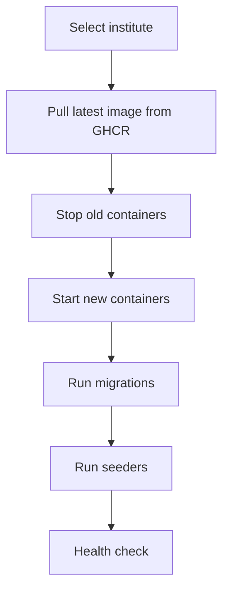
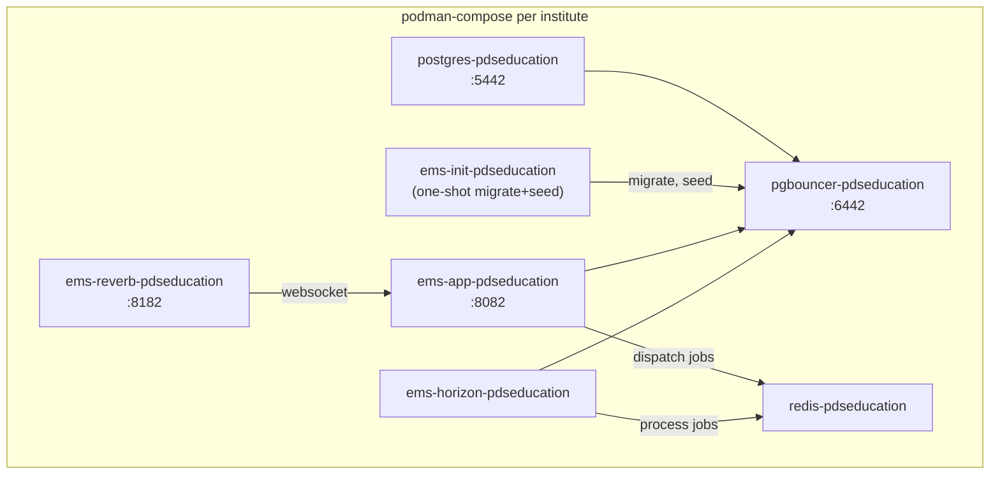

# 🚀 Deployment & VPS Management

> **Script:** `infra/podman/scripts/ems.sh`
> **Type:** Interactive CLI for production VPS management

---

## Overview

The **EMS Management Console** (`ems.sh`) is a polymorphic TUI that auto-discovers institutes from `/opt/ems/colleges/<id>/.env` on the VPS and provides a unified interface for all deployment and management tasks.

---

## Prerequisites

| Requirement | Description |
|-------------|-------------|
| SSH access | Key-based SSH to VPS (`deploy` user recommended) |
| Podman | Container runtime on VPS |
| GHCR access | Registry configured for image pulls |
| Domain | Optional — Nginx + Certbot for SSL |

---

## Quick Start

```bash
# From your local machine:
./infra/podman/scripts/ems.sh

# You'll be prompted for:
#   VPS IP or hostname: 123.45.67.89
#   SSH port [22]: 22
#   SSH user [deploy]: deploy
```

---

## Menu Structure

```
  ╔═══════════════════════════════════════╗
  ║       EMS Management Console          ║
  ╚═══════════════════════════════════════╝

  ✔  SSH Connection           Connected as deploy
  ✔  VPS Bootstrap            SSH + UFW + fail2ban + sysctl
  ✔  EMS Setup                /opt/ems ready
  ✔  Institutes (1)           pdseducation
  ✔  Queue Infra              Redis: 1, Horizon: 1

  1)  Bootstrap VPS           (SSH, firewall, packages)
  2)  Setup EMS               (configs, monitoring, /opt/ems)
  3)  Add Institute           (postgres, pgbouncer, nginx)
  4)  Deploy App              (pull image, restart, migrate)
  5)  Restore Database        (pick backup, restore)
  6)  Update Domain           (domain + SSL)
  7)  Adminer Tunnel          (DB browser via SSH)
  8)  Grafana Tunnel          (monitoring via SSH)
  9)  Configure GHCR          (add/update registry creds)
  0)  Factory Reset           (destroy everything)

  e)  Push Env & Restart      (upload .env, restart containers)
  s)  Run Seeder              (run specific or all seeders)
  h)  Horizon Management      (status, pause, restart, logs)
  r)  Refresh status
  q)  Quit
```

---

## First-Time VPS Setup

### Step 1: Bootstrap VPS

Hardens the server:
- SSH config (disable root login, password auth)
- UFW firewall (allow SSH, HTTP, HTTPS only)
- fail2ban (brute-force protection)
- sysctl optimizations (network tuning)
- Install Podman, Nginx, Certbot

### Step 2: Setup EMS

Initializes the EMS directory structure:

```
/opt/ems/
├── colleges/           # One dir per institute
│   └── pdseducation/
│       ├── .env        # Institute-specific environment
│       └── init.sql    # DB initialization script
├── config/
│   └── postgres/       # Shared PG configs
├── data/
│   └── pdseducation/
│       ├── postgres/   # PG data volume
│       └── redis/      # Redis data volume
└── monitoring/         # Prometheus, Grafana configs
```

### Step 3: Configure GHCR

Sets up authentication so the VPS can pull images from GitHub Container Registry:

```bash
# Stores credentials for podman pull
podman login ghcr.io
```

### Step 4: Add Institute

Creates a new institute deployment:
1. Creates directory structure in `/opt/ems/colleges/<id>/`
2. Uploads `.env` and `init.sql`
3. Starts PostgreSQL + PgBouncer containers
4. Runs migrations and seeders
5. Configures Nginx reverse proxy
6. Obtains SSL certificate via Certbot

---

## Deploying Updates

### Option 4: Deploy App



### Option e: Push Env & Restart

Uploads a local `.env` file and restarts all containers (app + reverb + horizon):

```bash
# Inside the script:
scp .env deploy@vps:/opt/ems/colleges/pdseducation/.env
podman restart ems-app-pdseducation
podman restart ems-reverb-pdseducation
# Graceful Horizon restart:
podman exec ems-horizon-pdseducation php artisan horizon:terminate
sleep 2
podman restart ems-horizon-pdseducation
```

---

## Horizon Management (`h`)

Queue infrastructure management sub-menu:

| # | Action | Command |
|:-:|--------|---------|
| 1 | **Status** | `php artisan horizon:status` |
| 2 | **Pause** | `php artisan horizon:pause` — stops processing, container stays alive |
| 3 | **Continue** | `php artisan horizon:continue` — resumes processing |
| 4 | **Restart** | Graceful terminate → wait 3s → `podman restart` |
| 5 | **Logs** | `podman logs --tail 50 ems-horizon-<id>` |
| 6 | **Redis Info** | Memory usage + queue depths for all 4 queues |

### Queue Depth Check

Shows pending job counts per queue:

```
── Memory ──
  used_memory_human:  12.5M
  maxmemory_human:    256M

── Queue Depths ──
  default              0 jobs
  video-processing     2 jobs
  sms                  0 jobs
  alerts               0 jobs
```

---

## Container Architecture (Per Institute)



### Image Strategy

| Container | Image | Rebuilt when? |
|-----------|-------|:---:|
| `ems-app-*` | `ghcr.io/.../ems:tag` | Every app deploy (`v-*` tags) |
| `ems-reverb-*` | Same as app | Same as app |
| `ems-horizon-*` | `ghcr.io/.../ems-horizon:tag` | **Only** on `horizon-v*` tags |
| `redis-*` | `redis:7-alpine` | Never |
| `postgres-*` | `postgres:15` | Never |

---

## Database Operations

### Option 5: Restore Database

1. Lists available backup files
2. Restores selected backup to the institute's database
3. Runs post-restore migrations

### Option s: Run Seeder

Lists all available seeder classes and lets you run one or all:

```
  Available seeders:
    1)  DatabaseSeeder
    2)  PermissionSeeder
    3)  WorkflowSeeder
    4)  RoleMappingSeeder
    ...

  Select seeder [1-N or a]:
```

---

## Networking & Monitoring

### Option 7: Adminer Tunnel

Creates an SSH tunnel to the institute's PgBouncer for local database browsing:

```bash
# Opens Adminer at http://localhost:8080
ssh -L 8080:localhost:6442 deploy@vps
```

### Option 8: Grafana Tunnel

Creates an SSH tunnel to the monitoring stack:
- Grafana dashboards
- Prometheus metrics
- cAdvisor container stats

---

## Related Scripts

| Script | Purpose |
|--------|---------|
| `vps-init-from-local.sh` | Bootstrap VPS (hardening, packages) |
| `vps-setup-from-local.sh` | EMS directory + monitoring setup |
| `add-college-from-local.sh` | Add new institute (PG, PgBouncer, Nginx) |
| `local-deploy.sh` | Pull image + restart containers |
| `db-restore-from-local.sh` | Database restore from backup |
| `update-domain-from-local.sh` | Domain + SSL configuration |
| `adminer-tunnel-from-local.sh` | SSH tunnel for DB access |
| `configure-ghcr-from-local.sh` | GHCR authentication setup |
| `vps-reset-from-local.sh` | Factory reset (⚠️ destroys everything) |
