# 🛠️ PDS Education Developer Guide

> **Target Audience:** Backend & Frontend Engineers
> **Objective:** Complete architectural reference — multitenancy, coding standards, route maps, component index, API inventory, and deployment.
> **Swagger API Docs:** [/api/documentation](/api/documentation)

---

## 1. System Architecture & Multitenancy

PDS Education uses a **Single Codebase, Domain-Based Context Resolution** multitenancy model. Each institution gets a subdomain (e.g., `schoolname.lvh.me`).

### 🔄 Request Lifecycle

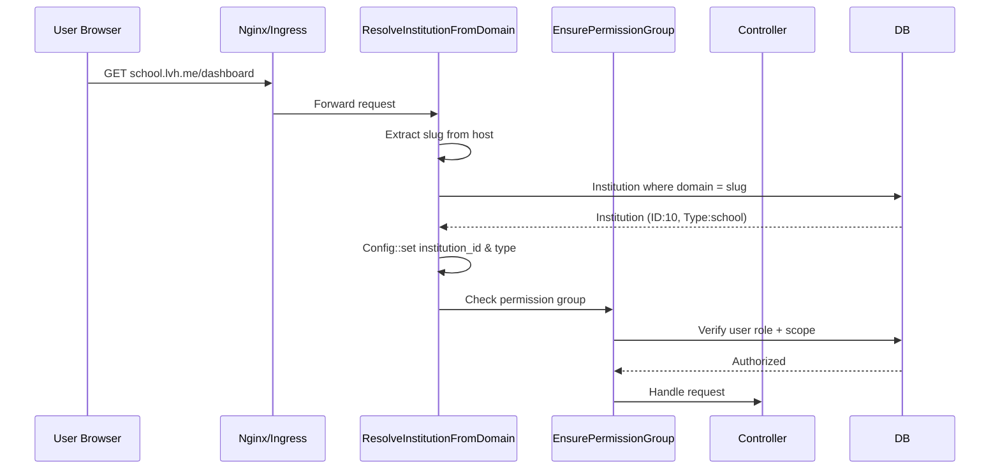

### Middleware Stack

| Middleware | Responsibility |
|-----------|---------------|
| `ResolveInstitutionFromDomain` | Sets `ems.default_institution_id` and `ems.default_institution_type` from subdomain |
| `EnsurePermissionGroup` | Maps route groups to permission sets via `config/route_permissions.php` |
| `CheckSubscription` | Validates tenant's subscription tier includes the requested module |
| `CheckAiAccess` | Gates AI endpoints — verifies `ai_assistant` module in subscription + SutraAI config |
| `HandleInertiaRequests` | Shares auth, flash, and institution data to React frontend |
| `CheckUserRole` | Validates user has the required role (e.g., `institution_admin`) |
| `DashboardRedirect` | Redirects to student portal if user is student role |

### Institution Types

| Type | Value | Description |
|------|-------|-------------|
| `SCHOOL` | `school` | K-12, simplified hierarchy |
| `COLLEGE` | `college` | Degree programs, departments |
| `COACHING` | `coaching` | Coaching centres, batches |
| `UNIVERSITY` | `university` | Multi-campus, full hierarchy |

---

## 2. Development Environment Setup

### Prerequisites

- **Podman** or Docker (container runtime)
- **Node.js 18+** (for Vite dev server)
- **PHP 8.2+** (if running without containers)
- **PostgreSQL 15+** (if running natively)

### Quick Start

```bash
# 1. Clone and setup env
cp .env.example .env

# 2. Start all services
npm run podman:dev

# 3. Access points
# App:        http://pdseducation.lvh.me:18088
# Adminer:    http://localhost:18090
# Dev Docs:   http://pdseducation.lvh.me:18088/dev-docs/
# Swagger:    http://pdseducation.lvh.me:18088/api/documentation
# Vite HMR:   http://localhost:15173
```

### Container Architecture

> **Shared DB Model:** PostgreSQL, PgBouncer, and Redis run as shared services (`postgres-ems`, `pgbouncer-ems`, `redis-ems`). Each institute gets its own database inside the shared Postgres, isolated by PgBouncer routing. Backups remain per-institute (each Laravel app backs up its own DB).

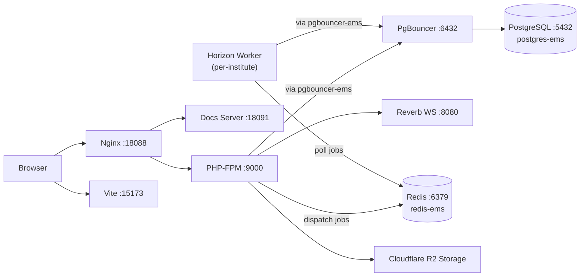

### Key Environment Variables

| Variable | Dev Default | VPS Value | Description |
|----------|---------|---------|-------------|
| `DB_HOST` | `postgres` | `pgbouncer-ems` | Database host (via PgBouncer on VPS) |
| `DB_DATABASE` | `college_mgmt` | per-institute | Database name |
| `APP_PORT` | `18088` | per-institute | Main app port |
| `VITE_PORT` | `15173` | — | Vite HMR port (dev only) |
| `DOCS_PORT` | `18091` | — | Docs server standalone port |
| `DOCS_USER` | `developer` | — | Docs basic auth username |
| `DOCS_PASS` | `docs@pdseducation` | — | Docs basic auth password |
| `ADMINER_PORT` | `18090` | — | Database admin UI port |
| `REDIS_HOST` | `redis` | `redis-ems` | Redis host (shared on VPS) |
| `REDIS_PORT` | `16379` | `6379` | Redis host port |
| `QUEUE_CONNECTION` | `redis` | `redis` | Queue driver (`redis` or `database`) |

---

## 3. Onboarding & Redirect Architecture

### 3.1 Onboarding Workflow

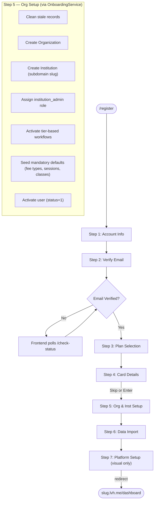

### Steps in Detail

| # | Screen | Route | Page Component | Description |
|---|--------|-------|----------------|-------------|
| 1 | Account Registration | `/register` | `auth/register.tsx` | Name, email, mobile, password. Creates inactive user, assigned unscoped `institution_admin` role, + sends verify email. |
| 2 | Email Verification | `/onboarding/verify-notice` | `Onboarding/VerifyEmailNotice.tsx` | "Check your inbox" page. Frontend polls `/onboarding/check-verification-status`. Auto-redirects on verify. |
| 3 | Plan Selection | `/onboarding/plan` | `Onboarding/PlanSelection.tsx` | Choose plan (Starter / Professional / Enterprise / Plus) + billing cycle. |
| 4 | Card Details | `/onboarding/card` | `Onboarding/CardDetails.tsx` | Enter card info (AES-256 encrypted) or **Skip**. |
| 5 | Org & Inst Setup | `/onboarding/setup` | `Onboarding/OrganizationSetup.tsx` | Creates Org + Institution + scopes the existing `institution_admin` role + activates workflows + seeds defaults. All via `OnboardingService::provision()`. |
| 6 | Data Import | `/onboarding/data-import` | `Onboarding/DataImport.tsx` | Auto-seed or CSV import for categories (departments, subjects, fee types, etc). |
| 7 | Platform Setup | `/onboarding/platform-setup` | `Onboarding/PlatformSetup.tsx` | **Visual-only** — animated transition with progress steps. No API calls. Redirects to subdomain dashboard URL provided by backend. |

### Key Technical Logic

- **Early Role Assignment**: The `institution_admin` role is attached at Step 1 (registration) without a scope. This allows the user to have a basic administrative identity from the start.
- **`OnboardingService::provision()`**: Single-transaction orchestrator that handles all of Step 5: cleanup → create org → create institution → **scope existing role** → activate workflows → seed defaults → activate user.
- **`OnboardingService::scopeRole()`**: Updates the `user_roles` pivot table for the existing `institution_admin` role to set the `scope_type` and `scope_id` of the new institution. Uses `updateExistingPivot()` for a single efficient update.
- **Card Details**: AES-256-CBC encryption via Laravel Crypt. Last 4 digits stored in `card_last_four`. Skippable.
- **Cleanup**: Deletes stale records from failed previous attempts before creating new ones.
- **Sequence Reset**: Resets PostgreSQL sequences after cleanup to avoid ID collisions.
- **Global seeders** (roles, permissions, workflows, role_mapping): Run at **app bootstrap** (`php artisan db:seed`), NOT during onboarding.

### 3.2 Redirect Architecture (`UserRedirectResolver`)

All post-login and post-onboarding redirects are handled by `UserRedirectResolver` — a polymorphic rule chain. Controllers never build redirect logic; they call `resolve()` and act on the result.

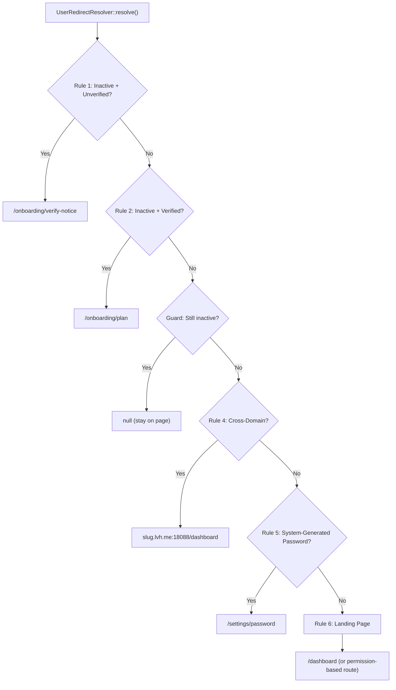

**Critical implementation details:**

| Aspect | Detail |
|--------|--------|
| **Global scope bypass** | All role queries use `withoutGlobalScope('institution_scope')` — on the brand domain there's no institution context, so the scope would filter out every role. |
| **Institution type source** | Uses `InstitutionType::values()` enum — never hardcoded arrays. |
| **URL builder** | `Institution::buildSubdomainUrl($path, $request)` — single source of truth for `scheme://slug.host:port/path`. |
| **Stay sentinel** | `RedirectResult::stay()` halts the rule chain without issuing a redirect. |
| **`resolveUserInstitution()`** | Public helper that finds user's institution via role scope (reusable). |
| **Landing page** | Resolved via `config/route_permissions.landing_pages` — permission→route map, first match wins. |

### 3.3 Login Flow (Cross-Domain)

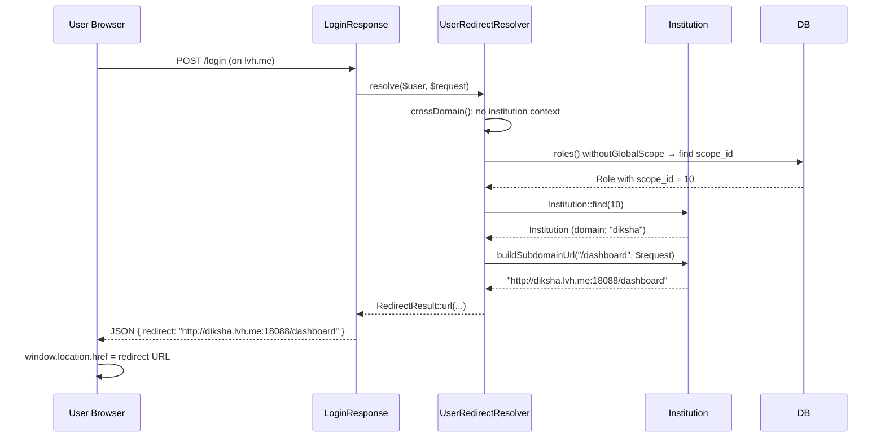

**Login on subdomain** (`slug.lvh.me/login`): The `crossDomain` rule returns null (already on subdomain via `config('ems.default_institution_id')`), so it falls through to `landingPage` → `/dashboard`.

### 3.4 Key Files

| File | Responsibility |
|------|----------------|
| `app/Services/OnboardingService.php` | Reusable provisioning orchestrator (create org, institution, role, workflows, seed) |
| `app/Services/OnboardingDataSeederService.php` | Polymorphic category seeder (fee types, classes, subjects, etc.) |
| `app/Support/UserRedirectResolver.php` | Polymorphic redirect rule chain |
| `app/Support/RedirectResult.php` | Immutable redirect result (route, URL, or stay) |
| `app/Support/InstitutionContext.php` | Active institution session management |
| `app/Models/Institution.php` | `buildSubdomainUrl()`, `buildFullDomain()` |
| `app/Http/Responses/LoginResponse.php` | Calls `UserRedirectResolver::resolve()` |
| `config/route_permissions.php` | Permission→landing page map |

---

## 4. Data Models & Entity Relationships

### Academic Hierarchy (School Scope)

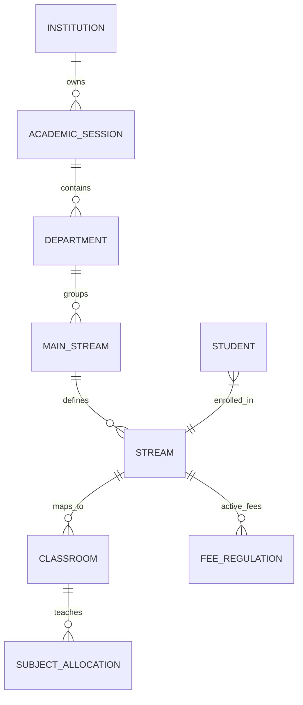

### Financial Engine

> **Single Source of Truth:** All fee calculations flow through `FeeCalculationEngine` (`app/Services/FeeCalculationEngine.php`). No inline math anywhere else. One engine, one formula, one path.

#### Architecture Overview

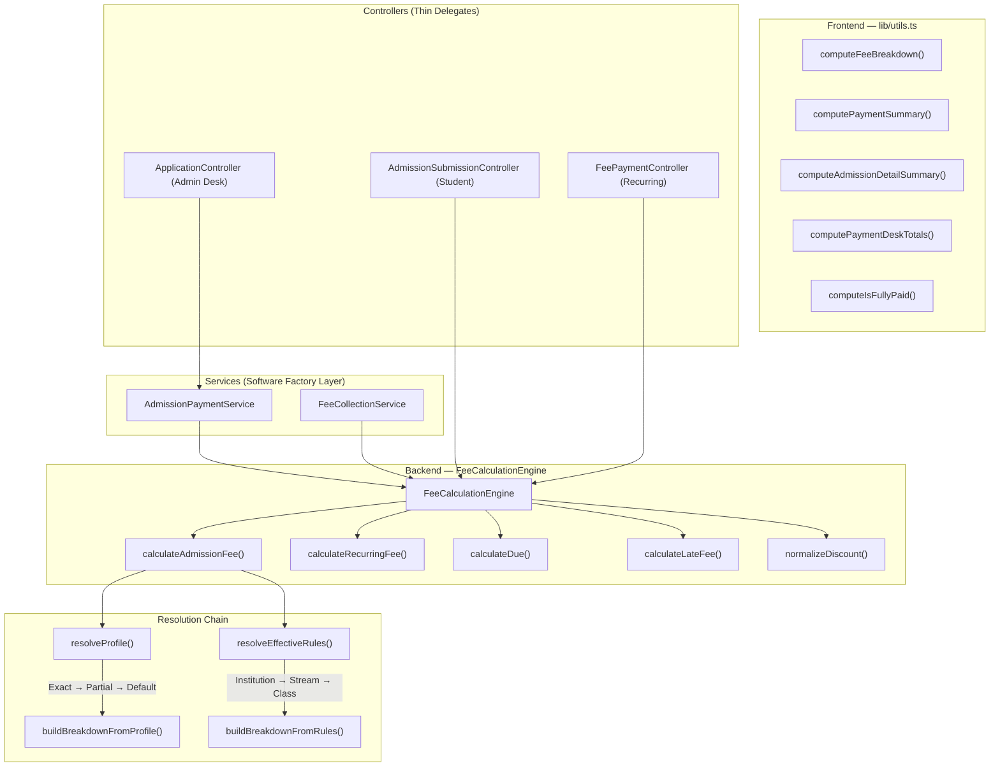

#### Due Amount — Universal Formula

```
due = max(0, totalFee − totalDiscount − totalPaid)
```

This formula exists in **one place** (`calculateDue()`). Every controller calls it — never inline math.

```php
// Backend (FeeCalculationEngine.php)
public function calculateDue(float $totalFee, float $totalDiscount, float $totalPaid): float
{
    return round(max(0, $totalFee - $totalDiscount - $totalPaid), 2);
}
```

```typescript
// Frontend (lib/utils.ts) — mirrors the same formula
const dueAmount = Math.max(0, grandTotal - totalPaid);
```

#### Admission Fee Calculation Flow

Both the **Admin Desk** (`ApplicationController::store`) and **Student Dashboard** (`AdmissionSubmissionController::submitForm`) follow the same pattern:

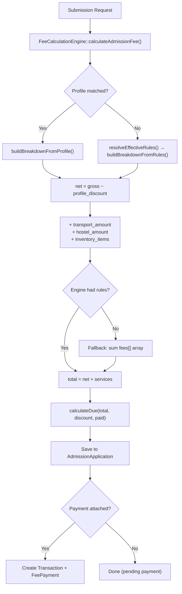

#### Fee Breakdown Storage

Both controllers store an itemized `fee_breakdown` JSON on the `AdmissionApplication` model:

```json
[
  { "fee_type_id": 1, "name": "Tuition Fee", "amount": 5000, "type": "charge", "category": "recurring" },
  { "fee_type_id": 3, "name": "Lab Fee", "amount": 1200, "type": "charge", "category": "one_time" },
  { "name": "Uniform (x2)", "amount": 800, "type": "inventory", "category": "inventory" }
]
```

> **Inventory items** are appended to `fee_breakdown` with `type: "inventory"` so the frontend can extract them separately.

#### Profile Resolution Priority

`resolveProfile()` uses a **scoring system** to find the best-matching `FeeRegulationProfile`:

| Priority | Match Criteria | Score |
|----------|---------------|-------|
| 1 | `profile_type` + `category` + `gender` | 7 |
| 2 | `profile_type` + `category` | 6 |
| 3 | `profile_type` + `gender` | 5 |
| 4 | `profile_type` only | 4 |
| 5 | `category` + `gender` (no profile_type) | 3 |
| 6 | Default profile (`is_default = true`) | 0 |
| — | Mismatch on any explicit field | −1 (disqualified) |

#### Scope Override Chain (Recurring Fees)

For recurring fee calculation, rules are resolved through a **narrower-scope-wins** chain:

```
Institution → Stream → Class
```

If a `FeeStructureRule` exists at the Class level for a given `fee_type_id`, it overrides the same fee at Stream and Institution levels.

#### Frontend Helpers (lib/utils.ts)

| Function | Purpose | Used By |
|----------|---------|---------|
| `computeFeeBreakdown(values)` | Sums fees, inventory, transport, hostel; applies discount | `ServicesStep`, `PaymentStep`, `ReviewStep` |
| `computePaymentSummary(values, grandTotal)` | Calculates `totalPaid` and `dueAmount` | `PaymentStep`, Zod `superRefine` |
| `computeAdmissionDetailSummary(application)` | Extracts itemized totals from saved application record | Application detail/show page |
| `computePaymentDeskTotals(application, newPayments)` | Calculates existing + new payments for payment recording | Payment desk page |
| `computeIsFullyPaid(application)` | Checks `payment_status === 'success'` AND `amount − discount − paid ≤ 0` | Payment desk (redirect guard) |

#### Concession / Discount Normalization

The engine provides `normalizeDiscount()` to map legacy `concession_amount` → `discount_amount`:

```php
$validated = $this->engine->normalizeDiscount($validated);
// Incoming: { concession_amount: 500 }
// Output:   { discount_amount: 500 }
```

#### AdmissionPaymentService — Payment Recording (Software Factory)

All admission payment business logic lives in `AdmissionPaymentService`. The controller is a thin delegate — it validates, calls the service, notifies, and returns a response.

**Key behaviors:**
- **Accumulates** `cash_amount` / `online_amount` across multiple payment rounds (never overwrites)
- **Concession-only** payments create an `admission_concession` transaction (zero amount, audit trail)
- **Payment status** is `success` when `due ≤ 0`, `partial` when `due > 0`
- Uses `FeeCalculationEngine::calculateDue()` as the single source of truth for all due calculations

```php
// Controller (thin delegate)
$result = app(AdmissionPaymentService::class)->recordPayment($application, $validated, $userId);
```

#### Payment Status Enum

| Status | Value | When Set |
|--------|-------|---------|
| `PENDING` | `pending` | Application created, no payment yet |
| `PARTIAL` | `partial` | Some payment made but `due > 0` |
| `SUCCESS` | `success` | Fully paid: `due ≤ 0` (includes concession-only) |
| `FAILED` | `failed` | Payment gateway failure |
| `NOT_APPLICABLE` | `not_applicable` | Fee-exempt applications |
| `REFUNDED` | `refunded` | Payment reversed |

#### Dual-Write: Transaction + FeePayment (Ledger)

When a payment is recorded, `AdmissionPaymentService` creates **two records**:

| Record | Model | Purpose |
|--------|-------|---------|
| **Transaction** | `Transaction` | Polymorphic payment log (for receipts, audit) |
| **FeePayment** | `FeePayment` | Student ledger entry (for fee dashboard, dues tracking) |

Both are created inside the same DB transaction. The `FeePayment` includes a `ledger_snapshot` for point-in-time auditability.

#### Key Files

| File | Responsibility |
|------|----------------|
| `app/Services/FeeCalculationEngine.php` | **Single source of truth** — all fee math |
| `app/Services/AdmissionPaymentService.php` | Payment recording: accumulation, transactions, ledger, status |
| `app/Services/FeeCollectionService.php` | Recurring fee ledger orchestrator |
| `app/Http/Controllers/Api/V1/Admission/ApplicationController.php` | Admin desk: store (thin delegate for recordPayment), process |
| `app/Http/Controllers/Api/V1/StudentDashboard/AdmissionSubmissionController.php` | Student self-submission: submitForm |
| `resources/js/lib/utils.ts` | Frontend calculation helpers |
| `resources/js/lib/validations/admission/application.ts` | Zod schema with `superRefine` payment validation |
| `resources/js/hooks/useServicesStep.ts` | Fee selection state management |
| `app/Models/AdmissionApplication.php` | Model with `fee_breakdown` JSON cast |
| `app/Enums/FeeCategory.php` | `RECURRING`, `ONE_TIME`, `DISCOUNT` enum |
| `app/Enums/FeeSlot.php` | Category/gender-based fee slot resolution |
| `app/Enums/PaymentStatus.php` | `PENDING`, `PARTIAL`, `SUCCESS`, `FAILED`, `NOT_APPLICABLE`, `REFUNDED` |

- **`FeeRegulation`**: Bridge between Fee Profile (what to charge) and Stream/Session (who to charge).
- **`StudentLedger`**: Tracks `expected`, `paid`, and `arrears` per month. Auto-projected when a regulation is activated.

---

## 5. Frontend & Navigation

### Dynamic Sidebar Resolution

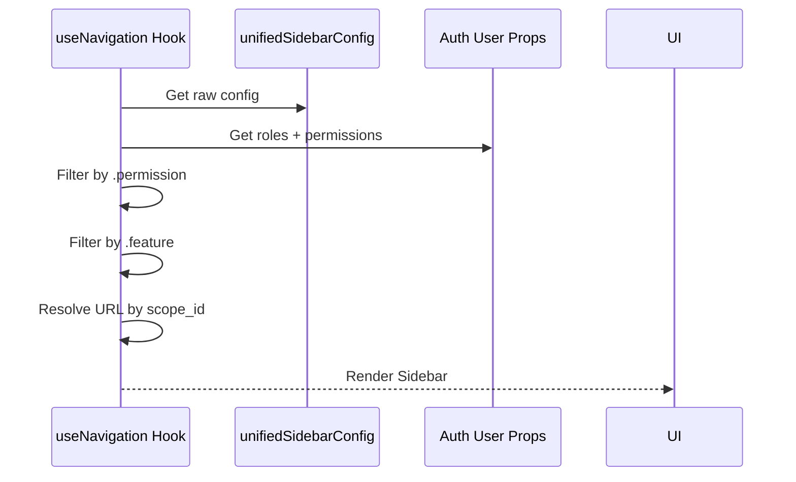

**Key Files:**
- `resources/js/constants/navigation.ts` — sidebar structure
- `resources/js/hooks/use-navigation.ts` — filtering logic

---

## 6. Complete Route Map

### Public Routes

| Route | Page Component | Description |
|-------|---------------|-------------|
| `/` | `welcome.tsx` | Institution landing (or redirect to marketing) |
| `/about-us` | `about-us.tsx` | About page |
| `/contact` | `contact.tsx` | Contact form |
| `/gallery` | `gallery/index.tsx` | Photo galleries |
| `/academics` | `academics/index.tsx` | Academic programs (public) |
| `/departments` | `departments/index.tsx` | Department list (public) |
| `/facilities` | `facilities/index.tsx` | Campus facilities |
| `/training-placement` | `training-placement/index.tsx` | Placements |
| `/approval` | `approval.tsx` | Approval status |

### Auth Routes

| Route | Page Component | Description |
|-------|---------------|-------------|
| `/login` | `auth/login.tsx` | Login form |
| `/register` | `auth/register.tsx` | Onboarding Step 1 |
| `/forgot-password` | `auth/forgot-password.tsx` | Password recovery |
| `/reset-password/{token}` | `auth/reset-password.tsx` | Password reset |
| `/two-factor-challenge` | `auth/two-factor-challenge.tsx` | 2FA verification |
| `/verify-email` | `auth/verify-email.tsx` | Email verification |
| `/set-password/{token}` | `auth/set-password.tsx` | Staff/student password set |

### Onboarding Routes

| Route | Page Component | Description |
|-------|---------------|-------------|
| `/onboarding/verify-notice` | `Onboarding/VerifyEmailNotice.tsx` | Step 2: Email verification notice |
| `/onboarding/plan` | `Onboarding/PlanSelection.tsx` | Step 3: Plan selection |
| `/onboarding/card` | `Onboarding/CardDetails.tsx` | Step 4: Card details (skippable) |
| `/onboarding/setup` | `Onboarding/OrganizationSetup.tsx` | Step 5: Org & institution setup |
| `/onboarding/data-import` | `Onboarding/DataImport.tsx` | Step 6: Data import (auto-seed / CSV) |
| `/onboarding/platform-setup` | `Onboarding/PlatformSetup.tsx` | Step 7: Platform bootstrap |

### Dashboard & Core (auth + verified)

| Route | Page Component | Middleware |
|-------|---------------|-----------|
| `/dashboard` | `dashboard.tsx` | `dashboard-redirect` |
| `/notifications` | `notifications/index.tsx` | — |
| `/billing/plans` | `billing/plans.tsx` | — |
| `/admin/guides` | `admin/docs/index.tsx` | — |
| `/admin/guides/{slug}` | `admin/docs/viewer.tsx` | — |

### Academic Setup (`academic_setup` middleware)

| Route | Page Component |
|-------|---------------|
| `/organization/departments` | `organization/departments/index.tsx` |
| `/organization/departments/create` | `organization/departments/create.tsx` |
| `/organization/departments/{id}` | `organization/departments/show.tsx` |
| `/organization/main-streams` | `organization/main-streams/index.tsx` |
| `/organization/streams` | `organization/streams/index.tsx` |
| `/organization/sessions` | `organization/sessions/index.tsx` |
| `/organization/subject-category` | `organization/subject-category/index.tsx` |
| `/organization/subject-groups` | `organization/subject-groups/index.tsx` |
| `/organization/subject` | `organization/subject/index.tsx` |
| `/organization/subject-category-mapping` | `organization/subject-category-mapping/index.tsx` |

### Accounts & Fees (`accounts_room` middleware)

| Route | Page Component |
|-------|---------------|
| `/accounts/fee-hub/analytics` | `accounts/fee-hub/Analytics.tsx` |
| `/accounts/fee-hub/fee-types` | `accounts/fee-hub/FeeTypes.tsx` |
| `/accounts/fee-hub/profiles` | `accounts/fee-hub/Profiles.tsx` |
| `/accounts/fee-hub/regulations` | `accounts/fee-hub/Regulations.tsx` |
| `/accounts/fee-hub/regulations/{id}` | `accounts/fee-hub/ClassRegulation.tsx` |
| `/accounts/fee-hub/students` | `accounts/fee-hub/StudentLedgers.tsx` |
| `/accounts/fee-hub/dues` | `accounts/fee-hub/DuesOverdue.tsx` |
| `/accounts/fee-hub/collection-settings` | `accounts/fee-hub/FeeCollectionSettings.tsx` |
| `/fee-payment/dashboard` | `fee-payment/dashboard.tsx` |
| `/fee-payment/manage-fee-head` | `fee-payment/manage-fee-head/index.tsx` |
| `/fees/heads` | `fees/heads/index.tsx` |
| `/fees/payments` | `fees/payments/index.tsx` |

### Admission & Students (`admission_cell` / `office_registry`)

| Route | Page Component |
|-------|---------------|
| `/admission/applications` | `admission/applications/index.tsx` |
| `/admission/applications/new` | `admission/applications/new.tsx` |
| `/admission/applications/{id}` | `admission/applications/show.tsx` |
| `/admission/promotions` | `admission/promotions/index.tsx` |
| `/admission/readmissions` | `admission/readmissions/index.tsx` |
| `/admission/manage-course` | `admission/manage-course.tsx` |
| `/students/manage` | `students/manage.tsx` |
| `/students/manage/{id}` | `students/show.tsx` |
| `/students/candidate` | `students/candidate.tsx` |
| `/students/notice-management` | `students/notice-management.tsx` |

### Attendance (`attendance` middleware)

| Route | Page Component |
|-------|---------------|
| `/attendance` | `attendance/index.tsx` |
| `/attendance/mark` | `attendance/mark.tsx` |
| `/attendance/reports/daily` | `attendance/reports/daily.tsx` |
| `/attendance/reports/summary` | `attendance/reports/summary.tsx` |

### Timetable (`timetable` middleware)

| Route | Page Component |
|-------|---------------|
| `/timetable` | `timetable/index.tsx` |
| `/timetable/builder` | `timetable/builder.tsx` |
| `/timetable/daily` | `timetable/daily.tsx` |
| `/timetable/templates` | `timetable/templates/index.tsx` |
| `/timetable/rooms` | `timetable/rooms/index.tsx` |
| `/timetable/substitutions` | `timetable/substitutions/index.tsx` |

### Certificates (`service_branch` middleware)

| Route | Page Component |
|-------|---------------|
| `/certificates` | `certificates/index.tsx` |
| `/certificates/manage-certificate-head` | `certificates/manage-certificate-head/index.tsx` |
| `/certificates/rules` | `certificates/rules/index.tsx` |

### Library (`library` middleware)

| Route | Page Component |
|-------|---------------|
| `/library/books` | `library/books.tsx` |

### Inventory (`inventory` middleware)

| Route | Page Component |
|-------|---------------|
| `/inventory` | `inventory/index.tsx` |
| `/inventory/categories` | `inventory/categories/index.tsx` |
| `/inventory/items` | `inventory/items/index.tsx` |
| `/inventory/items/{id}` | `inventory/items/show.tsx` |
| `/inventory/locations` | `inventory/locations/index.tsx` |
| `/inventory/movements` | `inventory/movements/index.tsx` |
| `/inventory/sales` | `inventory/sales/index.tsx` |
| `/inventory/sales/{id}` | `inventory/sales/show.tsx` |
| `/inventory/reports/low-stock` | `inventory/reports/low-stock.tsx` |

### Transport (`transport` middleware)

| Route | Page Component |
|-------|---------------|
| `/transport` | `transport/index.tsx` |
| `/transport/routes` | `transport/routes/index.tsx` |
| `/transport/routes/{id}` | `transport/routes/show.tsx` |
| `/transport/vehicles` | `transport/vehicles/index.tsx` |
| `/transport/drivers` | `transport/drivers/index.tsx` |
| `/transport/stops` | `transport/stops/index.tsx` |
| `/transport/assignments` | `transport/assignments/index.tsx` |
| `/transport/reports/manifest` | `transport/reports/manifest.tsx` |
| `/transport/reports/occupancy` | `transport/reports/occupancy.tsx` |

### Website & PR (`info_pr_hub` middleware)

| Route | Page Component |
|-------|---------------|
| `/notice-management` | `students/notice-management.tsx` |
| `/website/sliders` | `website/sliders/index.tsx` |
| `/website/galleries` | `website/galleries/index.tsx` |
| `/website/news` | `website/news/index.tsx` |
| `/website/tickers` | `website/tickers/index.tsx` |
| `/website/faculties` | `website/faculties/index.tsx` |

### Grievances & Support (`redressal_cell` middleware)

| Route | Page Component |
|-------|---------------|
| `/grievances` | `grievances/index.tsx` |
| `/grievances/contacts` | `grievances/contacts/index.tsx` |
| `/grievances/feedback` | `grievances/feedback/index.tsx` |
| `/grievances/support-ticket` | `grievances/support-ticket/index.tsx` |

### Settings

| Route | Page Component |
|-------|---------------|
| `/settings/institution` | `settings/institution.tsx` |
| `/settings/profile` | `settings/profile.tsx` |
| `/settings/password` | `settings/password.tsx` |
| `/settings/two-factor` | `settings/two-factor.tsx` |
| `/settings/digital-presence` | `settings/digital-presence.tsx` |
| `/settings/seo` | `settings/seo.tsx` |
| `/settings/landing-page-content` | `settings/landing-page-content.tsx` |
| `/settings/admission` | `settings/admission.tsx` |
| `/settings/stream-form` | `settings/stream-form.tsx` |
| `/settings/staff-directory` | `settings/staff-directory/index.tsx` |
| `/settings/student-verification` | `settings/student-verification.tsx` |

### Admin Panel (`system_console` middleware)

| Route | Page Component |
|-------|---------------|
| `/admin/roles` | `admin/roles/index.tsx` |
| `/admin/roles/create` | `admin/roles/create.tsx` |
| `/admin/roles/{id}/edit` | `admin/roles/edit.tsx` |
| `/admin/workflows` | `admin/workflows/index.tsx` |
| `/admin/workflows/create` | `admin/workflows/create.tsx` |
| `/admin/audit-logs` | `admin/audit-logs/index.tsx` |
| `/admin/data-import` | `admin/data-import/index.tsx` |
| `/admin/import-logs` | `admin/import-logs/index.tsx` |

### Student Portal

| Route | Page Component |
|-------|---------------|
| `/student-portal/dashboard` | `student-portal/dashboard.tsx` |
| `/student-portal/my-classes` | `student-portal/my-classes/index.tsx` |
| `/student-portal/fees` | `student-portal/fees/index.tsx` |
| `/student-portal/fees/history` | `student-portal/fees/history.tsx` |
| `/student-portal/certificates` | `student-portal/certificates/index.tsx` |
| `/student-portal/my-certificates` | `student-portal/certificates/myCertificate.tsx` |
| `/student-portal/my-applications` | `student-portal/my-applications/index.tsx` |
| `/student-portal/tickets` | `student-portal/tickets/index.tsx` |
| `/student-portal/admission` | `student-portal/admission/index.tsx` |
| `/student-portal/readmission` | `student-portal/readmission/index.tsx` |

---

## 7. API Controller Inventory

> **Swagger Documentation:** [/api/documentation](/api/documentation)
> All API routes are prefixed with `/api/v1/`. Full interactive docs available via Swagger UI.

### Organization & Academic

| Controller | Prefix | CRUD |
|-----------|--------|------|
| `DepartmentController` | `/departments` | ✅ full |
| `SessionController` | `/sessions` | ✅ full |
| `MainStreamController` | `/main-streams` | ✅ full |
| `StreamController` | `/streams` | ✅ full |
| `SubjectController` | `/subjects` | ✅ full |
| `SubjectCategoryController` | `/subject-categories` | ✅ full |
| `SubjectGroupController` | `/subject-groups` | ✅ full |
| `InstitutionController` | `/institutions` | index, show, update |
| `InstitutionProfileController` | `/institution-profile` | show, update |

### Admission & Students

| Controller | Prefix | CRUD |
|-----------|--------|------|
| `ApplicationController` | `/admission/applications` | ✅ full |
| `AdmissionHeadController` | `/admission/heads` | ✅ full |
| `PromotionController` | `/admission/promotions` | index, store |
| `ReadmissionController` | `/admission/readmissions` | index, store |
| `StudentController` | `/students` | ✅ full |
| `StudentVerificationController` | `/student-verification` | verify, set-password |
| `GuardianController` | `/guardians` | index, show |

### Fees & Payments

| Controller | Prefix | CRUD |
|-----------|--------|------|
| `FeeTypeController` | `/fee-types` | ✅ full |
| `FeeRegulationProfileController` | `/fee-regulation-profiles` | ✅ full |
| `StudentLedgerController` | `/student-ledgers` | index, show |
| `MonthlyLedgerController` | `/monthly-ledgers` | index, generate |
| `FeePaymentController` | `/fee-payments` | store (collect) |
| `FeeDuesController` | `/fee-dues` | index |
| `FeeCollectionSettingsController` | `/fee-collection-settings` | show, update |
| `FeeHeadController` | `/fee-heads` | ✅ full |
| `FeeParticularController` | `/fee-particulars` | ✅ full |

### Attendance

| Controller | Prefix | CRUD |
|-----------|--------|------|
| `AttendanceController` | `/attendance` | mark, report-daily, report-summary |

### Timetable

| Controller | Prefix | CRUD |
|-----------|--------|------|
| `TimetableController` | `/timetables` | ✅ full |
| `TimetableTemplateController` | `/timetable-templates` | ✅ full |
| `RoomController` | `/rooms` | ✅ full |
| `SubstitutionController` | `/substitutions` | ✅ full |

### Certificates

| Controller | Prefix | CRUD |
|-----------|--------|------|
| `CertificateHeadController` | `/certificate-heads` | ✅ full |
| `CertificateApplicationController` | `/certificate-applications` | ✅ full |

### Library

| Controller | Prefix | CRUD |
|-----------|--------|------|
| `LibraryBookController` | `/library/books` | ✅ full |
| `LibraryCopyController` | `/library/copies` | ✅ full |
| `LibraryIssueController` | `/library/issues` | store, return |

### Inventory

| Controller | Prefix | CRUD |
|-----------|--------|------|
| `InventoryCategoryController` | `/inventory/categories` | ✅ full |
| `InventoryItemController` | `/inventory/items` | ✅ full |
| `InventoryLocationController` | `/inventory/locations` | ✅ full |
| `InventoryMovementController` | `/inventory/movements` | index, store |
| `InventorySaleController` | `/inventory/sales` | ✅ full |
| `InventoryReportController` | `/inventory/reports` | low-stock |

### Transport

| Controller | Prefix | CRUD |
|-----------|--------|------|
| `TransportRouteController` | `/transport/routes` | ✅ full |
| `TransportVehicleController` | `/transport/vehicles` | ✅ full |
| `TransportDriverController` | `/transport/drivers` | ✅ full |
| `TransportStopController` | `/transport/stops` | ✅ full |
| `TransportAssignmentController` | `/transport/assignments` | index, store, destroy |
| `TransportReportController` | `/transport/reports` | manifest, occupancy |

### Website & PR

| Controller | Prefix | CRUD |
|-----------|--------|------|
| `NoticeController` | `/notices` | ✅ full |
| `SliderController` | `/sliders` | ✅ full |
| `GalleryController` | `/galleries` | ✅ full |
| `GalleryImageController` | `/gallery-images` | store, destroy |
| `NewsController` | `/news` | ✅ full |
| `TickerController` | `/tickers` | ✅ full |

### Grievances & Support

| Controller | Prefix | CRUD |
|-----------|--------|------|
| `GrievanceController` | `/grievances` | ✅ full |
| `ContactController` | `/contacts` | ✅ full |
| `FeedbackController` | `/feedback` | ✅ full |
| `SupportTicketController` | `/support-tickets` | ✅ full |

### Auth & Admin

| Controller | Prefix | CRUD |
|-----------|--------|------|
| `AuthController` | `/auth` | login, logout, me |
| `RoleController` | `/roles` | ✅ full |
| `WorkflowController` | `/workflows` | ✅ full |
| `PermissionController` | `/permissions` | index |
| `StaffController` | `/staff` | ✅ full |
| `UserController` | `/users` | ✅ full |
| `BillingController` | `/billing` | plans, checkout, success |
| `AuditLogController` | `/audit-logs` | index |
| `SettingController` | `/settings` | show, update |
| `BulkImportController` | `/data-import` | upload, status |

### Student Portal API

| Controller | Prefix | CRUD |
|-----------|--------|------|
| `StudentDashboardController` | `/student/dashboard` | index |
| `StudentProfileController` | `/student/profile` | show, update |
| `StudentFeeHeadController` | `/student/fees` | index |
| `StudentTransactionController` | `/student/transactions` | index |
| `AdmissionApplicationController` | `/student/admission` | store |
| `AdmissionSubmissionController` | `/student/submission` | store |
| `CertificateApplicationController` | `/student/certificates` | index, store |
| `StudentNoticeController` | `/student/notices` | index |

### Analytics & Reports

| Controller | Prefix | CRUD |
|-----------|--------|------|
| `DashboardAnalyticsController` | `/dashboard-stats` | index |
| `AnalyticsController` | `/analytics` | index |
| `AdmissionAnalyticsController` | `/analytics/admissions` | promotions, readmissions |
| `ReportController` | `/reports` | generate |

### LMS (Learning Management)

| Controller | Prefix | CRUD |
|-----------|--------|------|
| `LmsClassController` | `/lms/classes` | ✅ full |
| `LmsCourseController` | `/lms/courses` | ✅ full |
| `LmsAssignmentController` | `/lms/assignments` | ✅ full |
| `LmsTestController` | `/lms/tests` | ✅ full |
| `LmsMaterialController` | `/lms/materials` | ✅ full |
| `LmsLiveSessionController` | `/lms/live-sessions` | ✅ full |
| `ClassSubjectAllocationController` | `/lms/subject-allocation` | index, store |
| `ClassFeeStructureController` | `/lms/fee-structure` | index, store |

### Test Series & Analytics

| Controller | Prefix | CRUD |
|-----------|--------|------|
| `TestSeriesController` | `/test-series` | ✅ full + toggle-publish, leaderboard |
| `TestAnalyticsController` | `/test-series/{id}/analytics` | seriesAnalytics, myAnalytics, recalculate |

### Doubt Forum

| Controller | Prefix | CRUD |
|-----------|--------|------|
| `DoubtForumController` | `/doubts` | ✅ full + replies, accept, resolve, upvote, pin |

### Question Bank

| Controller | Prefix | CRUD |
|-----------|--------|------|
| `QuestionBankController` | `/question-bank/categories` | ✅ full |
| `QuestionBankController` | `/question-bank/questions` | ✅ full + practice mode |

### Communications & Alerts

| Controller | Prefix | CRUD |
|-----------|--------|------|
| `CommunicationsController` | `/communications/sms-logs` | index |
| `CommunicationsController` | `/communications/sms/send` | store (bulk) |
| `CommunicationsController` | `/communications/sms/stats` | index |
| `CommunicationsController` | `/communications/alert-rules` | ✅ full + trigger |

### Growth Features

| Controller | Prefix | CRUD |
|-----------|--------|------|
| `GrowthController` | `/growth/entrance-tests` | ✅ full |
| `GrowthController` | `/growth/pyq-papers` | index, store, destroy |
| `GrowthController` | `/growth/demo-classes` | ✅ full |
| `GrowthController` | `/growth/faculty-feedback` | index, store, summary |
| `GrowthController` | `/growth/installment-plans` | ✅ full |

### Video Engine

| Controller | Prefix | CRUD |
|-----------|--------|------|
| `VideoController` | `/videos` | ✅ full + upload, stream |
| `VideoController` | `/videos/{id}/upload-url` | Signed upload URL |
| `VideoController` | `/videos/{id}/stream` | HLS signed playback URL |
| `VideoController` | `/videos/{id}/retranscode` | Re-trigger transcoding |
| `VideoController` | `/videos/{id}/thumbnail` | Regenerate thumbnail |
| `VideoController` | `/videos/{id}/attach` | Polymorphic attach (Videoable) |

### AI Assistant (Subscription-Gated)

| Controller | Prefix | CRUD |
|-----------|--------|------|
| `AiController` | `/ai/chat` | chat (POST) |
| `AiController` | `/ai/agents/{type}/run` | runAgent (POST) |
| `AiController` | `/ai/agents/batch` | batchRun (POST) |
| `AiController` | `/ai/content/email-template` | emailTemplate (POST) |
| `AiController` | `/ai/intelligence/sentiment` | sentiment (POST) |
| `AiController` | `/ai/voice/transcribe` | transcribe (POST) |
| `AiController` | `/ai/rag/upload` | uploadDocument (POST) |
| `AiController` | `/ai/rag/query` | queryKnowledge (POST) |
| `AiController` | `/ai/usage` | usage (GET) |

> **Note:** All AI routes require `CheckAiAccess` middleware (subscription `ai_assistant` module).

---

## 8. Coding Standards

> **Mandatory.** All PRs must follow these conventions.

### 8.1 Forms: React Hook Form + Zod

| Rule | Location |
|------|----------|
| Zod schemas | `lib/validations/<feature>.ts` |
| Form configs | `constants/<feature>/` using `FORM_TYPE` |
| Component | `ControlledFormComponent` with `control` + `name` |
| Never | Inline schemas or configs in page components |

### 8.2 Iteration: `<Each>` Component

**Never** use `.map()` in JSX. Always:
```tsx
<Each of={items} keyExtractor={(i) => i.id} render={(i) => <Card {...i} />} />
```

### 8.3 API Calls: Dedicated Modules

```
File:  lib/api/<feature>Api.ts
Export: { index, store, show, update, destroy }
Usage: FeatureApi.index({ page: 1 })
```

### 8.4 Query Keys: Centralized

```
File: lib/querykey/<feature>.ts
Pattern: FeatureQueryKeys.all, .list(filters), .detail(id)
```

### 8.5 Error Responses: `ApiErrorMap`

```php
// Config:  config/api_error_maps.php
// Usage:   ApiErrorMap::respond('ai.rate_limited')
//          ApiErrorMap::abort('brand.not_owner')
```

### 8.6 Breadcrumbs

```
File: constants/page/<feature>.ts
Pattern: SCREAMING_SNAKE_CASE arrays
Inheritance: [...PARENT_BREADCRUMBS, { title, href }]
```

### 8.7 Constants & Types

| What | Where |
|------|-------|
| Form field configs | `constants/<feature>/` |
| Page copy & labels | `constants/content/` |
| Shared constants | `constants/shared/` |
| All interfaces/types | `types/index.d.ts` |
| Helpers | `lib/utils.ts` (lodash available) |

### 8.8 Atomic Design

```
Atoms      → Button, Input, Label, Badge         (components/ui/)
Molecules  → ControlledFormComponent, PlanCard    (components/shared/)
Components → DataTable, OnboardingStepper         (components/)
Pages      → register.tsx, dashboard.tsx          (Pages/)
```

### 8.9 Polymorphic Pattern

- Maps/records over switch/if chains
- Config-driven rendering with `<Each>`
- Single generic component handles variants via props

### 8.10 Infinite Scroll

Use `useInfiniteQuery` + `getNextPageParam` helper from `lib/utils.ts`.

---

## 9. File Organization

```
resources/js/
├── components/
│   ├── ui/              # Atoms (Button, Input, etc.)
│   ├── shared/          # Molecules (ControlledFormComponent)
│   ├── admin/           # Feature compositions
│   └── landing/         # Public website components
├── constants/
│   ├── auth/            # Auth form configs
│   ├── content/         # UI strings, copy
│   ├── shared/          # FORM_TYPE, etc.
│   └── page/            # Breadcrumb arrays
├── hooks/               # Custom React hooks
├── layouts/             # App, Guest, Auth layouts
├── lib/
│   ├── api/             # API modules
│   ├── querykey/        # Query key factories
│   ├── validations/     # Zod schemas
│   └── utils.ts         # Reusable helpers
├── Pages/               # Inertia pages
└── types/
    └── index.d.ts       # Shared TypeScript interfaces
```

```
app/
├── Enums/               # InstitutionType, SubscriptionTier
├── Http/
│   ├── Controllers/
│   │   ├── Api/V1/      # JSON API controllers
│   │   │   └── Ai/      # AI proxy controller
│   │   └── Web/         # Inertia page controllers
│   └── Middleware/       # Request middleware (incl. CheckAiAccess)
├── Models/              # Incl. AiUsageLog, AiConversation
├── Services/
│   └── Ai/              # SutracodeAiClient + specialized services
├── Support/             # ApiErrorMap, InstitutionContext
├── Console/Commands/    # Incl. ai:sync-usage, ai:reset-monthly-quota
└── Jobs/
```

---

## 10. Permission System

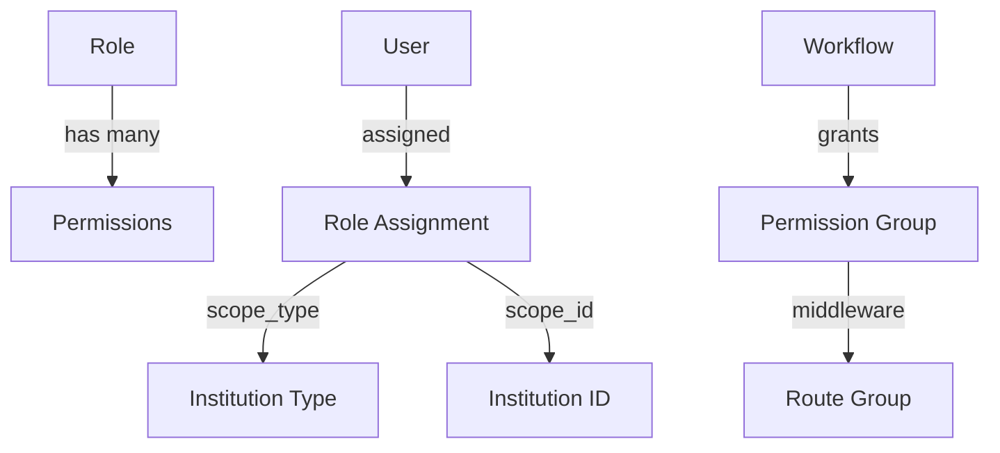

### Permission Groups

| Group | Key | Controls |
|-------|-----|----------|
| Academic Setup | `academic_setup` | Sessions, departments, streams, subjects |
| Accounts Room | `accounts_room` | Fee types, profiles, regulations, ledgers |
| Admission Cell | `admission_cell` | Applications, candidates, promotions |
| Office Registry | `office_registry` | Student/staff management |
| Service Branch | `service_branch` | Certificates |
| Info PR Hub | `info_pr_hub` | Notices, website, galleries |
| Redressal Cell | `redressal_cell` | Grievances, tickets |
| System Console | `system_console` | Roles, workflows, staff |
| Library | `library` | Books, issues, returns |
| Inventory | `inventory` | Items, movements, sales |
| Transport | `transport` | Routes, vehicles, drivers |
| Attendance | `attendance` | Mark attendance, reports |
| Timetable | `timetable` | Templates, builder |
| LMS | `lms` | Courses, classrooms |

### School vs College/Coaching/University Workflows

| Module | College/Coaching/University Workflow | School Workflow |
|--------|-----------------|-----------------|
| Core | `office_registry` | `office_registry_school` |
| Core | `system_console` | `system_console_school` |
| Academics | `academic_setup` | `academic_setup_school` |
| Fees | `accounts_room` | `accounts_room_school` |
| Admissions | `admission_cell` | `admission_cell_school` |
| Certificates | `service_branch` | `service_branch_school` |
| Portal | `student_portal` | `student_portal_school` |
| Parent | `parent_portal` | `parent_portal_school` |

> **Note:** Coaching uses the **base (higher-ed) workflow variants** — same as college and university.
> Only school gets the simplified `_school` suffix variants.

---

## 11. Deployment

### Environments

| Environment | URL Pattern | Method |
|-------------|-------------|--------|
| Local Dev | `*.lvh.me:18088` | Docker Compose |
| VPS/Staging | `*.pdseducation.in` | `ems.sh` + Podman Compose |
| Production | `*.pdseducation.app` | Kubernetes |

### 11.1 Shared vs Per-Institute Services (VPS)

| Service | Container Name | Scope | Notes |
|---------|---------------|-------|-------|
| PostgreSQL | `postgres-ems` | **Shared** | One instance, per-institute databases |
| PgBouncer | `pgbouncer-ems` | **Shared** | Connection pooling, routes to correct DB |
| Redis | `redis-ems` | **Shared** | Queues, cache, sessions |
| App | `ems-app-{id}` | Per-institute | PHP-FPM + Nginx |
| Reverb | `ems-reverb-{id}` | Per-institute | WebSocket server |
| Horizon | `ems-horizon-{id}` | Per-institute | Queue worker |
| Backup | per-institute | Per-institute | Each Laravel app backs up its own DB |

> **Key insight:** Shared services are managed via `/opt/ems/podman-compose.yml`. Per-institute app containers are deployed via `local-deploy.sh`. All containers share the same `ems-network`.

### Docker Images (Two Independent Images)

| Image | Dockerfile | Registry | Contains | Triggered by |
|-------|-----------|----------|----------|:------------:|
| **App** | `Dockerfile.prod` | `ghcr.io/.../ems` | Nginx + PHP-FPM + Frontend | `v-*` tags |
| **Horizon** | `Dockerfile.horizon` | `ghcr.io/.../ems-horizon` | PHP CLI + phpredis + FFmpeg | `horizon-v*` tags |

The Horizon image has its **own independent release cycle** — only rebuilt when background job code changes:

```bash
# Deploy app changes (UI, controllers, routes):
git tag v-pdseducation-2.5.0 && git push origin v-pdseducation-2.5.0
# → Rebuilds ONLY the app image

# Deploy queue/job changes (rare — new job, changed transcoding):
git tag horizon-v1.1.0 && git push origin horizon-v1.1.0
# → Rebuilds ONLY the Horizon image
```

### Deployment Flow

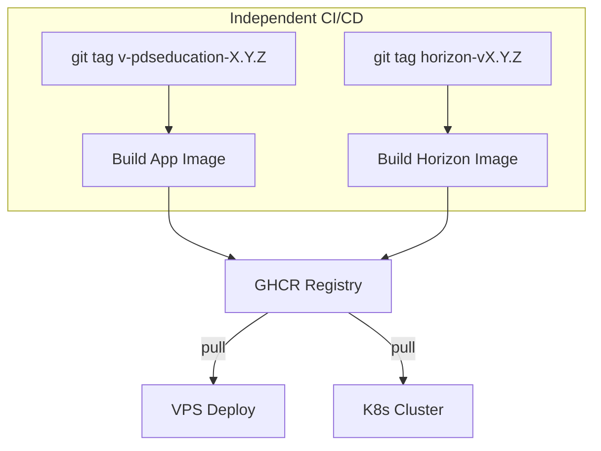

### Key Commands

```bash
# Local dev
docker compose up -d        # Start all (app + redis + horizon + pg)
docker compose logs horizon  # Horizon worker logs
docker compose down          # Stop

# Database
php artisan migrate
php artisan db:seed

# Queue / Horizon
php artisan horizon          # Run Horizon locally (without Docker)
php artisan horizon:status   # Check status
php artisan horizon:pause    # Pause workers
php artisan horizon:continue # Resume workers

# Frontend
npm run dev                 # Vite dev server
npm run build               # Production bundle

# Swagger
php artisan l5-swagger:generate
```

### VPS Deploy Commands

```bash
# Shared DB management (via ems.sh → option d)
podman start postgres-ems pgbouncer-ems redis-ems
podman exec pgbouncer-ems kill -HUP 1   # Reload PgBouncer config
podman logs postgres-ems                 # Shared Postgres logs

# Per-institute Horizon (graceful restart)
podman exec ems-horizon-pdseducation php artisan horizon:terminate
sleep 3 && podman restart ems-horizon-pdseducation

# Monitor shared Redis
podman exec redis-ems redis-cli info memory
podman exec redis-ems redis-cli llen queues:default
```

---

## 12. Multi-Organization & Multi-Account Architecture

### Organization → Institution Hierarchy

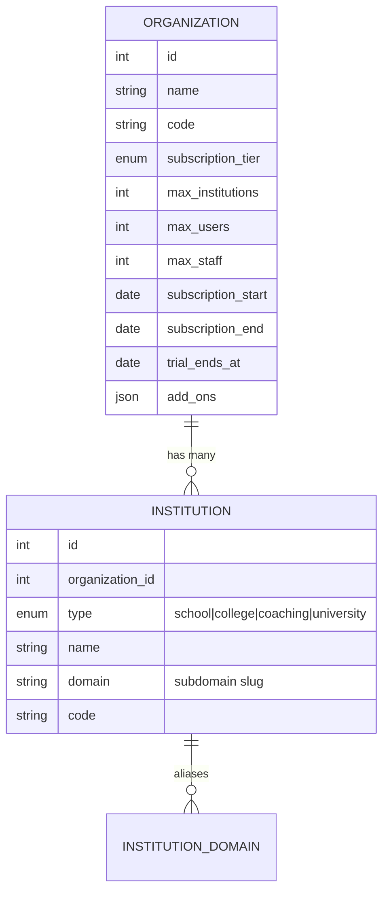

- **Organization** is the billing entity. One org can own multiple institutions (schools, colleges, etc.).
- **Institution** is the operational tenant. Each gets a unique `domain` slug → subdomain.
- **`organization_id`** ties every institution to its parent org for subscription checks.

### Multi-Account Flow (Same User, Multiple Institutions)

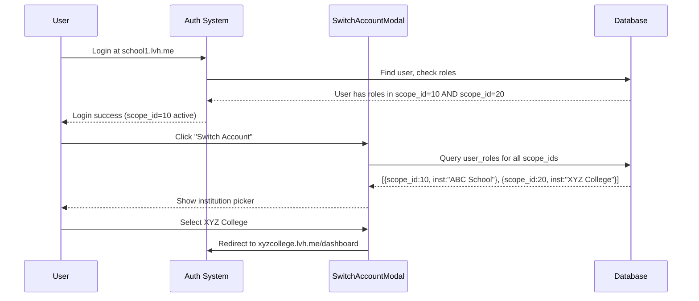

**Key Files:**
- `SwitchAccountModal.tsx` — UI for switching between institutions
- `User::roles()` — `belongsToMany` with `scope_type` and `scope_id` pivots
- `UserRole` model — stores `user_id`, `role_id`, `scope_type`, `scope_id`

### Scope Resolution

| `scope_type` | `scope_id` | Meaning |
|-------------|-----------|---------|
| `global` | `null` | Super admin, all institutions |
| `organization` | `org_id` | Org-level admin |
| `institution` | `inst_id` | Institution-specific role |

---

## 13. College & University Hierarchy (vs School)

### Hierarchy Comparison

```mermaid
flowchart TD
    subgraph "School (Simplified)"
    SI[Institution] --> SD[Department "Primary/Secondary"]
    SD --> SMS["Main Stream (Grade Group)"]
    SMS --> SS["Stream (Class 5A, 5B)"]
    SS --> SCR[Classroom]
    end

    subgraph "College (Full)"
    CI[Institution] --> CD["Department (CSE, ECE, MBA)"]
    CD --> CMS["Main Stream (B.Tech, M.Tech)"]
    CMS --> CS["Stream (B.Tech CSE Sem 1)"]
    CS --> CCR[Classroom]
    CS --> CSA[Subject Allocation]
    end

    subgraph "Coaching (Batch-Based)"
    COI[Institution] --> COD["Department (JEE, NEET, Foundation)"]
    COD --> COMS["Main Batch (JEE Programs)"]
    COMS --> COS["Batch (JEE-2026 Morning)"]
    COS --> COCR[Classroom]
    COS --> COSA[Subject Allocation]
    end

    subgraph "University (Multi-Campus)"
    UI[Organization] --> UC1["Campus 1 (Institution)"]
    UI --> UC2["Campus 2 (Institution)"]
    UC1 --> UD["Departments..."]
    UC2 --> UD2["Departments..."]
    end
```

### Differences by Institution Type

| Feature | School | College | **Coaching** | University |
|---------|--------|---------|--------------|-----------|
| Department | 1–2 (Primary, Secondary) | Many (CSE, ECE, MBA) | **Optional (JEE, NEET)** | Per-campus departments |
| Main Stream | Grade groups (1-5, 6-8) | Programs (B.Tech, M.Tech) | **Course Categories** | Programs per campus |
| Stream | Class sections (5A, 5B) | Semester/Year (CSE Sem 1) | **Batches (JEE-2026 AM)** | Semester/Year |
| Subject Groups | Fixed per grade | Elective groups | **PCM/PCB groups** | Elective + open electives |
| Admission Flow | Simple enroll | Application + merit | **Application + merit** | Multi-stage + entrance |
| Fee Structure | Annual/Monthly | Semester-wise | **Flexible (monthly/term)** | Semester + hostel + lab |
| Attendance | Daily roll call | Period-wise | **Daily per batch** | Period-wise + lab |
| Timetable | Fixed weekly | Semester rotation | **Batch-wise rotation** | Complex rotation |
| LMS | Basic classrooms | Full LMS + assignments | **Full LMS + tests** | LMS + research |

### How Institution Type Affects Code

```php
// In OnboardingController::mapModulesToWorkflows()
if ($instType === 'school') {
    $suffix = '_school';
} else {
    $suffix = ''; // college, coaching, university use base workflows
}

// This maps to different sidebar items, permission sets, and UI:
// 'accounts_room'       → college fee management
// 'accounts_room_school' → simplified school fee management
```

```typescript
// Frontend: constants/navigation.ts switches labels
// School: "Classes" | College: "Streams" | University: "Programs"
// School: "Class Teacher" | College: "Course Coordinator"
```

---

## 14. Auth & RBAC Deep Dive

### Authentication Flow

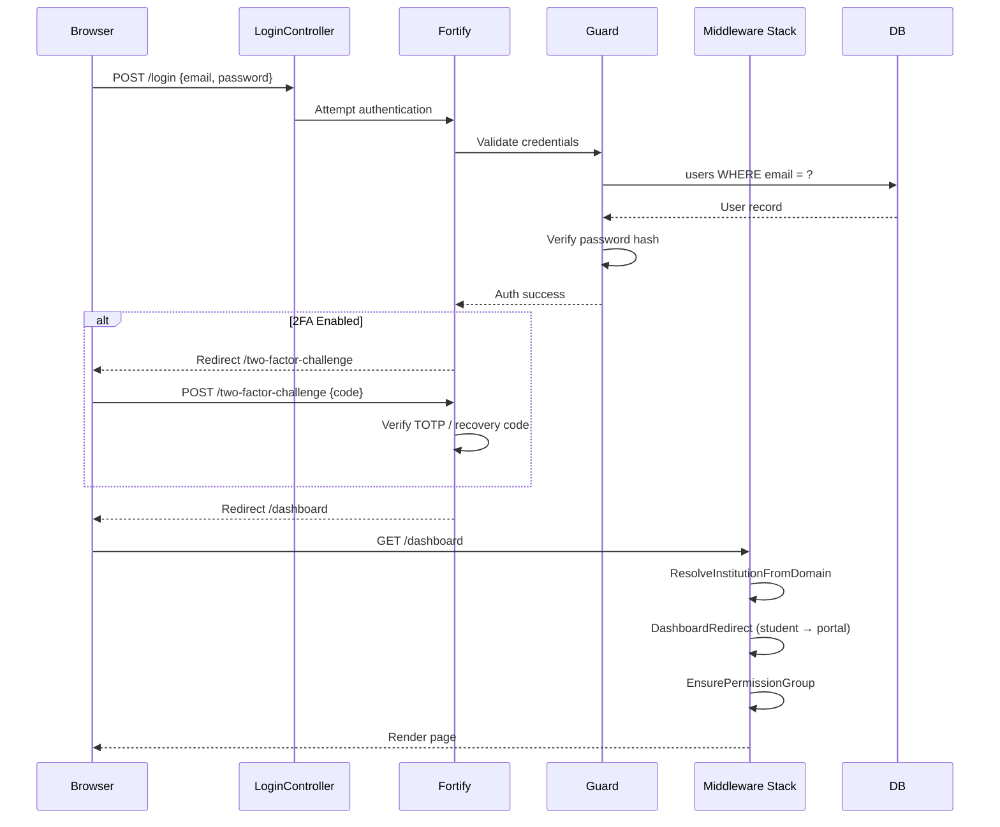

### Role-Based Access Control (RBAC) Model

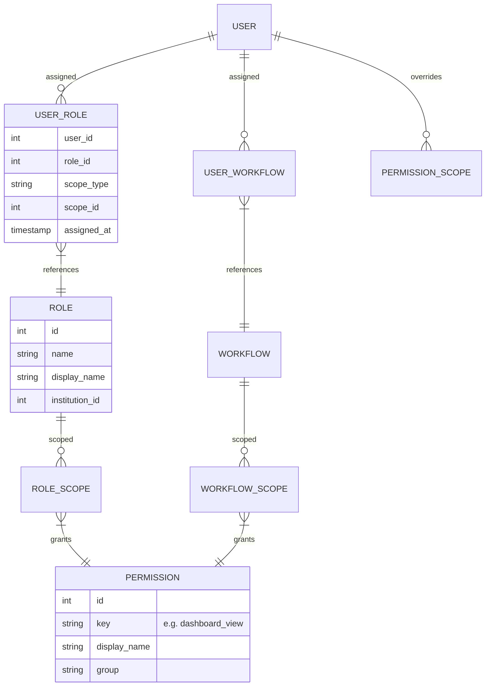

### Permission Resolution Algorithm

```php
// User::resolveEffectivePermissionKeys($institutionId)
// 1. Collect permissions from all assigned ROLES (scoped to institution)
// 2. Collect permissions from all assigned WORKFLOWS (scoped to institution)
// 3. Apply PERMISSION OVERRIDES (grant/revoke individual permissions)
// 4. Merge and deduplicate
// Result: flat array of permission keys ['dashboard_view', 'students_manage', ...]
```

### Built-in Role Types

| Role | Scope | Description |
|------|-------|-------------|
| `super_admin` | `global` | Platform-level access to all institutions |
| `organization_admin` | `organization` | Manages all institutions under one org |
| `institution_admin` | `institution` | Full access to a single institution |
| `teacher` | `institution` | View classes, mark attendance, LMS |
| `class_teacher` | `institution` | Manage assigned class students |
| `principal` | `institution` | View reports, approve certificates |
| `accountant` | `institution` | Fee management, payments |
| `student` | `institution` | Student portal access |
| `parent` | `institution` | Parent portal (view child data) |
| `librarian` | `institution` | Library management |
| `transport_manager` | `institution` | Transport routes, vehicles |

### Student Authentication (Separate Flow)

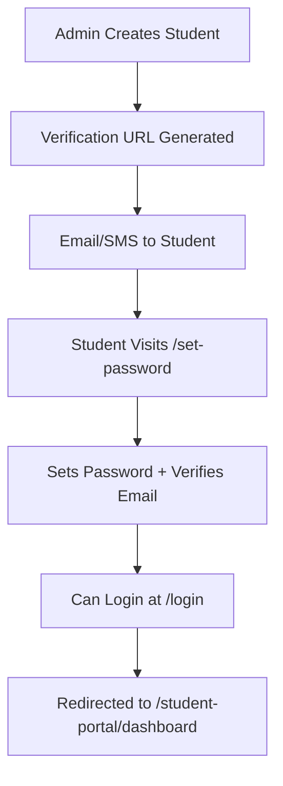

- **`StudentAuthController`**: Handles student-specific registration and password setup
- **`DashboardRedirect`** middleware: If user has `student` role → redirect to student portal

### Two-Factor Authentication

- Uses **TOTP** (Time-based One-Time Password) via Laravel Fortify
- Recovery codes generated at setup
- UI: `two-factor-setup-modal.tsx`, `two-factor-challenge.tsx`

---

## 15. Subscription Tiers & Feature Gating

### Tier Breakdown

| Feature | Foundation (₹1,499/mo) | Professional (₹3,999/mo) | Enterprise (₹7,999/mo) | Plus (₹14,999/mo) |
|---------|:---:|:---:|:---:|:---:|
| Max Institutions | 1 | 5 | 20 | Unlimited |
| Max Users | 100 | Unlimited | Unlimited | Unlimited |
| Max Staff | 5 | 50 | Unlimited | Unlimited |
| Storage | 1 GB | 25 GB | 100 GB | 500 GB |
| Emails/Month | 500 | 10,000 | Unlimited | Unlimited |
| AI Tokens/Month | — | 50,000 | 200,000 | 1,000,000 |

### Module Access by Tier

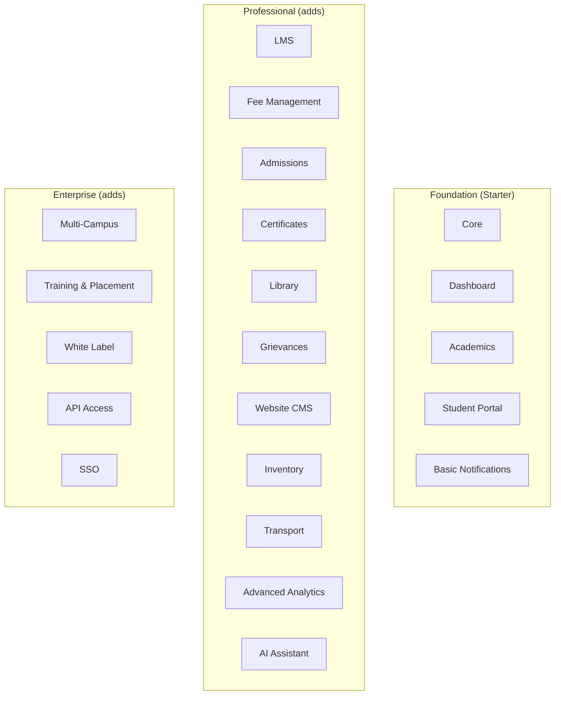

### How Feature Gating Works

```php
// CheckSubscription middleware
$org = $user->institution->organization;
$tier = $org->tier(); // SubscriptionTier enum

if (!$tier->hasModule('fee_management')) {
    return ApiErrorMap::respond('subscription.module_not_available');
}

// Frontend: sidebar items filtered by feature key
// constants/navigation.ts: { feature: 'fee_management', ... }
// hooks/use-navigation.ts: filters by user's tier modules
```

### Subscription Lifecycle

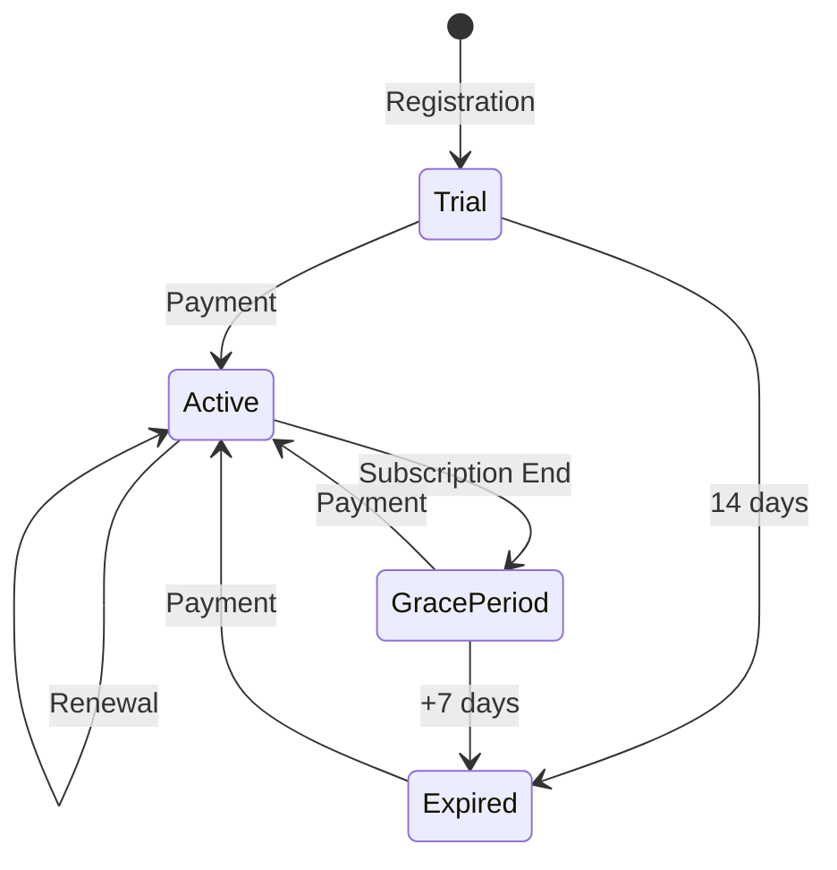

---

## 16. Fee Ledger Engine (Deep Dive)

### Complete Fee Flow

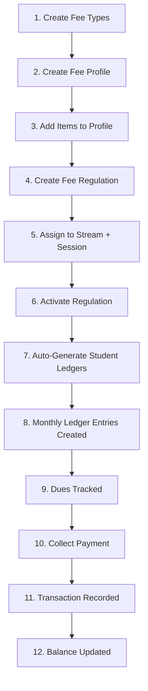

### Data Model

```mermaid
erDiagram
    FEE_TYPE ||--o{ FEE_REGULATION_PROFILE_ITEM : "used in"
    FEE_REGULATION_PROFILE ||--o{ FEE_REGULATION_PROFILE_ITEM : "contains"
    FEE_REGULATION_PROFILE ||--o{ FEE_STRUCTURE : "applied via"
    FEE_STRUCTURE }|--|| STREAM : "targets"
    FEE_STRUCTURE }|--|| SESSION : "for session"
    FEE_STRUCTURE ||--o{ FEE_STRUCTURE_RULE : "defines rules"
    STUDENT_PROFILE ||--o{ FEE_PAYMENT : "pays"
    FEE_PAYMENT }|--|| FEE_STRUCTURE : "against"
    FEE_PAYMENT ||--o{ TRANSACTION : "creates"

    FEE_TYPE {
        int id
        string name "Tuition|Lab|Library|Transport"
        int institution_id
        string frequency "monthly|quarterly|annually|one_time"
        decimal amount
    }
    FEE_REGULATION_PROFILE {
        int id
        string name "Standard Fee 2025"
        int institution_id
        int session_id
        boolean is_active
    }
    FEE_REGULATION_PROFILE_ITEM {
        int id
        int profile_id
        int fee_type_id
        decimal amount
        string frequency
    }
    FEE_STRUCTURE {
        int id
        int profile_id
        int stream_id
        int session_id
        boolean is_active
    }
    FEE_PAYMENT {
        int id
        int student_id
        int fee_structure_id
        decimal amount_paid
        string payment_mode
        string receipt_number
        date payment_date
    }
    TRANSACTION {
        int id
        int fee_payment_id
        string type "credit|debit"
        decimal amount
        json metadata
    }
```

### Frequency Types

| Frequency | Generation | Due Dates |
|-----------|-----------|-----------|
| `monthly` | 12 entries per year | 1st of each month |
| `quarterly` | 4 entries per year | Apr, Jul, Oct, Jan |
| `half_yearly` | 2 entries per year | Apr, Oct |
| `annually` | 1 entry per year | Apr (or session start) |
| `one_time` | At enrollment | Immediate |

### Ledger Generation Algorithm

```php
// When a FeeRegulation is activated:
// 1. Find all students in the regulation's Stream + Session
// 2. For each student:
//    a. Create StudentLedger record linking student → regulation
//    b. Based on frequency, generate MonthlyLedger entries
//    c. Each entry has: month, expected_amount, paid_amount=0, status=pending
// 3. When payment is collected:
//    a. Create FeePayment record
//    b. Create Transaction record
//    c. Update MonthlyLedger entries (oldest-first allocation)
//    d. Recalculate arrears and balance
```

### Dues & Overdue Detection

```mermaid
flowchart LR
    ML["Monthly Ledger Entry"] --> CHECK{"Current Date > Due Date?"}
    CHECK -- Yes --> OD["Mark OVERDUE"]
    CHECK -- No --> PENDING["Keep PENDING"]
    OD --> NOTIFY["Send Reminder"]
    NOTIFY --> SMS["SMS to Guardian"]
    NOTIFY --> EMAIL["Email to Student"]
```

### Key Controllers & Services

| File | Responsibility |
|------|---------------|
| `FeeTypeController` | CRUD fee types |
| `FeeRegulationProfileController` | CRUD profiles + items |
| `StudentLedgerController` | View student ledgers |
| `MonthlyLedgerController` | Generate & view monthly entries |
| `FeePaymentController` | Collect payments |
| `FeeDuesController` | List dues & overdue |
| `FeeCollectionSettingsController` | Configure due dates, late fees |

### Frontend Pages

| Page | Component | Description |
|------|-----------|-------------|
| Fee Types | `accounts/fee-hub/FeeTypes.tsx` | CRUD fee categories |
| Profiles | `accounts/fee-hub/Profiles.tsx` | Fee profile builder |
| Regulations | `accounts/fee-hub/Regulations.tsx` | Stream-session assignments |
| Class Regulation | `accounts/fee-hub/ClassRegulation.tsx` | Per-class regulation view |
| Student Ledgers | `accounts/fee-hub/StudentLedgers.tsx` | Student-wise ledger view |
| Dues & Overdue | `accounts/fee-hub/DuesOverdue.tsx` | Overdue tracking |
| Collection Settings | `accounts/fee-hub/FeeCollectionSettings.tsx` | Due dates, late fees |
| Analytics | `accounts/fee-hub/Analytics.tsx` | Fee collection dashboard |
| Payment Modal | `PaymentCollectModal.tsx` | Inline payment collection |
| Ledger Detail | `StudentLedgerDetail.tsx` | Month-wise breakdown |

---

## 17. LMS Architecture

### LMS Entity Relationships

```mermaid
erDiagram
    LMS_CLASS ||--o{ LMS_CLASS_ENROLLMENT : "enrolls"
    LMS_CLASS ||--o{ CLASS_SUBJECT_ALLOCATION : "teaches"
    LMS_CLASS ||--o{ LMS_ASSIGNMENT : "has"
    LMS_CLASS ||--o{ LMS_TEST : "has"
    LMS_CLASS ||--o{ LMS_MATERIAL : "resources"
    LMS_CLASS ||--o{ LMS_ANNOUNCEMENT : "posts"
    LMS_CLASS ||--o{ LMS_LIVE_SESSION : "schedules"
    LMS_ASSIGNMENT ||--o{ LMS_ASSIGNMENT_SUBMISSION : "submitted"
    LMS_TEST ||--o{ LMS_TEST_QUESTION : "contains"
    LMS_TEST ||--o{ LMS_TEST_ATTEMPT : "attempted"
    LMS_LIVE_SESSION ||--o{ LMS_RECORDING : "recorded"

    LMS_CLASS {
        int id
        int institution_id
        int stream_id
        int session_id
        string name "CSE 3rd Sem A"
        int created_by
    }
    LMS_ASSIGNMENT {
        int id
        int lms_class_id
        string title
        text description
        datetime due_date
        int max_marks
    }
    LMS_TEST {
        int id
        int lms_class_id
        string title
        int total_marks
        int duration_minutes
        datetime start_time
        datetime end_time
    }
```

### LMS Flow

```mermaid
flowchart TD
    ADMIN["Admin/Teacher"] --> CC["Create LMS Class"]
    CC --> LINK["Link to Stream + Session"]
    LINK --> ENROLL["Auto-Enroll Students"]
    ENROLL --> CONTENT["Add Content"]

    subgraph "Content Types"
    MAT["Materials (PDF, Video)"]
    ASG["Assignments"]
    TST["Tests/Quizzes"]
    ANN["Announcements"]
    LIVE["Live Sessions"]
    end

    CONTENT --> MAT
    CONTENT --> ASG
    CONTENT --> TST
    CONTENT --> ANN
    CONTENT --> LIVE

    ASG --> SUB["Student Submits"]
    TST --> ATT["Student Attempts"]
    LIVE --> REC["Session Recorded"]
    SUB --> GRADE["Teacher Grades"]
```

### Subject Allocation

```mermaid
flowchart LR
    CLASS["LMS Class"] --> SA["Subject Allocation"]
    SA --> SUB["Subject"]
    SA --> TEACH["Teacher (User)"]
    SA --> SLOT["Period Slots"]
    SLOT --> TT["Timetable Entry"]
```

- `ClassSubjectAllocation` implements `ScheduleableActivity` interface — it can be scheduled in timetables.
- Links `lms_class_id` → `subject_id` → `teacher_user_id`
- Drives both timetable and attendance tracking.

### Key Controllers

| Controller | Manages |
|-----------|---------|
| `LmsClassController` | Class CRUD, enrollment |
| `LmsCourseController` | Course catalog |
| `LmsAssignmentController` | Assignments + grading |
| `LmsTestController` | Tests + questions |
| `LmsTestQuestionController` | Question bank |
| `LmsTestAttemptController` | Student attempts |
| `LmsMaterialController` | Learning materials |
| `LmsLiveSessionController` | Live class scheduling |
| `LmsRecordingController` | Session recordings |
| `LmsAnnouncementController` | Class announcements |
| `ClassSubjectAllocationController` | Subject→Teacher mapping |
| `LmsClassEnrollmentController` | Student enrollment |

---

## 18. Complete Data Model Catalog

### Core Models (100+ total)

| Domain | Models |
|--------|--------|
| **Organization** | `Organization`, `Institution`, `InstitutionDomain` |
| **Academic** | `Department`, `MainStream`, `Stream`, `Session`, `Subject`, `SubjectCategory`, `SubjectCategoryMapping`, `SubjectGroup` |
| **Student** | `StudentProfile`, `StudentAcademicInfo`, `StudentAddress`, `StudentDocument`, `StudentPreviousExam`, `StudentTransition`, `StudentVerificationData` |
| **Staff** | `StaffProfile`, `User`, `Guardian` |
| **Auth** | `Role`, `RoleScope`, `Permission`, `PermissionScope`, `UserRole`, `Workflow`, `WorkflowScope` |
| **Fee** | `FeeType`, `FeeHead`, `FeeHeadStructure`, `FeeParticular`, `FeeRegulationProfile`, `FeeRegulationProfileItem`, `FeeStructure`, `FeeStructureRule`, `FeePayment`, `Transaction` |
| **Admission** | `AdmissionHead`, `AdmissionHeadPaper`, `AdmissionApplication`, `AdmissionApplicationSubject`, `AdmissionVerificationData`, `PromotionDetail`, `ReadmissionDetail` |
| **LMS** | `LmsClass`, `LmsCourse`, `LmsClassEnrollment`, `ClassSubjectAllocation`, `ClassFeeStructure`, `LmsAssignment`, `LmsAssignmentSubmission`, `LmsTest`, `LmsTestQuestion`, `LmsTestAttempt`, `LmsMaterial`, `LmsLiveSession`, `LmsRecording`, `LmsAnnouncement`, `Lesson`, `LessonProgress`, `CourseEnrollment`, `CourseSection` |
| **Attendance** | `AttendanceRecord` |
| **Timetable** | `Timetable`, `TimetableEntry`, `TimetableTemplate`, `PeriodSlot`, `Room`, `Substitution` |
| **Certificate** | `CertificateHead`, `CertificateApplication` |
| **Library** | `LibraryBook`, `LibraryCopy`, `LibraryIssue` |
| **Inventory** | `InventoryCategory`, `InventoryItem`, `InventoryLocation`, `InventoryMovement`, `InventorySale`, `InventorySaleLine` |
| **Transport** | `TransportRoute`, `TransportRouteStop`, `TransportStop`, `TransportVehicle`, `TransportDriver`, `TransportAssignment` |
| **Grievance** | `Grievance`, `Contact`, `Feedback`, `SupportTicket`, `SupportMessage` |
| **Website** | `HomeSlider`, `Gallery`, `GalleryImage`, `News`, `Notice`, `NoticeTarget`, `Ticker` |
| **System** | `Setting`, `AuditLog`, `ImportLog` |
| **Test Series** | `TestSeries`, `TestSeriesTest`, `TestSeriesResult` |
| **Doubt Forum** | `DoubtThread`, `DoubtReply` |
| **Question Bank** | `QuestionBankCategory`, `QuestionBankQuestion` |
| **Communications** | `SmsLog`, `AlertRule` |
| **Growth** | (DB-only: `entrance_tests`, `pyq_papers`, `demo_classes`, `faculty_feedbacks`, `installment_plans`) |
| **Video Engine** | `Video`, `Videoable` |

---

## 20. Coaching Platform Modules

> All coaching-specific modules are documented in detail in separate files.
> These modules use the **base (higher-ed) workflow variants** — same as college and university.

```mermaid
flowchart TD
    subgraph "Phase 0: Video Engine"
    VE["Video Upload + HLS Transcoding"]
    VE --> STREAM["Signed URL Streaming"]
    end

    subgraph "Phase 1: Test Series"
    TS["Curated Test Bundles"] --> ANALYTICS["Performance Analytics"]
    ANALYTICS --> LB["Leaderboards"]
    end

    subgraph "Phase 2: Doubt Forum + Question Bank"
    DF["Q&A Forum"] --> QA["Accept Best Answer"]
    QB["Multi-Type Question Bank"] --> PRACTICE["Practice Mode"]
    end

    subgraph "Phase 3: Communications"
    SMS["SMS Service (Msg91)"] --> ALERTS["Auto Alert Rules"]
    end

    subgraph "Phase 4: Growth"
    ET["Entrance Tests"] --> PYQ["PYQ Bank"]
    DC["Demo Classes"] --> FF["Faculty Feedback"]
    IP["Installment Plans"]
    end

    subgraph "Phase 5: Infrastructure"
    REDIS["Redis (shared: redis-ems)"] --> HORIZON["Laravel Horizon (per-institute)"]
    HORIZON --> QUEUES["Named Queue Workers"]
    end
```

| Phase | Module | Doc | Permissions | Endpoints |
|:-----:|--------|-----|:-----------:|:---------:|
| 0 | Video Streaming Engine | [video-engine.md](./video-engine.md) | 4 | 11 |
| 1 | Test Series & Analytics | [test-series.md](./test-series.md) | 9 | 10 |
| 2 | Doubt Forum | [doubt-forum.md](./doubt-forum.md) | 5 | 11 |
| 2 | Question Bank | [question-bank.md](./question-bank.md) | 4 | 11 |
| 3 | Communications & Alerts | [communications.md](./communications.md) | 4 | 8 |
| 4 | Growth Features | [growth-features.md](./growth-features.md) | 5 | 18 |
| 5 | Horizon + Redis | [horizon-redis.md](./horizon-redis.md) | — | — |

---

## 19. VPS Troubleshooting

### 19.1 `rootlessport: bind: address already in use`

**Error:**
```
Error: rootlessport listen tcp 0.0.0.0:8082: bind: address already in use
```

**Root Cause:** Podman rootless (`slirp4netns`/`pasta`) sometimes leaves orphaned kernel sockets after containers are removed. These sockets have **no owning process** — `fuser`, `ss -tlnp`, and `pkill rootlessport` cannot clear them. The socket inode is owned by UID 0 (root) at the kernel level.

**Automated Fix (built into `local-deploy.sh`):**
The deploy script now aggressively cleans orphaned containers and processes before binding. On each deploy it:
1. Detects if the configured port is occupied
2. Kills any stale container using that port (`podman stop` + `podman rm -f`)
3. Kills orphaned `rootlessport`/`conmon` processes via `pkill -9`
4. Cleans Podman runtime state (`podman system prune -f`)
5. Verifies port is free — if still occupied (kernel-level orphan), fails with a clear error

**Manual Fix (step-by-step):**

1. **Check what's holding the port:**
   ```bash
   ss -tlnp sport = :8082
   # Has "pid=..." → a container or process owns it (cleanable)
   # No "pid=..." → kernel-level orphan (needs reboot)
   ```

2. **Clean stale containers and processes:**
   ```bash
   # Kill any container on the port
   podman ps -a --format '{{.Names}} {{.Ports}}' | grep ':8082->' | awk '{print $1}' | xargs -r podman rm -f

   # Kill orphaned helper processes
   pkill -9 -u $(id -u) -f 'rootlessport|conmon'
   sleep 2

   # Clean runtime state
   podman system prune -f
   ```

3. **If port is STILL occupied** (kernel-level orphan — no PID):
   ```bash
   # Only a system reboot clears these. Ask VPS provider to reboot, then:
   cd /opt/ems && podman-compose up -d postgres-ems pgbouncer-ems redis-ems
   # Then deploy normally via ems.sh → option 4
   ```

**Prevention:** Always stop containers gracefully (`podman stop -t 5`) before removal. Avoid `podman kill` or force-killing container processes, as this is the most common cause of orphaned sockets in Podman rootless.

---

### 19.2 `Failed to parse dotenv file: ""PDS Education""`

**Error:**
```
The environment file is invalid!
Failed to parse dotenv file. Encountered unexpected whitespace at [""PDS Education""].
```

**Root Cause:** The wrong `.env` was pushed to VPS — typically the root `.env.example` (which has `APP_NAME="PDS Education"` with quotes) instead of the college-specific `.env` from `infra/podman/colleges/<college_id>/.env`. Double-quotes around values with spaces cause Laravel's dotenv parser to fail.

**Fix:**
```bash
# 1. Check which .env is on VPS
ssh deploy@<VPS_IP> "head -10 /opt/ems/colleges/<college_id>/.env"
# If you see APP_NAME="PDS Education" → wrong file!

# 2. Re-sync the correct .env (built into deploy script)
# Just re-run: ems.sh → option 4 → select college
# The deploy script auto-syncs the correct local .env to VPS.

# 3. Manual fix (if needed):
#    Edit infra/podman/colleges/<college_id>/.env locally,
#    remove quotes from values that don't need them:
#    APP_NAME=PDSEducation (not APP_NAME="PDSEducation")
#    Then re-deploy.
```

**Prevention:** The deploy script (`local-deploy.sh`) now always syncs the correct college-specific `.env` before every deploy. The `.env` sanitizer also strips infrastructure-specific vars (DB_HOST, passwords, etc.) and re-adds them with production values.

---

### 19.3 Nuclear Cleanup (Full Reset)

Use when containers are in a broken state and normal restart/remove doesn't work.

```bash
ssh deploy@<VPS_IP> bash -s <<'EOF'
# 1. Stop and remove ALL containers
podman stop -a -t 3 && podman rm -a -f

# 2. Kill orphaned child processes
pkill -9 -u $(id -u) -f 'conmon|crun|rootlessport|pasta' || true
sleep 2

# 3. Clean runtime state
rm -rf /run/user/$(id -u)/containers/* /tmp/containers-user-$(id -u)/* || true

# 4. Prune unused resources (keeps images)
podman system prune -f

# 5. Recreate network + infra
podman network create ems-network 2>/dev/null || true
cd /opt/ems && podman-compose up -d postgres-ems pgbouncer-ems redis-ems

# 6. Verify infra is healthy
sleep 5
podman exec --user postgres postgres-ems pg_isready -U postgres

# 7. Re-deploy app via ems.sh → option 4
EOF
```

> **⚠ Warning:** Nuclear cleanup removes ALL containers including other tenants (e.g., PDS Education). Re-deploy all tenants after cleanup.

---

### 19.4 Cloudflare Error 522 — Connection Timed Out

**Error:**
```
Error 522: Connection timed out
The initial connection between Cloudflare's network and the origin web server timed out.
```

**Root Cause:** Cloudflare's **SSL/TLS mode** determines which port it connects to on the origin:
- **Flexible** → HTTP port 80
- **Full / Full (Strict)** → HTTPS port 443

If the SSL mode is **Full** but Nginx on the VPS only listens on port 80 (HTTP), Cloudflare tries HTTPS on port 443 where nothing is listening → 522 timeout.

**Diagnosis:**
```bash
# 1. Check if anything listens on port 443
ssh deploy@<VPS_IP> "ss -tlnp sport = :443"
# Empty output = nothing on 443 → this is the problem

# 2. Verify Nginx serves the app correctly on port 80
ssh deploy@<VPS_IP> "curl -sf -H 'Host: pdseducation.tech' http://127.0.0.1:80/ -o /dev/null -w 'HTTP %{http_code}\n'"
# HTTP 200 = Nginx → app chain works on port 80

# 3. Check Nginx site config
ssh deploy@<VPS_IP> "sudo cat /etc/nginx/sites-available/ems-<college_id>"
```

**Fix — Add SSL to Nginx:**
```bash
ssh deploy@<VPS_IP> bash -s <<'EOF'
# Generate self-signed cert (valid for Cloudflare Full mode, 10 years)
sudo openssl req -x509 -nodes -days 3650 -newkey rsa:2048 \
  -keyout /etc/ssl/private/<college_id>.key \
  -out /etc/ssl/certs/<college_id>.crt \
  -subj "/CN=<domain>/O=<college_name>"

# Add SSL server block to Nginx config
# (keep existing port 80 block, add port 443 block with same proxy_pass)
sudo tee -a /etc/nginx/sites-available/ems-<college_id> > /dev/null <<'NGINX'

server {
    listen 443 ssl;
    listen [::]:443 ssl;
    server_name <domain> www.<domain>;
    ssl_certificate /etc/ssl/certs/<college_id>.crt;
    ssl_certificate_key /etc/ssl/private/<college_id>.key;
    ssl_protocols TLSv1.2 TLSv1.3;
    ssl_ciphers HIGH:!aNULL:!MD5;
    location / {
        proxy_pass http://127.0.0.1:<APP_PORT>;
        proxy_http_version 1.1;
        proxy_set_header Host $host;
        proxy_set_header X-Real-IP $remote_addr;
        proxy_set_header X-Forwarded-For $proxy_add_x_forwarded_for;
        proxy_set_header X-Forwarded-Proto https;
        proxy_set_header X-Forwarded-Host $host;
        proxy_connect_timeout 10s;
        proxy_send_timeout 60s;
        proxy_read_timeout 60s;
        client_max_body_size 100M;
        proxy_buffer_size 128k;
        proxy_buffers 4 256k;
        proxy_busy_buffers_size 256k;
    }
}
NGINX

sudo nginx -t && sudo nginx -s reload
EOF
```

**Verify:**
```bash
# HTTPS should work locally
ssh deploy@<VPS_IP> "curl -sf -k https://127.0.0.1/ -H 'Host: <domain>' -o /dev/null -w 'HTTPS: HTTP %{http_code}\n'"

# Cloudflare should return 200
curl -sf https://<domain>/ -o /dev/null -w "Cloudflare: HTTP %{http_code}\n"
```

**Firewall:** Only ports 22, 80, and 443 should be open in UFW. App ports (8082, 8083, etc.) should **NOT** be exposed — all traffic flows through Nginx.

**Prevention:** When setting up a new college tenant, always create the Nginx SSL config at the same time as the HTTP config. The self-signed cert works with Cloudflare **Full** mode. For **Full (Strict)**, generate a Cloudflare Origin CA cert from the Cloudflare dashboard instead.

---

## 20. Quick Reference Links

| Resource | URL |
|----------|-----|
| **Swagger API Docs** | [/api/documentation](/api/documentation) |
| **Dev Docs Hub** | [/dev-docs/](/dev-docs/) |
| **Adminer (DB)** | [localhost:18090](http://localhost:18090) |
| **Vite Dev Server** | [localhost:15173](http://localhost:15173) |
| **School Workflow Guide** | [docs/school-workflows.md](./school-workflows.md) |
| **Coaching Workflow Guide** | [docs/coaching-workflows.md](./coaching-workflows.md) |
| **Video Engine Guide** | [docs/video-engine.md](./video-engine.md) |
| **Test Series Guide** | [docs/test-series.md](./test-series.md) |
| **Doubt Forum Guide** | [docs/doubt-forum.md](./doubt-forum.md) |
| **Question Bank Guide** | [docs/question-bank.md](./question-bank.md) |
| **Communications Guide** | [docs/communications.md](./communications.md) |
| **Growth Features Guide** | [docs/growth-features.md](./growth-features.md) |
| **Horizon + Redis Guide** | [docs/horizon-redis.md](./horizon-redis.md) |
| **Deployment Guide** | [docs/deployment-guide.md](./deployment-guide.md) |
| **Server Hardening Guide** | [docs/server-hardening.md](./server-hardening.md) |

---

## Unified Notification Factory (Software Factory Pattern)

> **Concept:** Every notification flows through a **config-driven pipeline** that decides which channels to use (push, email, SMS, WhatsApp) based on notification type. Adding or removing a channel for any notification = **one config line change**.

### Architecture Overview

```mermaid
flowchart TD
    TRIGGER["Controller / Event / Job"] -->|"$user->notify(new SomeNotification(...))"| NOTIF["Notification Class"]
    NOTIF --> TRAIT["NotifiesViaChannelMatrix trait"]
    TRAIT -->|"reads config/notifications.php"| CONFIG["Channel Matrix Config"]
    CONFIG --> FILTER{"isConfigured() check"}
    FILTER -->|"env keys missing → skip"| SAFE["Silently skip channel"]
    FILTER -->|"configured"| MAP["ChannelMap::resolveMany()"]
    MAP --> DB["database"]
    MAP --> BC["broadcast (WebSocket)"]
    MAP --> PUSH["WebPushChannel"]
    MAP --> MAIL["mail"]
    MAP --> SMS["SmsChannel → SmsService → SendSmsJob → Msg91"]
    MAP --> WA["WhatsappChannel → WhatsappService → SendWhatsappJob → Msg91"]
    SMS --> WEBHOOK1["Msg91 Webhook → SmsLog update"]
    WA --> WEBHOOK2["Msg91 Webhook → WhatsappLog update"]
```

### Notification Dispatch Sequence

```mermaid
sequenceDiagram
    participant C as Controller/Event/Job
    participant N as Notification Class
    participant T as NotifiesViaChannelMatrix
    participant CF as config/notifications.php
    participant CM as ChannelMap
    participant SC as SmsChannel
    participant SS as SmsService
    participant J as SendSmsJob
    participant P as Msg91 API
    participant L as SmsLog

    C->>N: $user->notify(new FeeReminder(...))
    N->>T: via($notifiable)
    T->>CF: config('notifications.channels.fee_due_reminder')
    CF-->>T: ['database','broadcast','push','mail','sms','whatsapp']
    T->>T: Filter by isConfigured()
    T->>CM: resolveMany(['database','broadcast','push','sms'])
    CM-->>T: [database, broadcast, WebPushChannel, SmsChannel]
    Note over T: Laravel dispatches to each channel
    T->>SC: send($notifiable, $notification)
    SC->>N: toSms($notifiable)
    N-->>SC: {phone, message, template_id, ...}
    SC->>SS: send(institutionId, sentBy, phone, ...)
    SS->>L: SmsLog::create(status: 'queued')
    SS->>J: SendSmsJob::dispatch($log)
    J->>P: HTTP POST (Msg91 API)
    P-->>J: {request_id: 'msg91-abc'}
    J->>L: update(status: 'sent', provider_id)
    Note over P,L: Webhook later updates to 'delivered'
```

### Channel Matrix

The single source of truth lives in `config/notifications.php` → `channels`:

| Notification Type | Push | Email | SMS | WhatsApp | Urgency |
|---|:---:|:---:|:---:|:---:|---|
| `fee_due_reminder` | ✅ | ✅ | ✅ | ✅ | 🔴 Critical |
| `fee_overdue_reminder` | ✅ | ✅ | ✅ | ✅ | 🔴 Critical |
| `fee_payment_receipt` | ✅ | ✅ | — | ✅ | 🔴 Critical |
| `attendance_marked` | ✅ | — | ✅ | ✅ | 🔴 Critical |
| `admission_application_submitted` | ✅ | — | ✅ | ✅ | 🟠 High |
| `admission_status_changed` | ✅ | — | ✅ | ✅ | 🟠 High |
| `admission_payment_recorded` | ✅ | — | — | ✅ | 🟠 High |
| `lms_live_session_scheduled` | ✅ | — | — | ✅ | 🟡 Medium |
| `lms_announcement_created` | ✅ | — | — | ✅ | 🟡 Medium |
| `public_notice` | ✅ | — | — | ✅ | 🟡 Medium |
| `lms_material_created` | ✅ | — | — | — | 🟢 Low |
| `lms_assignment_created` | ✅ | — | — | — | 🟢 Low |
| `lms_test_created` | ✅ | — | — | — | 🟢 Low |
| `lms_recording_added` | ✅ | — | — | — | 🟢 Low |
| `class_updated` | ✅ | — | — | — | 🟢 Low |
| `staff_invitation` | ✅ | ✅ | — | — | 🟠 High |
| `support_ticket` | ✅ | — | — | — | 🟢 Low |
| `test` | ✅ | — | — | — | — |

Fee receipt email lines are generated from the same `FinancialDocument` assembly as the PDF; see `docs/financial-documents.md`. SMS/WhatsApp templates remain DLT-driven in `config/notifications.php`.

### SMS / WhatsApp Message Lifecycle

```mermaid
stateDiagram-v2
    [*] --> queued: SmsService::send() / WhatsappService::send()
    queued --> sent: SendSmsJob / SendWhatsappJob dispatches to Msg91
    sent --> delivered: Msg91 webhook confirms delivery
    sent --> failed: Msg91 webhook reports failure
    delivered --> read: WhatsApp read receipt (WhatsApp only)
    queued --> failed: Job fails after 3 retries
    failed --> [*]
    read --> [*]
    delivered --> [*]

    note right of queued
        SmsLog / WhatsappLog created
        Job dispatched to Redis queue
    end note

    note right of failed
        Error logged
        Other channels still deliver
    end note
```

### Safety Layers (Fallback When Env Keys Missing)

The factory has **3 layers of protection** — if SMS/WhatsApp env keys aren't set, nothing breaks:

```mermaid
flowchart TD
    N["Notification dispatched"] --> L1{"Layer 1: Trait\nisConfigured()?"}
    L1 -->|"No env keys"| SKIP1["Channel removed from via() array\n❌ No job created"]
    L1 -->|"Keys exist"| L2{"Layer 2: Channel\nisConfigured()?"}
    L2 -->|"Still not configured"| SKIP2["Channel::send() returns early\n❌ No job created"]
    L2 -->|"Configured"| L3["Layer 3: try/catch\naround service call"]
    L3 -->|"API error"| LOG["Log warning, continue\n✅ Other channels still deliver"]
    L3 -->|"Success"| SENT["✅ Message queued"]
```

| Layer | Where | What it does |
|---|---|---|
| **Layer 1** | `NotifiesViaChannelMatrix::via()` | Filters out `'sms'`/`'whatsapp'` from channel list if `isConfigured()` returns false |
| **Layer 2** | `SmsChannel::send()` / `WhatsappChannel::send()` | Double-checks config before calling service (guard) |
| **Layer 3** | `try/catch` block in each channel | If provider API fails, logs warning — other channels still deliver |

**`isConfigured()` checks:**

| Service | Returns `true` when |
|---|---|
| `SmsService::isConfigured()` | `SMS_MSG91_AUTH_KEY` env var is set |
| `WhatsappService::isConfigured()` | `WHATSAPP_MSG91_AUTH_KEY` AND `WHATSAPP_MSG91_INTEGRATED_NUMBER` are set |

### Class Structure

```mermaid
classDiagram
    class Notification {
        +via(notifiable) array
        +toArray(notifiable) array
        +toWebPush(notifiable) WebPushMessage
    }

    class NotifiesViaChannelMatrix {
        +string notificationType
        +via(notifiable) array
    }

    class ChannelMap {
        +resolveMany(channels) array$
        +resolve(channel) string$
    }

    class SmsChannel {
        +send(notifiable, notification) void
    }

    class WhatsappChannel {
        +send(notifiable, notification) void
    }

    class SmsService {
        +isConfigured() bool$
        +send(...) SmsLog
        +sendBulk(...) array
        +processAlertRule(rule, recipients) int
    }

    class WhatsappService {
        +isConfigured() bool$
        +send(...) WhatsappLog
        +sendBulk(...) array
        +processAlertRule(rule, recipients) int
    }

    class FeeDueReminderNotification {
        +notificationType = fee_due_reminder
        +toArray(notifiable) array
        +toWebPush(notifiable) WebPushMessage
        +toSms(notifiable) array
        +toWhatsapp(notifiable) array
    }

    Notification <|-- FeeDueReminderNotification
    FeeDueReminderNotification ..> NotifiesViaChannelMatrix : uses trait
    NotifiesViaChannelMatrix ..> ChannelMap : resolves channels
    ChannelMap ..> SmsChannel : maps sms
    ChannelMap ..> WhatsappChannel : maps whatsapp
    SmsChannel --> SmsService : delegates
    WhatsappChannel --> WhatsappService : delegates
```

### How to Add Notifications to a New Feature

#### Step 1: Register in config

```php
// config/notifications.php

// In 'registry' → add metadata
'library_book_due' => [
    'type' => 'library_book_due',
    'notification_class' => \App\Notifications\LibraryBookDueNotification::class,
    'trigger' => 'LibraryController::issueReminder',
    'recipients' => 'Student who borrowed the book',
],

// In 'channels' → decide which channels
'library_book_due' => ['database', 'broadcast', 'push', 'sms', 'whatsapp'],

// In 'sms_templates' → add if using SMS
'library_book_due' => env('SMS_TPL_LIBRARY_DUE', ''),

// In 'whatsapp_templates' → add if using WhatsApp
'library_book_due' => env('WA_TPL_LIBRARY_DUE', 'library_due_v1'),
```

#### Step 2: Create the Notification class

```php
<?php
namespace App\Notifications;

use App\Traits\NotifiesViaChannelMatrix;
use Illuminate\Bus\Queueable;
use Illuminate\Contracts\Queue\ShouldQueue;
use Illuminate\Notifications\Notification;
use NotificationChannels\WebPush\WebPushMessage;

class LibraryBookDueNotification extends Notification implements ShouldQueue
{
    use NotifiesViaChannelMatrix, Queueable;

    // ⚠️ MUST match config key in notifications.channels
    public string $notificationType = 'library_book_due';

    public function __construct(
        public string $bookTitle,
        public string $dueDate,
        public int $institutionId
    ) {}

    // Required — stored in database
    public function toArray(object $notifiable): array
    {
        return [
            'type' => 'library_book_due',
            'title' => 'Book return reminder',
            'body' => "Please return \"{$this->bookTitle}\" by {$this->dueDate}.",
            'url' => '/library/my-books',
        ];
    }

    // Required — push notification
    public function toWebPush(object $notifiable, Notification $notification): WebPushMessage
    {
        return (new WebPushMessage)
            ->title('Book return reminder')
            ->body("Return \"{$this->bookTitle}\" by {$this->dueDate}")
            ->data(['url' => '/library/my-books', 'type' => 'library_book_due']);
    }

    // Only needed if 'sms' is in your channel config
    public function toSms(object $notifiable): array
    {
        return [
            'phone'          => $notifiable->phone ?? $notifiable->mobile ?? '',
            'message'        => "Library: Return \"{$this->bookTitle}\" by {$this->dueDate}.",
            'institution_id' => $this->institutionId,
            'category'       => 'library',
            'template_id'    => config('notifications.sms_templates.library_book_due'),
        ];
    }

    // Only needed if 'whatsapp' is in your channel config
    public function toWhatsapp(object $notifiable): array
    {
        return [
            'phone'          => $notifiable->phone ?? $notifiable->mobile ?? '',
            'message'        => "Library: Return \"{$this->bookTitle}\" by {$this->dueDate}.",
            'template_name'  => config('notifications.whatsapp_templates.library_book_due', 'library_due_v1'),
            'institution_id' => $this->institutionId,
            'category'       => 'library',
        ];
    }
}
```

#### Step 3: Fire it

```php
// In your controller, service, or anywhere
$student->notify(new LibraryBookDueNotification('Algorithms', '25 Mar 2026', $institutionId));
```

### Three Trigger Patterns

```mermaid
flowchart LR
    subgraph P1["Pattern 1: Direct"]
        C1["Controller"] -->|"$user->notify(...)"| N1["Notification"]
    end

    subgraph P2["Pattern 2: Event-Driven"]
        C2["Controller A"] -->|"event(...)"| E["Event"]
        C3["Controller B"] -->|"event(...)"| E
        E --> L["Listener"]
        L -->|"$user->notify(...)"| N2["Notification"]
    end

    subgraph P3["Pattern 3: Scheduled Job"]
        S["Scheduler"] -->|"dailyAt 08:00"| J["Job"]
        J -->|"loop recipients"| N3["Notification"]
    end

    N1 --> F["Notification Factory"]
    N2 --> F
    N3 --> F
    F --> CH["Push + Email + SMS + WhatsApp"]
```

#### Pattern 1: Direct (simple, one place triggers it)

```php
// In your controller
$student->notify(new LibraryBookDueNotification('Algorithms', '25 Mar 2026', $institutionId));
```

#### Pattern 2: Event-driven (multiple places fire same notification)

```php
// 1. Create Event
class BookIssued {
    public function __construct(
        public User $student,
        public string $bookTitle,
        public string $dueDate,
        public int $institutionId
    ) {}
}

// 2. Create Listener
class SendBookIssuedNotification {
    public function handle(BookIssued $event): void {
        $event->student->notify(new LibraryBookDueNotification(
            $event->bookTitle, $event->dueDate, $event->institutionId
        ));
    }
}

// 3. Register in EventServiceProvider
protected $listen = [
    BookIssued::class => [SendBookIssuedNotification::class],
];

// 4. Fire from anywhere
event(new BookIssued($student, 'Algorithms', '25 Mar 2026', $institutionId));
```

#### Pattern 3: Scheduled Job (time-based, automated reminders)

```php
// Job dispatched by scheduler (app/Console/Kernel.php)
class SendLibraryRemindersJob implements ShouldQueue {
    public function handle(): void {
        $overdueIssues = LibraryIssue::overdue()->with('user')->get();
        foreach ($overdueIssues as $issue) {
            $issue->user->notify(new LibraryBookDueNotification(
                $issue->book->title,
                $issue->due_date->format('d M Y'),
                $issue->institution_id
            ));
        }
    }
}

// In Kernel.php
$schedule->job(new SendLibraryRemindersJob)->dailyAt('08:00');
```

### `toSms()` Return Array Reference

| Key | Type | Required | Description |
|---|---|---|---|
| `phone` | `string` | ✅ | Recipient phone (with country code). Falls back gracefully if empty. |
| `message` | `string` | ✅ | SMS body text |
| `institution_id` | `int` | ✅ | For quota tracking |
| `category` | `?string` | — | Grouping key (`fee_reminder`, `attendance`, `admission`, etc.) |
| `template_id` | `?string` | — | Msg91 DLT template ID |
| `recipient_name` | `?string` | — | For SmsLog (display purposes) |
| `recipient_user_id` | `?int` | — | For SmsLog → User relationship |
| `sent_by` | `?int` | — | Defaults to `$notifiable->id` |

### `toWhatsapp()` Return Array Reference

| Key | Type | Required | Description |
|---|---|---|---|
| `phone` | `string` | ✅ | Recipient phone (with country code) |
| `message` | `string` | ✅ | WhatsApp message body |
| `template_name` | `string` | ✅ | Meta-approved template name (e.g., `fee_reminder_v1`) |
| `institution_id` | `int` | ✅ | For quota tracking |
| `category` | `?string` | — | Grouping key |
| `media_url` | `?string` | — | URL to media file (PDF, image, etc.) |
| `media_type` | `?string` | — | Media type (`image`, `document`, `video`) |
| `recipient_name` | `?string` | — | For WhatsappLog |
| `recipient_user_id` | `?int` | — | For WhatsappLog → User relationship |

### Edge Cases & Gotchas

#### 1. Missing phone number

If `toSms()` or `toWhatsapp()` returns an empty `phone`, the channel **skips silently** (no error):

```php
public function toSms(object $notifiable): array {
    return [
        'phone' => $notifiable->phone ?? $notifiable->mobile ?? '', // ← empty = skipped
        // ...
    ];
}
```

#### 2. Quota exceeded

When SMS/WhatsApp monthly or daily quota is exceeded, `SmsQuotaExceededException` is thrown. The channel catches it and logs a warning — other channels still deliver.

Quotas are per-institution (in `institutions` table):

| Column | Default | Description |
|---|---|---|
| `sms_monthly_quota` | 1000 | Monthly SMS limit |
| `sms_daily_limit` | 200 | Daily SMS limit |
| `whatsapp_monthly_quota` | 500 | Monthly WhatsApp limit |
| `whatsapp_daily_limit` | 100 | Daily WhatsApp limit |

#### 3. WhatsApp requires pre-approved templates

WhatsApp Business API (via Msg91) requires Meta-approved templates. You **cannot** send freeform messages. Define templates in `config/notifications.php` → `whatsapp_templates` and get them approved in the Msg91 dashboard.

#### 4. Notification not reaching SMS/WhatsApp

**Checklist:**

1. Is the notification type key in `config/notifications.php` → `channels`?
2. Does the channels array include `'sms'` / `'whatsapp'`?
3. Does the notification class have `toSms()` / `toWhatsapp()` method?
4. Does `$notificationType` property match the config key exactly?
5. Are env keys set? (`SMS_MSG91_AUTH_KEY`, `WHATSAPP_MSG91_AUTH_KEY`, etc.)
6. Is the `$notifiable` user's `phone` or `mobile` field populated?
7. Is the institution's quota not exceeded?

#### 5. Adding a channel to an existing notification (zero downtime)

```php
// config/notifications.php → channels
// Before:
'lms_material_created' => ['database', 'broadcast', 'push'],
// After:
'lms_material_created' => ['database', 'broadcast', 'push', 'whatsapp'],
```

Then add `toWhatsapp()` method to `LmsMaterialCreatedNotification.php`. That's it — live instantly after deploy.

#### 6. Removing a channel

Just remove from config. No code changes needed (the `toSms()` method can stay — it won't be called):

```php
'attendance_marked' => ['database', 'broadcast', 'push', 'whatsapp'], // removed 'sms'
```

#### 7. OTP uses the SMS factory

`OtpService` routes through `SmsService` so every OTP appears in `sms_logs`. If `SmsService` fails (e.g., no env keys), it falls back to the legacy 2Factor API.

#### 8. AlertRuleEngine channel routing

Alert rules dispatch to SMS, WhatsApp, or both based on the `channel` field:

```php
$engine = app(AlertRuleEngine::class);
$engine->processEvent($institutionId, 'fee_overdue', [
    'recipients' => [
        ['phone' => '919876543210', 'name' => 'Guardian', 'variables' => ['amount' => '5000']],
    ],
]);
// Rule with channel='both' → sends via SmsService AND WhatsappService
```

### Environment Variables

| Variable | Required For | Example |
|---|---|---|
| `SMS_PROVIDER` | SMS | `msg91` |
| `SMS_MSG91_AUTH_KEY` | SMS | `your_msg91_auth_key` |
| `SMS_MSG91_DEFAULT_TEMPLATE` | SMS | `default_template_id` |
| `SMS_WEBHOOK_SECRET` | SMS DLR | `your_webhook_secret` |
| `WHATSAPP_PROVIDER` | WhatsApp | `msg91` |
| `WHATSAPP_MSG91_AUTH_KEY` | WhatsApp | `your_msg91_auth_key` |
| `WHATSAPP_MSG91_INTEGRATED_NUMBER` | WhatsApp | `919876543210` |
| `WHATSAPP_WEBHOOK_SECRET` | WhatsApp DLR | `your_webhook_secret` |
| `SMS_TPL_FEE_DUE` | Fee SMS | Msg91 DLT template ID |
| `SMS_TPL_FEE_OVERDUE` | Fee SMS | Msg91 DLT template ID |
| `SMS_TPL_ATTENDANCE` | Attendance SMS | Msg91 DLT template ID |
| `WA_TPL_FEE_DUE` | Fee WhatsApp | `fee_reminder_v1` |
| `WA_TPL_ATTENDANCE` | Attendance WhatsApp | `attendance_alert_v1` |

### Key Files Index

| File | Purpose |
|---|---|
| `config/notifications.php` | Channel matrix + registry + template maps |
| `app/Traits/NotifiesViaChannelMatrix.php` | Config-driven `via()` with safety guards |
| `app/Support/ChannelMap.php` | Maps string keys → channel classes |
| `app/Channels/SmsChannel.php` | Laravel channel → SmsService bridge |
| `app/Channels/WhatsappChannel.php` | Laravel channel → WhatsappService bridge |
| `app/Services/SmsService.php` | SMS factory (Msg91 provider, quota, logging) |
| `app/Services/WhatsappService.php` | WhatsApp factory (Msg91, templates, media) |
| `app/Jobs/SendSmsJob.php` | Queued SMS dispatch (3 retries) |
| `app/Jobs/SendWhatsappJob.php` | Queued WhatsApp dispatch (3 retries) |
| `app/Services/AlertRuleEngine.php` | Channel-aware alert rule processing |
| `app/Services/OtpService.php` | OTP via SmsService (with 2Factor fallback) |
| `app/Models/SmsLog.php` | SMS delivery log model |
| `app/Models/WhatsappLog.php` | WhatsApp delivery log model |
| `app/Http/Controllers/Api/V1/Communications/` | SMS/WhatsApp logs, stats, send endpoints |

---

## 22. AI Assistant Module (SutraAI Integration)

> **Subscription Required:** `ai_assistant` module (Professional tier and above)

### Architecture Overview

```mermaid
flowchart TD
    FE["Frontend Components"] -->|POST /api/v1/ai/*| MW["CheckAiAccess Middleware"]
    MW -->|Subscription + Config Check| CTRL["AiController"]
    CTRL -->|Quota Check| BASE["SutracodeAiClient"]
    BASE -->|HTTP| ENGINE["SutraAI Engine :8090"]
    CTRL -->|Log Usage| DB1[("ai_usage_logs")]
    CTRL -->|Link Thread| DB2[("ai_conversations")]

    subgraph "Specialized Services"
        BASE --> S1["AiChatService"]
        BASE --> S2["AiAgentService"]
        BASE --> S3["AiContentService"]
        BASE --> S4["AiIntelligenceService"]
        BASE --> S5["AiVoiceService"]
        BASE --> S6["AiRagService"]
    end
```

### Service Architecture

All AI services extend `SutracodeAiClient`, which handles:
- **Authentication** via `Bearer` token from `config('services.sutra_ai.api_key')`
- **Timeouts** (30s connect, 120s read)
- **Retries** (2 retries on 5xx errors)
- **Quota Enforcement** against `SubscriptionTier::maxAiTokensPerMonth()`
- **Usage Logging** to `ai_usage_logs` table
- **Institution Isolation** via `external_user_id`

| Service | File | Capabilities |
|---------|------|--------------|
| `SutracodeAiClient` | `app/Services/Ai/SutracodeAiClient.php` | Base HTTP client (auth, quota, logging) |
| `AiChatService` | `app/Services/Ai/AiChatService.php` | Chat completions, conversation threads |
| `AiAgentService` | `app/Services/Ai/AiAgentService.php` | Run specialized agents (single + batch) |
| `AiContentService` | `app/Services/Ai/AiContentService.php` | Email templates, content repurposing, landing pages |
| `AiIntelligenceService` | `app/Services/Ai/AiIntelligenceService.php` | Sentiment analysis, language detection, SEO audit |
| `AiVoiceService` | `app/Services/Ai/AiVoiceService.php` | Audio transcription, voice-to-agent, TTS |
| `AiRagService` | `app/Services/Ai/AiRagService.php` | Document upload, knowledge base queries |

### API Endpoints

All routes under `/api/v1/ai/` require `CheckAiAccess` middleware:

| Method | Endpoint | Handler | Description |
|--------|----------|---------|-------------|
| POST | `/ai/chat` | `AiController@chat` | Chat completion with agent type |
| POST | `/ai/agents/{type}/run` | `AiController@runAgent` | Run a specialized agent |
| POST | `/ai/agents/batch` | `AiController@batchRun` | Run multiple agents in parallel |
| POST | `/ai/content/email-template` | `AiController@emailTemplate` | Generate email template |
| POST | `/ai/intelligence/sentiment` | `AiController@sentiment` | Analyze text sentiment |
| POST | `/ai/voice/transcribe` | `AiController@transcribe` | Transcribe audio file |
| POST | `/ai/rag/upload` | `AiController@uploadDocument` | Upload doc to knowledge base |
| POST | `/ai/rag/query` | `AiController@queryKnowledge` | Query RAG knowledge base |
| GET | `/ai/usage` | `AiController@usage` | Get institution's AI usage stats |

### Data Models

```mermaid
erDiagram
    INSTITUTION ||--o{ AI_USAGE_LOG : tracks
    INSTITUTION ||--o{ AI_CONVERSATION : owns
    USER ||--o{ AI_USAGE_LOG : generates
    USER ||--o{ AI_CONVERSATION : creates

    AI_USAGE_LOG {
        int id
        int institution_id
        int user_id
        string agent_type
        string endpoint
        int tokens_used
        int latency_ms
        string status
        json metadata
        timestamp created_at
    }
    AI_CONVERSATION {
        int id
        int institution_id
        int user_id
        string sutra_conversation_id
        string entity_type
        int entity_id
        string title
        json metadata
        timestamp created_at
    }
```

### Middleware: `CheckAiAccess`

```php
// Checks in order:
// 1. SUTRA_AI_URL and SUTRA_AI_API_KEY are configured
// 2. User belongs to an institution with an active subscription
// 3. Subscription includes the 'ai_assistant' module
```

### Token Quotas by Tier

| Tier | Monthly AI Tokens | Method |
|------|:-----------------:|--------|
| Starter | 0 | Must purchase add-on |
| Professional | 50,000 | `SubscriptionTier::maxAiTokensPerMonth()` |
| Enterprise | 200,000 | `SubscriptionTier::maxAiTokensPerMonth()` |
| Plus | 1,000,000 | `SubscriptionTier::maxAiTokensPerMonth()` |

### Error Codes

| Code | HTTP | Message |
|------|:----:|--------|
| `ai.not_available` | 403 | AI not available on current plan |
| `ai.quota_exceeded` | 429 | Monthly token quota exceeded |
| `ai.provider_error` | 502 | SutraAI service unavailable |
| `ai.invalid_agent` | 400 | Invalid agent type specified |

### Cron Commands

| Command | Schedule | Purpose |
|---------|----------|---------|
| `ai:sync-usage` | Daily at midnight | Check quotas, alert at 80%+ usage |
| `ai:reset-monthly-quota` | 1st of each month | Billing cycle marker (usage is date-scoped) |

### Frontend Integration

#### Components

| Component | File | Type | Purpose |
|-----------|------|------|---------|
| `AiAssistButton` | `components/ui/ai-assist-button.tsx` | Atom | Sparkle ✨ button with gradient text + shimmer |
| `AiAssistPopover` | `components/shared/AiAssistPopover.tsx` | Molecule | Prompt → Generate → Accept/Regenerate/Cancel |

#### API & Query Keys

| File | Purpose |
|------|---------|
| `lib/api/aiApi.ts` | API module (8 endpoints) |
| `lib/querykey/ai.ts` | `AiQueryKeys.all`, `.usage()`, `.chat(type)`, `.agent(type)` |

#### Using AI Assist in Form Configs

The `aiAssist` prop flows through `ControlledFormComponent` → `FieldUI` → `BaseInputRenderers` (for textarea) and `RichTextEditor`:

```tsx
// In any form config:
{
  name: "description",
  type: FORM_TYPE.TEXTAREA,
  label: "Notice Description",
  aiAssist: {
    agentType: "copywriter",
    context: { purpose: "Write a school notice" },
    hasAccess: true, // derive from subscription check
  },
}
```

For `RichTextEditor`, pass `aiAssist` prop directly:

```tsx
<RichTextEditor
  value={value}
  onChange={onChange}
  aiAssist={{ agentType: "content_writer", hasAccess: true }}
/>
```

### Environment Variables

| Variable | Required | Example |
|----------|:--------:|--------|
| `SUTRA_AI_URL` | ✅ | `http://localhost:8090` |
| `SUTRA_AI_API_KEY` | ✅ | `sk_live_Kw0UdfqxXu-...` |

### Key Files Index

| File | Purpose |
|------|---------|
| `config/services.php` → `sutra_ai` | URL + API key config |
| `app/Services/Ai/SutracodeAiClient.php` | Base HTTP client |
| `app/Services/Ai/Ai*Service.php` | 6 specialized services |
| `app/Http/Middleware/CheckAiAccess.php` | Subscription + config gate |
| `app/Http/Controllers/Api/V1/Ai/AiController.php` | Proxy controller (9 endpoints) |
| `app/Models/AiUsageLog.php` | Token tracking model |
| `app/Models/AiConversation.php` | Conversation thread model |
| `app/Console/Commands/AiSyncUsageCommand.php` | Daily quota sync |
| `app/Console/Commands/AiResetQuotaCommand.php` | Monthly cycle marker |
| `app/Enums/SubscriptionTier.php` | `maxAiTokensPerMonth()` |
| `config/api_error_maps.php` | AI error codes |
| `resources/js/lib/api/aiApi.ts` | Frontend API module |
| `resources/js/lib/querykey/ai.ts` | Query keys |
| `resources/js/components/ui/ai-assist-button.tsx` | Sparkle button atom |
| `resources/js/components/shared/AiAssistPopover.tsx` | AI popover molecule |
| `resources/css/animations.css` | `ai-shimmer` animation |

---

> **Revision:** 5.5
> **Last Updated:** 2026-03-21
> **Maintainer:** Engineering Team
