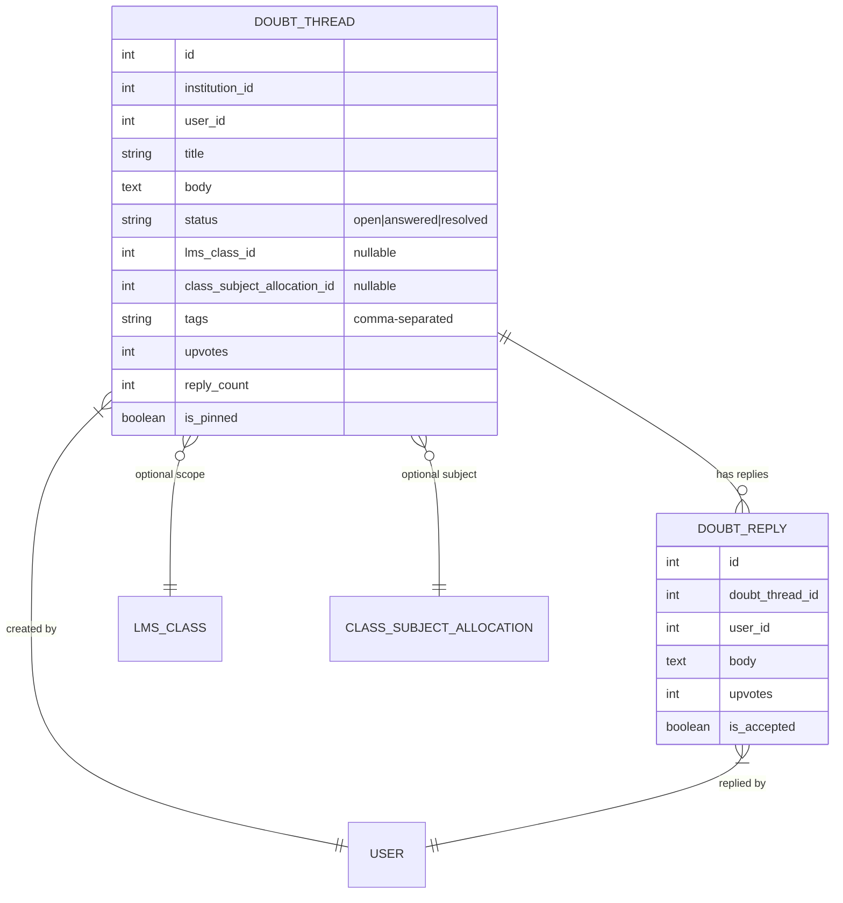
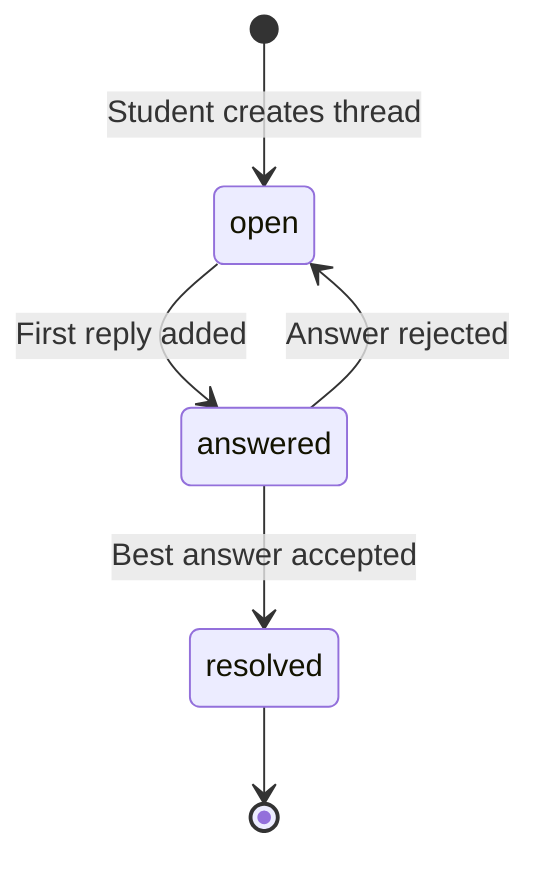

# 💬 Doubt Forum

> **Module:** `doubt_forum`
> **Scope:** Coaching / College / University
> **Permissions Workflow:** `doubt_forum` (5 permissions)

---

## Overview

A Stack Overflow-style doubt resolution forum where students post questions (optionally scoped to a class/subject), teachers and peers reply, and the best answer is accepted. Supports voting, pinning, and search.

---

## Data Model

---

## Thread Lifecycle

---

## API Endpoints

| Method | Endpoint | Action |
|--------|----------|--------|
| `GET` | `/api/v1/doubts` | List threads (filter by status, class, search) |
| `POST` | `/api/v1/doubts` | Create thread |
| `GET` | `/api/v1/doubts/{id}` | Show thread + replies |
| `PUT` | `/api/v1/doubts/{id}` | Update thread |
| `DELETE` | `/api/v1/doubts/{id}` | Delete thread + replies |
| `POST` | `/api/v1/doubts/{id}/replies` | Add reply |
| `PATCH` | `/api/v1/doubts/{id}/replies/{replyId}/accept` | Accept as best answer |
| `PATCH` | `/api/v1/doubts/{id}/resolve` | Mark thread resolved |
| `PATCH` | `/api/v1/doubts/{id}/upvote` | Upvote thread |
| `PATCH` | `/api/v1/doubts/{id}/replies/{replyId}/upvote` | Upvote reply |
| `PATCH` | `/api/v1/doubts/{id}/pin` | Toggle pin |

---

## Key Behaviors

- **Auto-status**: When a reply is added to an `open` thread → `answered`
- **Accept answer**: Sets `is_accepted = true` on the reply, thread status → `resolved`
- **Pinned threads** sort first in listing
- **Upvoting** is simple increment (no per-user tracking yet)

---

## Permissions (5)

| Key | Description |
|-----|-------------|
| `create_doubts` | Post new doubt threads |
| `view_doubts` | Browse doubt forum |
| `manage_doubts` | Edit/delete any thread, pin threads |
| `reply_doubts` | Add replies to threads |
| `accept_doubt_answers` | Accept best answer |

---

## Frontend Files

| File | Purpose |
|------|---------|
| `lib/api/doubtForumApi.ts` | API module |
| `lib/querykey/doubtForum.ts` | Query keys (`DoubtForumQueryKeys`) |
| `lib/validations/doubtForum.ts` | Zod schemas (`doubtThreadSchema`, `doubtReplySchema`) |
