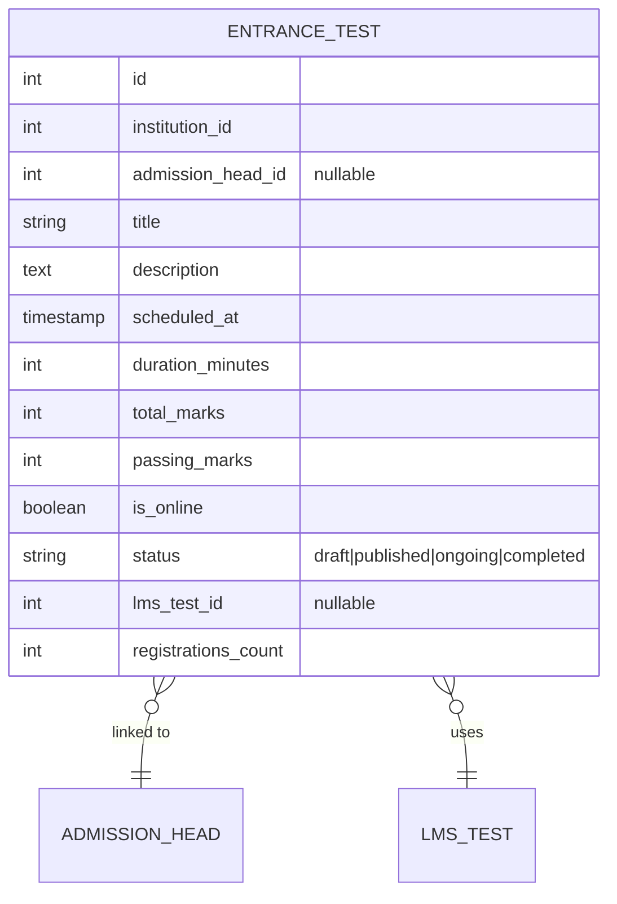

# 🚀 Growth Features

> **Module:** `growth_features`
> **Scope:** Coaching (primary), adaptable to College / University
> **Permissions Workflow:** `growth_features` (5 permissions)

---

## Overview

Growth features accelerate student acquisition and retention. Five sub-modules:

| Feature | Purpose |
|---------|---------|
| **Entrance Tests** | Pre-admission aptitude tests linked to the admission system |
| **PYQ Bank** | Previous Year Question papers (JEE, NEET, Board, Internal) |
| **Demo Classes** | Trial classes for prospective students |
| **Faculty Feedback** | Anonymous student-to-teacher ratings |
| **Installment Plans** | Flexible fee payment schedules |

---

## Data Model

### Entrance Tests

### PYQ Bank

| Field | Description |
|-------|-------------|
| `exam_name` | JEE Main, NEET, Board, Internal, etc. |
| `year` | Paper year (1990–2099) |
| `subject` | Optional subject filter |
| `file_path` | R2 storage path |
| `download_count` | Auto-incremented on download |

### Demo Classes

| Field | Description |
|-------|-------------|
| `faculty_id` | Assigned teacher |
| `mode` | `online` or `offline` |
| `meeting_link` | For online classes |
| `venue` | For offline classes |
| `max_seats` / `registered_count` | Capacity tracking |
| `status` | `upcoming`, `ongoing`, `completed`, `cancelled` |

### Faculty Feedback

| Field | Description |
|-------|-------------|
| `student_id` | Reviewer |
| `faculty_id` | Faculty being reviewed |
| `rating` | 1–5 stars |
| `is_anonymous` | Default `true` — faculty can't see who rated |
| **Unique constraint** | One review per student per faculty per class |

### Installment Plans

| Field | Description |
|-------|-------------|
| `total_amount` | Plan total |
| `number_of_installments` | How many payments |
| `frequency` | `monthly`, `quarterly`, `custom` |
| `installments` | JSON: `[{due_date, amount, label}]` |

---

## API Endpoints

### Entrance Tests

| Method | Endpoint | Action |
|--------|----------|--------|
| `GET` | `/api/v1/growth/entrance-tests` | List |
| `POST` | `/api/v1/growth/entrance-tests` | Create |
| `PUT` | `/api/v1/growth/entrance-tests/{id}` | Update |
| `DELETE` | `/api/v1/growth/entrance-tests/{id}` | Delete |

### PYQ Bank

| Method | Endpoint | Action |
|--------|----------|--------|
| `GET` | `/api/v1/growth/pyq-papers` | List (filter: exam_name, year, subject) |
| `POST` | `/api/v1/growth/pyq-papers` | Upload |
| `DELETE` | `/api/v1/growth/pyq-papers/{id}` | Delete |

### Demo Classes

| Method | Endpoint | Action |
|--------|----------|--------|
| `GET` | `/api/v1/growth/demo-classes` | List |
| `POST` | `/api/v1/growth/demo-classes` | Create |
| `PUT` | `/api/v1/growth/demo-classes/{id}` | Update |
| `DELETE` | `/api/v1/growth/demo-classes/{id}` | Delete |

### Faculty Feedback

| Method | Endpoint | Action |
|--------|----------|--------|
| `GET` | `/api/v1/growth/faculty-feedback` | List (filter: faculty_id) |
| `POST` | `/api/v1/growth/faculty-feedback` | Submit rating |
| `GET` | `/api/v1/growth/faculty-feedback/{facultyId}/summary` | Rating summary + distribution |

### Installment Plans

| Method | Endpoint | Action |
|--------|----------|--------|
| `GET` | `/api/v1/growth/installment-plans` | List |
| `POST` | `/api/v1/growth/installment-plans` | Create |
| `PUT` | `/api/v1/growth/installment-plans/{id}` | Update |
| `DELETE` | `/api/v1/growth/installment-plans/{id}` | Delete |

---

## Permissions (5)

| Key | Description |
|-----|-------------|
| `manage_entrance_tests` | CRUD entrance tests |
| `manage_pyq_papers` | Upload/delete PYQ papers |
| `manage_demo_classes` | CRUD demo classes |
| `view_faculty_feedback` | View feedback reports |
| `manage_installment_plans` | CRUD payment plans |

---

## Frontend Files

| File | Purpose |
|------|---------|
| `lib/api/growthApi.ts` | API module (all 5 sub-modules) |
| `lib/querykey/communications.ts` | `GrowthQueryKeys` (shared file) |
