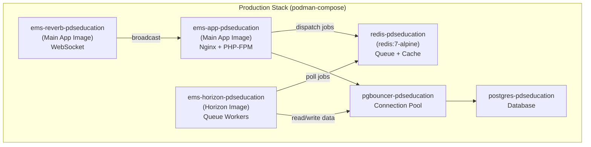
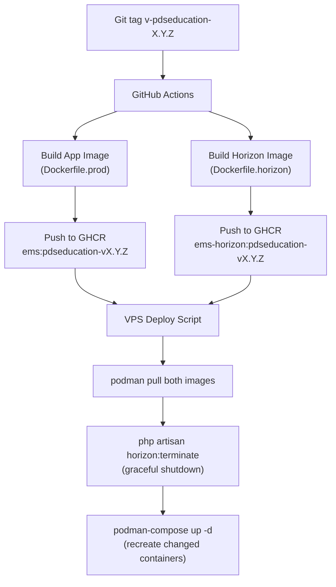

# ⚡ Horizon + Redis Queue Infrastructure

> **Phase:** 5
> **Status:** ✅ Implemented
> **Replaces:** Database queue driver

---

## Overview

Production-grade job processing using **Redis + Laravel Horizon** with a **dedicated Docker image** (`Dockerfile.horizon`) separate from the main app. This keeps the main image small (~180MB) while the horizon image (~250MB) includes FFmpeg for video transcoding.

---

## Architecture



### Image Comparison

| | Main App Image | Horizon Image |
|-|:-:|:-:|
| **Dockerfile** | `Dockerfile.prod` | `Dockerfile.horizon` |
| **Base** | `php:8.4-fpm-alpine` | `php:8.4-cli-alpine` |
| **Nginx** | ✅ | ❌ |
| **Supervisor** | ✅ | ❌ |
| **Frontend assets** | ✅ (Vite build) | ❌ (stripped) |
| **FFmpeg** | ❌ | ✅ |
| **phpredis** | ❌ | ✅ |
| **pcntl** | ❌ | ✅ |
| **Entrypoint** | supervisord | `php artisan horizon` |
| **Est. Size** | ~180MB | ~250MB |

---

## Queue Configuration

### Named Queues

| Queue | Purpose | Timeout | Workers |
|-------|---------|:-------:|:-------:|
| `default` | General jobs | 300s | 1–3 (auto) |
| `video-processing` | Transcoding, thumbnails | 7200s (2hr) | 2 (fixed) |
| `sms` | SMS dispatch | 60s | 1–2 (auto) |
| `alerts` | Alert rule processing | 60s | 1–2 (auto) |

### Job → Queue Mapping

| Job | Queue |
|-----|-------|
| `TranscodeVideoJob` | `video-processing` |
| `GenerateVideoThumbnailJob` | `video-processing` |
| SMS sending (via `SmsService`) | `sms` |
| Alert processing (via `AlertRuleEngine`) | `alerts` |

---

## Files Created / Modified

| File | Status | Description |
|------|:------:|-------------|
| `Dockerfile.horizon` | **NEW** | Lean CLI image with phpredis + FFmpeg |
| `config/horizon.php` | **NEW** | 3 supervisors, metrics, trimming |
| `app/Providers/HorizonServiceProvider.php` | **NEW** | Dashboard gate (super_admin only) |
| `.github/workflows/build-horizon-image.yml` | **NEW** | CI/CD for Horizon image |
| `config/queue.php` | **MOD** | Redis connection with `block_for: 5` |
| `infra/podman/colleges/pdseducation/podman-compose.yml` | **MOD** | +Redis and +Horizon containers |

---

## Production Binding Guide

### 1. Build & Push the Horizon Image

The Horizon image has its own CI/CD workflow that builds and pushes to a **separate GHCR registry**:

```
# Main app → ghcr.io/sutracodehq-ui/education-system-management:tag
# Horizon  → ghcr.io/sutracodehq-ui/education-system-management-horizon:tag
```

**Manual trigger:**
```bash
# Via GitHub Actions UI → "Build Horizon Image" workflow
# Or via CLI:
gh workflow run build-horizon-image.yml \
  -f tag_type=institution \
  -f institution_id=pdseducation \
  -f version=1.0.0 \
  -f push=true
```

**Automated:** Call it from your existing deploy workflow after building the main image:
```yaml
# In deploy-vps.yml or ci-cd.yml:
build-horizon:
  uses: ./.github/workflows/build-horizon-image.yml
  with:
    tag_type: institution
    institution_id: pdseducation
    version: ${{ needs.build.outputs.version }}
    push: true
```

### 2. VPS Environment Setup

Add these to the institution's `.env`:

```env
# ── Redis ────────────────────────────────
QUEUE_CONNECTION=redis
REDIS_HOST=redis-pdseducation
REDIS_PORT=6379
REDIS_PASSWORD=
REDIS_DB=0
REDIS_CACHE_DB=1

# ── Horizon ──────────────────────────────
HORIZON_PREFIX=ems-pdseducation-horizon:
# Optional: separate image tag
# HORIZON_IMAGE_TAG=pdseducation-v1.0.0
```

### 3. Deploy Containers

```bash
# On VPS, in the institution compose directory:
cd /opt/ems/colleges/pdseducation

# Pull new images
podman pull ghcr.io/sutracodehq-ui/education-system-management:pdseducation-latest
podman pull ghcr.io/sutracodehq-ui/education-system-management-horizon:pdseducation-latest

# Start all services (Redis + Horizon will start alongside app)
podman-compose --env-file .env up -d

# Verify
podman ps --filter "label=college.id=pdseducation"
```

### 4. Deploy Flow (Rolling Updates)



### 5. Horizon Graceful Restart

On deploy, terminate Horizon gracefully before recreating:

```bash
# Inside the horizon container:
podman exec ems-horizon-pdseducation php artisan horizon:terminate

# Then recreate:
podman-compose --env-file .env up -d --force-recreate ems-horizon-pdseducation
```

---

## Horizon Dashboard

- **URL:** `https://pdseducation.tech/horizon`
- **Auth:** Super admin only (gated in `HorizonServiceProvider`)
- **Features:**
  - Real-time supervisor status
  - Job throughput and runtime metrics
  - Failed job inspection and retry
  - Queue wait time monitoring
  - Worker process counts

---

## Docker Compose (Production)

```yaml
# In podman-compose.yml:
redis-pdseducation:
  image: redis:7-alpine
  container_name: redis-pdseducation
  restart: always
  volumes:
    - /opt/ems/data/pdseducation/redis:/data
  command: >
    redis-server
    --maxmemory 256mb
    --maxmemory-policy allkeys-lru
    --save 60 1000
    --appendonly yes
  healthcheck:
    test: ["CMD", "redis-cli", "ping"]

ems-horizon-pdseducation:
  image: ghcr.io/sutracodehq-ui/education-system-management-horizon:${HORIZON_IMAGE_TAG:-${CMS_IMAGE_TAG}}
  container_name: ems-horizon-pdseducation
  restart: always
  env_file: ./.env
  environment:
    - QUEUE_CONNECTION=redis
    - REDIS_HOST=redis-pdseducation
  depends_on:
    redis-pdseducation:
      condition: service_healthy
```

---

## Monitoring & Troubleshooting

| Command | Purpose |
|---------|---------|
| `podman logs ems-horizon-pdseducation` | View Horizon worker logs |
| `podman logs redis-pdseducation` | Redis logs |
| `podman exec redis-pdseducation redis-cli info memory` | Redis memory usage |
| `podman exec redis-pdseducation redis-cli llen queues:default` | Queue depth |
| `podman exec ems-horizon-pdseducation php artisan horizon:status` | Worker status |
| `podman exec ems-horizon-pdseducation php artisan horizon:pause` | Pause processing |
| `podman exec ems-horizon-pdseducation php artisan horizon:continue` | Resume |

---

## Production Checklist

- [ ] Add `QUEUE_CONNECTION=redis` and `REDIS_HOST=redis-pdseducation` to `.env`
- [ ] Install `laravel/horizon` via Composer (`composer require laravel/horizon`)
- [ ] Build and push Horizon image via CI/CD
- [ ] Create Redis data directory on VPS: `mkdir -p /opt/ems/data/pdseducation/redis`
- [ ] Deploy with `podman-compose up -d`
- [ ] Verify Horizon dashboard at `/horizon`
- [ ] Test video upload → verify transcoding job processed via Redis
