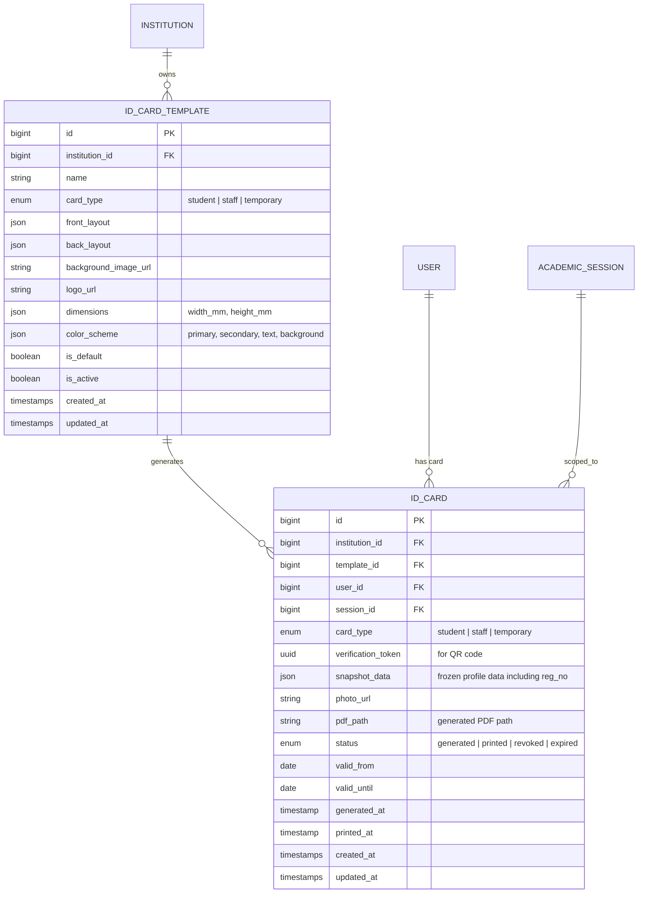
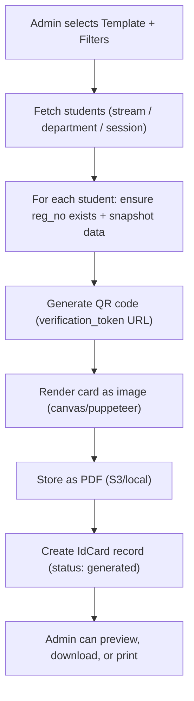

# 🪪 ID Card Module — Plan & Architecture

> **Module:** `id_cards` | **Permission Group:** `service_branch` | **Platform:** PDS Education EMS
>
> Comprehensive plan for the ID Card Generation module — template designer, bulk generation, QR verification, and PDF export.

---

## Table of Contents

1. [Overview](#1-overview)
2. [Registration Number System](#2-registration-number-system-polymorphic)
3. [User Stories](#3-user-stories)
4. [Data Model](#4-data-model)
5. [ID Card Template Designer](#5-id-card-template-designer)
6. [Generation & Printing Workflow](#6-generation--printing-workflow)
7. [QR Code & Verification](#7-qr-code--verification)
8. [Routes & API Inventory](#8-routes--api-inventory)
9. [UI Screens](#9-ui-screens)
10. [Institution Type Adaptations](#10-institution-type-adaptations)
11. [Staff ID Cards](#11-staff-id-cards)
12. [Implementation Phases](#12-implementation-phases)

---

## 1. Overview

The ID Card Module enables institutions to **design**, **generate**, and **print** student and staff identity cards directly from the platform. Cards pull live data from existing profiles (name, photo, stream, roll number, etc.) and render them against customizable templates.

### Key Capabilities

| Feature | Description |
|---------|-------------|
| **Registration Number** | Polymorphic, config-driven unique ID per user — org code + role prefix + random segment |
| **Template Designer** | Form-based visual editor for ID card front & back layouts |
| **Bulk Generation** | Generate cards for entire streams/departments in one click |
| **QR/Barcode** | Auto-generated QR codes linking to a public verification endpoint |
| **PDF Export** | High-DPI PDF output (CR80 card size: 85.6mm x 53.98mm) optimized for professional printers |
| **Session-Aware** | Cards tied to academic session — regenerated each year |
| **Multi-Type** | Student cards, Staff cards, Temporary cards |

### Existing Scaffolding

| Item | Location | Status |
|------|----------|--------|
| Permission | `generate_id_cards` in `service_branch` workflow | Seeded |
| Sidebar Entry | `/certificates/id-cards` with `IdCard` icon | In navigation.ts |
| Route Permission | `config/route_permissions.php` line 176 | Mapped |
| `users.reg_no` | User model `fillable` | Exists (needs auto-gen) |
| `organizations.code` | Organization model | Exists |
| `staff_profiles.employee_id` | StaffProfile model | Exists |
| Controller | — | Not created |
| Model / Migration | — | Not created |
| Pages | — | Not created |

---

## 2. Registration Number System (Polymorphic)

The **registration number** (`reg_no`) is the universal unique identifier for every user within an organisation. The system is **polymorphic** — patterns are driven by a config map, not hardcoded logic.

### Core Principles

- **Org-scoped** — includes the organisation's code as an identity segment
- **Role-aware** — different prefixes per user type (student, teacher, staff, admin, etc.)
- **Random segment** — cryptographic random alphanumeric string (not sequential) for uniqueness
- **Config-driven** — patterns defined in `config/reg_no.php`, customizable without code changes
- **Immutable** — set once, never changes
- **Always on card** — non-removable from ID card templates

### Pattern Architecture

```
{ROLE_PREFIX}-{ORG_CODE}-{YY}{RANDOM}
```

| Segment | Source | Description |
|---------|--------|-------------|
| `ROLE_PREFIX` | Config map by role | Role identifier tag |
| `ORG_CODE` | `organizations.code` | Organisation short code (uppercase) |
| `YY` | Year of creation | 2-digit enrollment/joining year |
| `RANDOM` | `Str::random(5)` | 5-char alphanumeric (uppercase), collision-checked |

### Role Prefix Map (Config-Driven)

```php
// config/reg_no.php
return [
    'prefixes' => [
        'student'            => 'STU',
        'teaching_staff'     => 'TCH',
        'non_teaching_staff' => 'STF',
        'admin'              => 'ADM',
        'librarian'          => 'LIB',
        'accountant'         => 'ACT',
        'driver'             => 'DRV',
        'guardian'           => 'GRD',
    ],
    'random_length'  => 5,   // 5 chars = 33M+ combos per prefix-org-year
    'random_charset' => 'ABCDEFGHJKLMNPQRSTUVWXYZ23456789', // no I/O/0/1
    'separator'      => '-',
];
```

> **Why is `ORG_CODE` not in config?** Config only stores static/polymorphic data (role prefixes + random settings). The org code is different per institution and fetched dynamically from `organizations.code` at runtime. This means the same config works for all institutions — each gets their own org code injected.

### Generated Examples

| Role | Org | Full `reg_no` |
|------|-----|---------------|
| Student | ACME | `STU-ACME-257KX3P` |
| Teacher | ACME | `TCH-ACME-24BN42R` |
| Staff | DPS | `STF-DPS-25M8WYQ` |
| Admin | ACME | `ADM-ACME-23DH6VT` |
| Librarian | JNU | `LIB-JNU-25CK9NE` |

### `RegistrationNumberService` (Polymorphic Handler)

```php
class RegistrationNumberService
{
    /**
     * Polymorphic: role key -> prefix from config map.
     * Pattern: {PREFIX}-{ORG_CODE}-{YY}{RANDOM}
     */
    public function generate(int $institutionId, string $roleKey): string
    {
        $config  = config('reg_no');
        $prefix  = $config['prefixes'][$roleKey]
            ?? throw new \InvalidArgumentException("Unknown role: {$roleKey}");
        $orgCode = $this->getOrgCode($institutionId); // organizations.code
        $year    = date('y');
        $sep     = $config['separator'];

        // Retry-safe: generate random, check uniqueness, retry on collision
        do {
            $random    = $this->randomString($config['random_length'], $config['random_charset']);
            $candidate = "{$prefix}{$sep}{$orgCode}{$sep}{$year}{$random}";
        } while (User::where('reg_no', $candidate)->exists());

        return $candidate;
    }
}
```

### Where `reg_no` is Generated

| User Type | Trigger Point | Role Key |
|-----------|--------------|----------|
| Student | `ApplicationController::process` (on approval) | `student` |
| Teacher | `StaffController::store` (category = teaching) | `teaching_staff` |
| Non-Teaching Staff | `StaffController::store` (category != teaching) | `non_teaching_staff` |
| Admin | Admin user creation | `admin` |

### Key Design Rules

1. `reg_no` is set **once** and **never changes** — even if role, stream, or department changes
2. **No sequential counters** — random segment prevents information leakage about enrollment size
3. `config/reg_no.php` is the **single source of truth** — adding a new role = add one line (polymorphic)
4. Collision-checked: generate -> check uniqueness -> retry on collision (negligible probability: 33M+ combos)
5. On the ID card, `reg_no` is always rendered prominently (non-removable from template)

---

## 3. User Stories

### Admin-Side
1. **As an admin**, I can create and customize ID card templates (placement of photo, name, fields, logo, background, colours).
2. **As an admin**, I can preview a template with sample student data before publishing.
3. **As an admin**, I can select a stream/department/session and generate ID cards for all enrolled students in bulk.
4. **As an admin**, I can download generated cards as a print-ready PDF (multiple cards per A4 sheet).
5. **As an admin**, I can regenerate individual student ID cards if their photo or information changes.
6. **As an admin**, I can generate staff ID cards using the same template engine.

### Student-Side
7. **As a student**, I can view and download my digital ID card from the student portal.
8. **As a student**, I can share my digital ID card via a QR verification link.

### Verification
9. **As anyone with the QR code**, I can scan it and see a verification page confirming the student's identity and enrollment status.

---

## 4. Data Model

### Entity Relationship



> **Note:** No `card_number` field on `id_cards`. The user's `reg_no` (from `users.reg_no`) is the card identifier — always included in `snapshot_data`.

### Key Design Decisions

- **`reg_no` as card number**: The user's `users.reg_no` (e.g., `STU-ACME-257KX3P`) is the primary identifier on the card. No separate field needed.
- **`snapshot_data` (JSON)**: Freezes the student/staff data at generation time, including `reg_no`. If data changes, the card shows the old data until regenerated.
- **`verification_token` (UUID)**: A public, non-guessable token used in QR codes. Does NOT expose internal IDs.
- **Templates vs Cards**: Templates are reusable designs. Cards are instances generated from templates with specific user data.

---

## 5. ID Card Template Designer

### 5.1 Template Fields (Data Placeholders)

These placeholders are available in the designer and auto-filled during generation:

| Placeholder | Source | Description |
|-------------|--------|-------------|
| `{{reg_no}}` | `users.reg_no` | **Registration number — always shown, non-removable** |
| `{{name}}` | `users.name` | Student/staff full name |
| `{{photo}}` | `users.profile_photo_path` | Passport-size photo |
| `{{roll_no}}` | `student_profiles.roll_no` | Roll / enrollment number |
| `{{stream}}` | `streams.name` | Class / Stream / Batch name |
| `{{department}}` | `departments.name` | Department name |
| `{{session}}` | `sessions.name` | Academic session (e.g., 2025-26) |
| `{{dob}}` | `student_profiles.dob` | Date of birth |
| `{{blood_group}}` | `student_profiles.blood_group` | Blood group |
| `{{father_name}}` | `student_profiles.father_name` | Father's name |
| `{{mother_name}}` | `student_profiles.mother_name` | Mother's name |
| `{{address}}` | `student_profiles.address` | Address |
| `{{mobile}}` | `student_profiles.mobile` | Contact number |
| `{{qr_code}}` | Generated | QR code image (auto-placed) |
| `{{institution_name}}` | `institutions.name` | Institution name |
| `{{institution_logo}}` | `institutions.logo` | Institution logo |
| `{{valid_until}}` | `id_cards.valid_until` | Card expiry date |
| `{{signature}}` | `student_profiles.signature_url` | Student signature |

### 5.2 Template Layout (JSON Schema)

```json
{
  "dimensions": { "width_mm": 85.6, "height_mm": 53.98 },
  "background": { "color": "#1a237e", "image_url": "/storage/id-card-bg.png" },
  "elements": [
    { "type": "image",  "field": "institution_logo", "x": 5, "y": 3, "w": 12, "h": 12 },
    { "type": "text",   "field": "institution_name", "x": 20, "y": 5, "fontSize": 10, "fontWeight": "bold", "color": "#ffffff" },
    { "type": "image",  "field": "photo",            "x": 30, "y": 18, "w": 25, "h": 30, "border": true },
    { "type": "text",   "field": "name",             "x": 30, "y": 50, "fontSize": 12, "fontWeight": "bold", "align": "center" },
    { "type": "text",   "field": "reg_no",           "x": 5,  "y": 52, "fontSize": 9, "fontWeight": "bold", "label": "Reg No", "locked": true },
    { "type": "text",   "field": "roll_no",          "x": 5,  "y": 55, "fontSize": 8, "label": "Roll No" },
    { "type": "text",   "field": "stream",           "x": 5,  "y": 60, "fontSize": 8, "label": "Class" },
    { "type": "text",   "field": "blood_group",      "x": 60, "y": 55, "fontSize": 8, "label": "Blood Group" },
    { "type": "qr_code","field": "qr_code",          "x": 60, "y": 35, "w": 18, "h": 18 },
    { "type": "text",   "field": "valid_until",      "x": 5,  "y": 48, "fontSize": 7, "label": "Valid Until" }
  ]
}
```

> Note: `reg_no` element has `"locked": true` — it cannot be removed from templates.

### 5.3 Designer UI (Frontend)

MVP approach — a **form-based configuration editor** (not a full drag-and-drop builder):

1. **Left Panel**: Form fields to select which data fields to include, colors, background, logo
2. **Right Panel**: Live preview of the card with sample data (portrait-oriented card mockup)
3. **Front / Back toggle**: Switch between designing front and back sides
4. **Field positioning**: Simple grid layout (top-left / top-right / center / bottom-left / bottom-right zones)

> [!TIP]
> **Phase 2 Enhancement**: Upgrade to a full drag-and-drop designer using `react-dnd` or `@dnd-kit/core` for pixel-level precision.

---

## 6. Generation & Printing Workflow

### 6.1 Generation Flow



### 6.2 Bulk Generation

| Step | Backend | Frontend |
|------|---------|----------|
| 1. Select filters | — | Stream/Department/Session dropdowns |
| 2. Start generation | `POST /api/id-cards/generate` | Progress modal with count |
| 3. Process (async) | `GenerateIdCardsJob` on `default` queue | Real-time progress via polling |
| 4. Complete | Cards stored in `id_cards` table | Toast notification + download link |

### 6.3 Print Layout

PDF output uses **CR80 card size (85.6mm x 53.98mm)**:

- **8 cards per A4 page** (2 columns x 4 rows) with 3mm cut marks
- **Duplex support**: Front pages followed by back pages in matching order
- **DPI**: 300 DPI for professional printing
- Uses `dompdf` (already in Laravel) or `Browsershot` (Puppeteer) for rendering

---

## 7. QR Code & Verification

### 7.1 QR Content

```
https://{institution-domain}.pdseducation.app/verify/id/{verification_token}
```

### 7.2 Public Verification Page

A **public, unauthenticated** page that shows:

| Field | Display |
|-------|---------| 
| Photo | Student photo |
| Name | Full name |
| Reg No | Registration number |
| Stream | Class / Stream / Batch |
| Session | 2025-26 |
| Status | Active / Expired / Revoked |
| Institution | Name + Logo |
| Valid Until | Expiry date |

> No sensitive data (address, Aadhar, contact) is shown on the verification page.

### 7.3 Card Revocation

Admin can revoke a card (e.g., if the student is suspended or leaves). The verification page then shows `Revoked` status.

---

## 8. Routes & API Inventory

### Web Routes (Admin)

| Route | Page | Description |
|-------|------|-------------|
| `/certificates/id-cards` | `certificates/id-cards/index.tsx` | ID card dashboard — list templates & generated cards |
| `/certificates/id-cards/templates/create` | `certificates/id-cards/templates/create.tsx` | Create new template |
| `/certificates/id-cards/templates/{id}/edit` | `certificates/id-cards/templates/edit.tsx` | Edit template |
| `/certificates/id-cards/generate` | `certificates/id-cards/generate.tsx` | Bulk generation page |
| `/certificates/id-cards/{id}` | `certificates/id-cards/show.tsx` | View generated card |

### API Routes

| Method | Endpoint | Controller | Description |
|--------|----------|------------|-------------|
| GET | `/api/v1/id-card-templates` | `IdCardTemplateController@index` | List templates |
| POST | `/api/v1/id-card-templates` | `IdCardTemplateController@store` | Create template |
| GET | `/api/v1/id-card-templates/{id}` | `IdCardTemplateController@show` | Get template |
| PUT | `/api/v1/id-card-templates/{id}` | `IdCardTemplateController@update` | Update template |
| DELETE | `/api/v1/id-card-templates/{id}` | `IdCardTemplateController@destroy` | Delete template |
| POST | `/api/v1/id-cards/generate` | `IdCardController@generate` | Bulk generate |
| GET | `/api/v1/id-cards` | `IdCardController@index` | List generated cards |
| GET | `/api/v1/id-cards/{id}` | `IdCardController@show` | Show card |
| POST | `/api/v1/id-cards/{id}/regenerate` | `IdCardController@regenerate` | Regenerate single card |
| PATCH | `/api/v1/id-cards/{id}/revoke` | `IdCardController@revoke` | Revoke card |
| GET | `/api/v1/id-cards/{id}/download` | `IdCardController@download` | Download PDF |
| GET | `/api/v1/id-cards/bulk-download` | `IdCardController@bulkDownload` | Download bulk PDF |

### Public Route

| Method | Endpoint | Controller | Description |
|--------|----------|------------|-------------|
| GET | `/verify/id/{token}` | `IdCardVerificationController@verify` | Public QR verification |

### Student Portal

| Method | Endpoint | Controller | Description |
|--------|----------|------------|-------------|
| GET | `/api/v1/student/id-card` | `StudentIdCardController@show` | Get my ID card |
| GET | `/api/v1/student/id-card/download` | `StudentIdCardController@download` | Download my ID card PDF |

---

## 9. UI Screens

### 9.1 ID Card Dashboard (`/certificates/id-cards`)

- **Tab 1: Templates** — Grid of saved templates with preview thumbnails, create/edit/delete
- **Tab 2: Generated Cards** — DataTable with student name, reg_no, status, generated date. Filter by stream, session, status
- **Actions**: Generate New, Bulk Download, Print

### 9.2 Template Designer

- Form-based layout builder (Phase 1)
- Fields: Template name, card type (student/staff), background color/image, logo, field selection, front/back toggle
- Live preview panel rendering the card with sample data
- `reg_no` field always included (locked, non-removable)

### 9.3 Bulk Generation Page

- Filters: Session, Stream/Department, Template
- Student count preview before generation
- Generate button -> progress modal -> completion
- Download PDF link after generation

### 9.4 Student Portal — My ID Card

- Card preview (front + back flip animation)
- Download as PDF button
- QR code with "Share" option

---

## 10. Institution Type Adaptations

| Field | School | College | Coaching | University |
|-------|--------|---------|----------|------------|
| **Reg No example** | `STU-DPS-257KX3P` | `STU-ACME-25BN42R` | `STU-IIT-25M8WYQ` | `STU-JNU-25DH6VT` |
| Stream label | Class 5A | B.Tech CSE S3 | JEE-2026 Morning | B.Tech CSE Sem 5 |
| Roll No field | `roll_no` | `roll_no` or `university_roll_no` | `roll_no` | `university_roll_no` |
| Extra fields | Father's Name | Department, Semester | Batch, Duration | Faculty, School |
| Card back | Emergency contact, Transport route | Department HOD, Library barcode | Batch timing, Center address | Faculty Dean, Library barcode |
| Validity | 1 academic year | 1 semester or full course | Batch duration | 1 semester or full course |

---

## 11. Staff ID Cards

Same template engine but with staff-specific fields:

| Placeholder | Source | Description |
|-------------|--------|-------------|
| `{{reg_no}}` | `users.reg_no` | **Registration number (STF-* or TCH-*)** |
| `{{name}}` | `users.name` | Staff name |
| `{{photo}}` | `users.profile_photo_path` | Photo |
| `{{designation}}` | `staff_profiles.designation` | Post (e.g., Assistant Professor) |
| `{{department}}` | `departments.name` | Department |
| `{{employee_id}}` | `staff_profiles.employee_id` | Employee ID |
| `{{joining_date}}` | `staff_profiles.joining_date` | Date of joining |
| `{{mobile}}` | `users.mobile` | Contact |
| `{{qr_code}}` | Generated | Verification QR |

---

## 12. Implementation Phases

### Phase 1 — Core (MVP)
- [ ] Config: `config/reg_no.php` with polymorphic prefix map
- [ ] Service: `RegistrationNumberService` with collision-safe generation
- [ ] Migration: `id_card_templates` + `id_cards` tables
- [ ] Models: `IdCardTemplate`, `IdCard`
- [ ] Controllers: `IdCardTemplateController`, `IdCardController`
- [ ] API routes registration
- [ ] Web routes + page stubs
- [ ] Template CRUD (form-based designer with live preview)
- [ ] Single card generation with `dompdf`
- [ ] Bulk generation (sync, up to 50 students)
- [ ] PDF download (single + bulk)
- [ ] QR code generation + public verification page

### Phase 2 — Enhancement
- [ ] Async bulk generation via `GenerateIdCardsJob` (Horizon queue)
- [ ] Student portal: View + download ID card
- [ ] Staff ID card support
- [ ] Card revocation workflow
- [ ] Regeneration with data diff detection
- [ ] Print layout optimizer (8 per A4 with cut marks)

### Phase 3 — Advanced
- [ ] Full drag-and-drop template designer
- [ ] Barcode (Code128) support alongside QR
- [ ] Card delivery tracking (generated -> printed -> distributed)
- [ ] Digital ID card with NFC data export
- [ ] Bulk re-generation for session rollover

---

### Links & Resources
- [Developer Guide](./developer-guide.md)
- [School Workflow Guide](./school-workflows.md)
- [College Workflow Guide](./college-workflows.md)
- [University Workflow Guide](./university-workflows.md)
- [Coaching Workflow Guide](./coaching-workflows.md)
