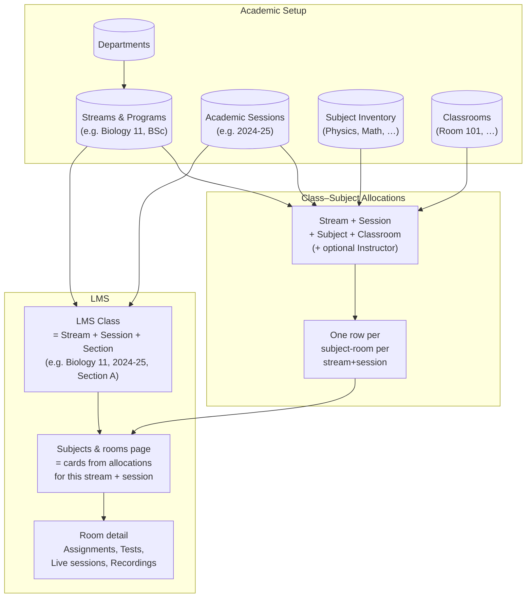
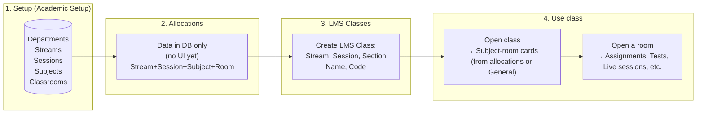
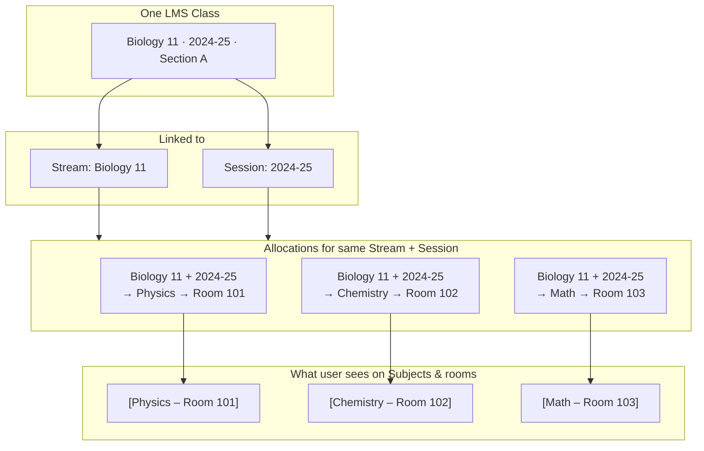
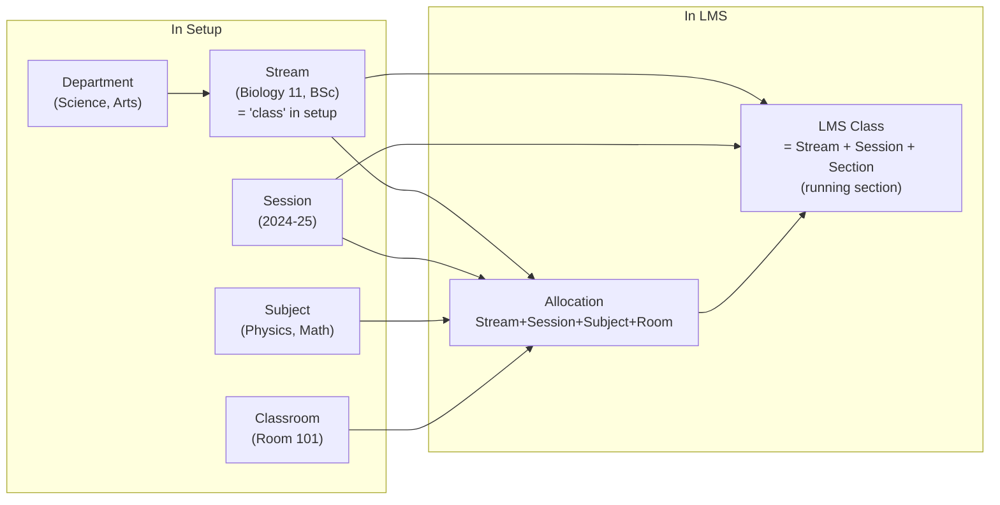
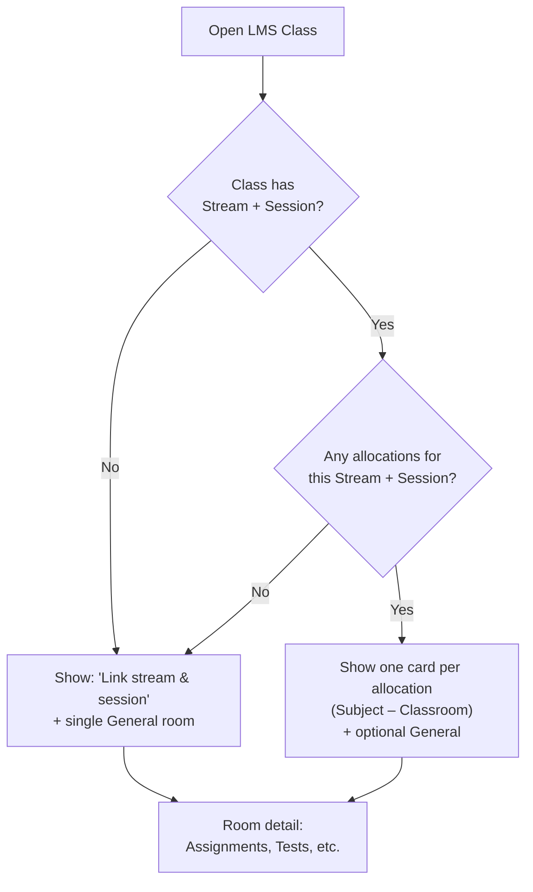

# LMS: Class Setup → Multiple Subjects — Flow Diagrams

These diagrams describe the **existing** LMS flow (current implementation). For the full plan from scratch and **gaps**, see [plan-lms-from-scratch-with-gaps.md](./plan-lms-from-scratch-with-gaps.md).

Use any [Mermaid](https://mermaid.js.org)-compatible viewer (e.g. GitHub, VS Code with Mermaid extension, or [mermaid.live](https://mermaid.live)) to render the code blocks below.

---

## 1. Data & structure flow (what feeds what)

---

## 2. User journey (existing flow)

---

## 3. One class, many subjects (detail)

---

## 4. Terminology at a glance

---

## 5. When a class has no stream/session vs has allocations

---

*Rendered example: paste the code blocks into [mermaid.live](https://mermaid.live) or view this file on GitHub.*
