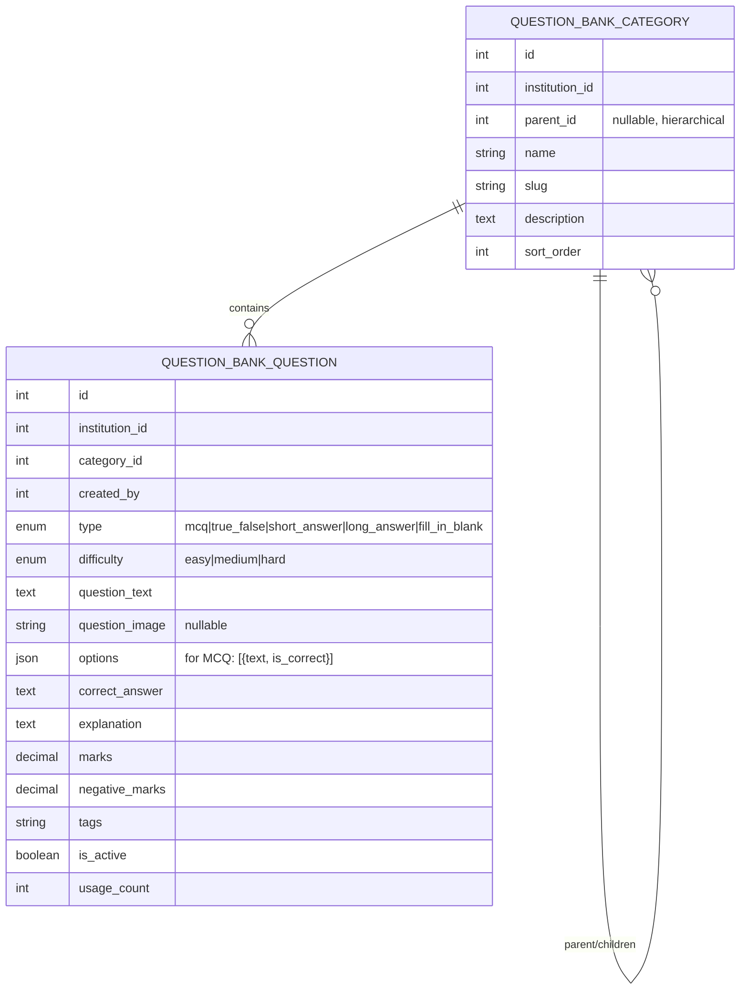

# 📚 Question Bank

> **Module:** `question_bank`
> **Scope:** Coaching / College / University
> **Permissions Workflow:** `question_bank` (4 permissions)

---

## Overview

A categorized bank of reusable questions for tests, assignments, and practice. Supports MCQ, True/False, Short Answer, Long Answer, and Fill-in-the-Blank question types. Includes a **practice mode** for students.

---

## Data Model



---

## Question Types

| Type | `options` field | `correct_answer` field |
|------|----------------|----------------------|
| `mcq` | `[{text: "A", is_correct: true}, {text: "B", is_correct: false}]` | Not used |
| `true_false` | `[{text: "True", is_correct: true}, {text: "False", is_correct: false}]` | Not used |
| `short_answer` | `null` | Expected answer text |
| `long_answer` | `null` | Reference answer / rubric |
| `fill_in_blank` | `null` | Expected fill text |

---

## API Endpoints

### Categories

| Method | Endpoint | Action |
|--------|----------|--------|
| `GET` | `/api/v1/question-bank/categories` | List root categories + children |
| `POST` | `/api/v1/question-bank/categories` | Create category |
| `PUT` | `/api/v1/question-bank/categories/{id}` | Update |
| `DELETE` | `/api/v1/question-bank/categories/{id}` | Delete (cascade) |

### Questions

| Method | Endpoint | Action |
|--------|----------|--------|
| `GET` | `/api/v1/question-bank/questions` | List (filter by category, type, difficulty) |
| `POST` | `/api/v1/question-bank/questions` | Create |
| `GET` | `/api/v1/question-bank/questions/{id}` | Show detail |
| `PUT` | `/api/v1/question-bank/questions/{id}` | Update |
| `DELETE` | `/api/v1/question-bank/questions/{id}` | Delete |

### Practice Mode

| Method | Endpoint | Action |
|--------|----------|--------|
| `POST` | `/api/v1/question-bank/practice` | Get random questions by category/difficulty |

**Practice mode** shuffles MCQ options and hides `correct_answer` + `explanation` from the response.

---

## Hierarchical Categories

Categories support unlimited nesting via `parent_id`:

```
Physics/
├── Mechanics/
│   ├── Newton's Laws
│   └── Kinematics
├── Thermodynamics/
└── Optics/
```

---

## Permissions (4)

| Key | Description |
|-----|-------------|
| `create_questions` | Add questions to the bank |
| `view_questions` | Browse question bank |
| `edit_questions` | Modify questions |
| `delete_questions` | Remove questions |

---

## Frontend Files

| File | Purpose |
|------|---------|
| `lib/api/questionBankApi.ts` | API module (categories + questions + practice) |
| `lib/querykey/doubtForum.ts` | `QuestionBankQueryKeys` (shared file) |
| `lib/validations/doubtForum.ts` | `questionBankQuestionSchema`, `questionBankCategorySchema` |
