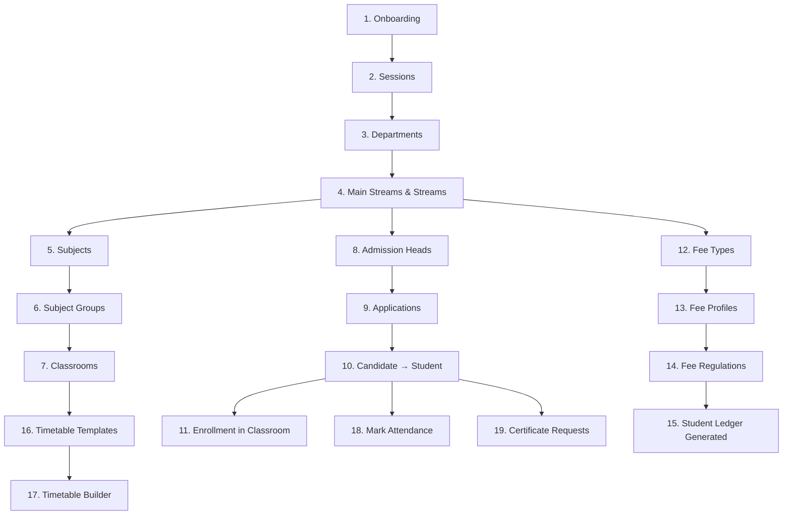

# 🎓 School Workflow Guide

> **Scope Type:** `school` | **Platform:** Education System Management
> 
> Complete step-by-step documentation of every admin and student workflow available for a **school** institution type.

---
> [!TIP]
> **Developing for PDS Education?** Check out the [🛠️ Developer Guide](./developer-guide.md) for architectural flows, logic diagrams, and implementation patterns.
---

---

## Table of Contents

1. [Onboarding & Initial Setup](#1-onboarding--initial-setup)
2. [Academic Setup](#2-academic-setup)
3. [Admission & Student Registry](#3-admission--student-registry)
4. [Treasury & Fee Management](#4-treasury--fee-management)
5. [Attendance](#5-attendance)
6. [Timetable & Scheduling](#6-timetable--scheduling)
7. [Certificate Management](#7-certificate-management)
8. [Library](#8-library)
9. [Inventory](#9-inventory)
10. [Transport](#10-transport)
11. [Website & Public Relations](#11-website--public-relations)
12. [Redressal & Grievances](#12-redressal--grievances)
13. [Analytics & Admin Desk](#13-analytics--admin-desk)
14. [System Console](#14-system-console)
15. [Settings & Configuration](#15-settings--configuration)
16. [Student Portal](#16-student-portal)

---

## 1. Onboarding & Initial Setup

The onboarding flow creates a new organisation and institution of type `school`.

### Steps

| # | Screen | Route | Description |
|---|--------|-------|-------------|
| 1 | **Account Registration** | `/register` | Enter name, email, mobile, password. Creates inactive user + sends verification email. |
| 2 | **Email Verification** | `/onboarding/verify-notice` | "Check your inbox" page. Frontend polls for verification. Auto-redirects on verify. |
| 3 | **Plan Selection** | `/onboarding/plan` | Choose plan (Starter / Professional / Enterprise / Plus) + billing cycle (monthly/annual). |
| 4 | **Card Details** | `/onboarding/card` | Enter card info (AES-256 encrypted) or **Skip** to proceed without payment. |
| 5 | **Organisation & Institution Setup** | `/onboarding/setup` | Enter organisation name, institution name, select type = "School", workspace slug. Creates Org + Institution. |
| 6 | **Data Import** | `/onboarding/data-import` | Auto-seed departments, subjects, fee types for the school, or upload CSV. Download sample templates. |
| 7 | **Platform Setup** | `/onboarding/platform-setup` | Automated setup: seeds roles, permissions, workflows, and mandatory defaults. Redirect to dashboard on completion. |

### Key Behaviour (School Scope)
- Roles seeded: `institution_admin`, `vice_principal`, `teaching_staff`, `accountant`, `office_clerk`, `librarian`, `student`, `candidate`, `guardian`
- Features enabled depend on plan (e.g., Starter = core + admissions + fee_management; Professional = all features)
- Permissions scoped with `scope_type = school`
- Workflows use `_school` suffix variants (e.g., `accounts_room_school`, `admission_cell_school`)

---

## 2. Academic Setup

> **Sidebar Group:** Academic | **Permission Group:** `academic_setup`

Foundation data that all other modules depend on. Set these up first after onboarding.

### 2.1 Sessions
| Action | Route | Details |
|--------|-------|---------|
| List sessions | `/organization/sessions` | View all academic sessions (e.g., 2025-26) |
| Create session | `/organization/sessions/create` | Set name, start date, end date, mark as current |
| Edit session | `/organization/sessions/{id}/edit` | Modify session details |

### 2.2 Departments
| Action | Route | Details |
|--------|-------|---------|
| List departments | `/organization/departments` | View all departments (Primary, Secondary, etc.) |
| Create department | `/organization/departments/create` | Set name, code, HOD |
| View department | `/organization/departments/{id}` | Department detail with staff & streams |
| Edit department | `/organization/departments/{id}/edit` | Modify department |

### 2.3 Main Streams & Streams
| Action | Route | Details |
|--------|-------|---------|
| List main streams | `/organization/main-streams` | Top-level groupings (e.g., "Class I–V", "Class VI–X") |
| Create main stream | `/organization/main-streams/create` | Set name, department |
| List streams | `/organization/streams` | Individual classes/sections (e.g, Class 5A, Class 10B) |
| Create stream | `/organization/streams/create` | Set name, main stream, capacity, class teacher |

### 2.4 Subjects & Subject Groups
| Action | Route | Details |
|--------|-------|---------|
| Manage subjects | `/organization/subject` | List/create/edit subjects (Hindi, Math, Science, etc.) |
| Subject groups | `/organization/subject-groups` | Group subjects (e.g., "Science Group" = Physics + Chemistry + Biology) |
| Subject categories | `/organization/subject-category` | Categories like Core, Elective, Language |
| Category mapping | `/organization/subject-category-mapping` | Map subjects to categories |

### 2.5 Classrooms (LMS)
| Action | Route | Details |
|--------|-------|---------|
| List classes | `/lms/classes` | All created classrooms with enrollments |
| View by stream | `/lms/classes/stream/{streamId}` | Classes for a specific stream |
| Class detail | `/lms/classes/{id}` | Subject allocations, enrolled students, rooms |
| Subject detail | `/lms/classes/{id}/subjects/{allocationId}` | Subject-specific materials, syllabus |
| Room detail | `/lms/classes/{id}/rooms/{roomId}` | Real-time classroom (discussion, materials) |
| Courses | `/lms/courses` | Course templates (optional) |

---

## 3. Admission & Student Registry

> **Sidebar Group:** Admission & Registry | **Permission Groups:** `admission_cell`, `office_registry`

### 3.1 Candidates
| Action | Route | Details |
|--------|-------|---------|
| Candidate list | `/students/candidate` | Prospective students who haven't been admitted yet |

### 3.2 Admission Applications
| Action | Route | Details |
|--------|-------|---------|
| List applications | `/admission/applications` | All admission applications with status filters |
| New application | `/admission/applications/new/{step}` | Multi-step form: identity → address/guardian → medical/documents → academic → services → payment → review |
| View application | `/admission/applications/{id}` | Full application detail with approval actions |
| Payment | `/admission/applications/{id}/pay` | Process admission fee payment |

### 3.3 Admission Heads
| Action | Route | Details |
|--------|-------|---------|
| List heads | `/admission/heads` | Admission batches/groups (e.g., "Class 1 Admission 2025-26") |
| Create head | `/admission/heads/create` | Set name, session, stream, capacity, fee structure |
| View head | `/admission/heads/{id}` | Applications under this admission head |

### 3.4 Student Management
| Action | Route | Details |
|--------|-------|---------|
| Analytics | `/students/analytics` | Student statistics and demographics |
| Student list | `/students/manage` | All enrolled students with search/filter |
| Student profile | `/students/manage/{id}` | Full student detail (personal, academic, fee, attendance) |
| Edit student | `/students/manage/{id}/edit` | Update student information |

### 3.5 Promotions
| Action | Route | Details |
|--------|-------|---------|
| Promotions | `/admission/promotions` | Bulk year-end class promotions |
| Promotion analytics | `/admission/analytics/promotions` | Promotion statistics |

### 3.6 Re-Admissions
| Action | Route | Details |
|--------|-------|---------|
| Re-admissions | `/admission/readmissions` | Re-admit previously withdrawn students |
| Re-admission analytics | `/admission/analytics/readmissions` | Re-admission statistics |

---

## 4. Treasury & Fee Management

> **Sidebar Group:** Treasury & Fees | **Permission Group:** `accounts_room`

### 4.1 Fee Types
| Action | Route | Details |
|--------|-------|---------|
| Manage fee types | `/accounts/fee-hub/fee-types` | Define fee categories (Tuition, Transport, Lab, etc.) with amounts and frequencies |

### 4.2 Fee Profiles
| Action | Route | Details |
|--------|-------|---------|
| Manage profiles | `/accounts/fee-hub/profiles` | Group multiple fee types into a fee profile (e.g., "Class 5 Profile" = Tuition + Lab + Activity) |

### 4.3 Fee Regulations
| Action | Route | Details |
|--------|-------|---------|
| List regulations | `/accounts/fee-hub/regulations` | Assign fee profiles to streams/classes for a session |
| Class regulation | `/accounts/fee-hub/regulations/{id}` | View/edit fee rules for a specific class |

### 4.4 Student Ledgers
| Action | Route | Details |
|--------|-------|---------|
| Student ledgers | `/accounts/fee-hub/students` | Per-student fee ledger with payment history |

### 4.5 Fee Heads (Legacy)
| Action | Route | Details |
|--------|-------|---------|
| Manage fee heads | `/fee-payment/manage-fee-head` | Legacy fee head management |

### 4.6 Dues & Overdue
| Action | Route | Details |
|--------|-------|---------|
| Dues dashboard | `/accounts/fee-hub/dues` | Students with pending/overdue fees, send reminders |

### 4.7 Collection Settings
| Action | Route | Details |
|--------|-------|---------|
| Settings | `/accounts/fee-hub/collection-settings` | Configure payment modes, late fee rules, receipt format |

---

## 5. Attendance

> **Sidebar Group:** (via route) | **Permission Group:** `attendance`

| Action | Route | Details |
|--------|-------|---------|
| Overview | `/attendance` | Attendance dashboard |
| Mark attendance | `/attendance/mark` | Select class, date, mark present/absent/late for each student |
| Daily report | `/attendance/reports/daily` | Day-wise attendance breakdown |
| Summary report | `/attendance/reports/summary` | Monthly/session attendance summary |

---

## 6. Timetable & Scheduling

> **Sidebar Group:** Timetable & Scheduling | **Permission Group:** `timetable`

| Action | Route | Details |
|--------|-------|---------|
| Overview | `/timetable` | Master timetable view |
| Templates | `/timetable/templates` | Define period structures (8 periods × 45 min) |
| Rooms | `/timetable/rooms` | Physical room inventory |
| Daily view | `/timetable/daily` | Today's timetable across all classes |
| Substitutions | `/timetable/substitutions` | Manage teacher substitutions |
| Builder | `/timetable/{id}/builder` | Drag-and-drop timetable builder |

---

## 7. Certificate Management

> **Sidebar Group:** Certificate | **Permission Group:** `service_branch`

### 7.1 Certificate Heads
| Action | Route | Details |
|--------|-------|---------|
| Manage heads | `/certificates/manage-certificate-head` | Define certificate types: Transfer Certificate, Bonafide, Character Certificate, etc. Set fee and processing days. |

### 7.2 Certificate Applications
| Action | Route | Details |
|--------|-------|---------|
| List applications | `/certificates/applications` | All certificate requests with status (pending/approved/issued) |
| View application | `/certificates/applications/{id}` | Review and issue/reject certificate |

### 7.3 Certificate Types & Rules
| Action | Route | Details |
|--------|-------|---------|
| Types | `/certificates/types` | Certificate template types |
| Create type | `/certificates/types/create` | Design certificate template |
| Rules | `/certificates/rules` | Automation rules for certificate issuance |

---

## 8. Library

> **Sidebar Group:** Library | **Permission Group:** `library`

| Action | Route | Details |
|--------|-------|---------|
| Books catalogue | `/library/books` | List all books with title, author, ISBN, category |
| Book detail | `/library/books/{id}` | Book info with copies and issue history |
| Copies | `/library/copies` | Accession register – individual copies with barcodes |
| Issues & Returns | `/library/issues` | Issue books to students/staff, process returns |
| Overdue report | `/library/reports/overdue` | Books past due date with student info |

---

## 9. Inventory

> **Sidebar Group:** Inventory | **Permission Group:** `inventory`

| Action | Route | Details |
|--------|-------|---------|
| Categories | `/inventory/categories` | Item categories (Stationery, Furniture, Electronics, etc.) |
| Locations | `/inventory/locations` | Storage locations (Main Store, Library, Lab, etc.) |
| Items | `/inventory/items` | Item master with stock levels |
| Item detail | `/inventory/items/{id}` | Item history, movements, current stock |
| Movements | `/inventory/movements` | Stock in/out transactions |
| Sales | `/inventory/sales` | Items sold to students (uniform, books) |
| Sale detail | `/inventory/sales/{id}` | Individual sale receipt |
| Low Stock | `/inventory/reports/low-stock` | Items below reorder level |

---

## 10. Transport

> **Sidebar Group:** Transport | **Permission Group:** `transport`

| Action | Route | Details |
|--------|-------|---------|
| Stops | `/transport/stops` | Bus stop locations |
| Routes | `/transport/routes` | Route definitions with stop ordering |
| Route detail | `/transport/routes/{id}` | Stops, assigned vehicles, passengers |
| Vehicles | `/transport/vehicles` | Vehicle fleet (registration, capacity, GPS) |
| Drivers | `/transport/drivers` | Driver profiles with license info |
| Assignments | `/transport/assignments` | Assign students/staff to routes |
| Manifest | `/transport/reports/manifest` | Route-wise passenger list |
| Occupancy | `/transport/reports/occupancy` | Vehicle capacity utilisation |

---

## 11. Website & Public Relations

> **Sidebar Group:** Website & PR | **Permission Group:** `info_pr_hub`

| Action | Route | Details |
|--------|-------|---------|
| Notices | `/notice-management` | Create/publish announcements to students, parents, staff |
| Sliders | `/website/sliders` | Hero banner images for the school website |
| Galleries | `/website/galleries` | Photo album management |
| Gallery photos | `/website/galleries/{id}` | Upload/manage photos in a gallery |
| Tickers | `/website/tickers` | Scrolling text updates on website |
| News | `/website/news` | News articles and press releases |
| Faculties | `/website/faculties` | Faculty profiles shown on website |

---

## 12. Redressal & Grievances

> **Sidebar Group:** Redressal | **Permission Group:** `redressal_cell`

| Action | Route | Details |
|--------|-------|---------|
| Grievance board | `/grievances` | All grievances with status tracking |
| Support tickets | `/grievances/support-ticket` | IT/admin support ticket management |
| Feedback | `/grievances/feedback` | Stakeholder feedback (parents, students) |
| Contacts | `/grievances/contacts` | Enquiry directory – messages from website visitors |
| Contact detail | `/grievances/contacts/{id}` | Individual enquiry with response history |

---

## 13. Analytics & Admin Desk

> **Sidebar Group:** Analytics | **Permission Group:** `admin_desk`

| Action | Route | Details |
|--------|-------|---------|
| Dashboard | `/dashboard` | Role-based dashboard (admin sees institution stats) |
| Analytics overview | `/analytics` | Charts and KPIs across all modules |
| Student analytics | `/students/analytics` | Student demographics, enrollment trends |
| Audit logs | `/admin/audit-logs` | System activity log (who did what, when) |
| Import logs | `/admin/analytics/import-logs` | Data import history and results |
| Data import | `/admin/data-import` | Bulk import students, staff via Excel/CSV |

---

## 14. System Console

> **Sidebar Group:** (Settings) | **Permission Group:** `system_console`

| Action | Route | Details |
|--------|-------|---------|
| Staff directory | `/settings/staff-directory` | Manage teaching and non-teaching staff |
| Create staff | `/settings/staff-directory/create` | Add new staff with role assignment |
| Security roles | `/admin/roles` | Custom role management (beyond defaults) |
| Create role | `/admin/roles/create` | Define role with selected permissions |
| Workflows | `/admin/workflows` | Approval workflows (e.g., leave, fee waiver) |
| Create workflow | `/admin/workflows/create` | Define multi-step approval chain |

---

## 15. Settings & Configuration

> **Route:** `/settings/*` | **Permission Group:** `system_console` + `account`

### 15.1 Personal Settings
| Action | Route | Details |
|--------|-------|---------|
| My Profile | `/settings/profile` | Update name, email, avatar |
| Change Password | `/settings/password` | Update password |
| Two-Factor Auth | `/settings/two-factor` | Enable/disable 2FA |
| Appearance | `/settings/appearance` | Theme preferences |

> [!NOTE]
> **Forced Password Reset:** Users created via seeders (with system-generated passwords) are automatically redirected to `/settings/password` on first login. An amber banner explains the requirement. The flag (`system_generated_password`) is cleared after the password is changed.

### 15.2 Institute Identity
| Action | Route | Details |
|--------|-------|---------|
| Institution Profile | `/settings/institution` | School name, address, contact details, logo |
| Digital Branding | `/settings/digital-presence` | Colors, favicon, subdomain configuration |
| SEO & Favicon | `/settings/seo` | Meta title, description, OG image |
| Landing Content | `/settings/landing-page-content` | Customise public website content, about, vision, history |
| Academics | `/settings/institutional-academics` | Academic programs shown on website |
| Departments | `/settings/institutional-departments` | Department descriptions for website |
| Facilities | `/settings/institutional-facilities` | Facility listings for website |
| Placements | `/settings/institutional-placement` | Placement info for website |
| Approvals | `/settings/institutional-approvals` | Regulatory approvals and affiliations |

### 15.3 Operational Rules
| Action | Route | Details |
|--------|-------|---------|
| Admission Policy | `/settings/admission` | Admission process, terms, required documents |
| Academic Hierarchy | `/settings/stream-form` | Configure stream/class naming conventions |
| Admission Certificate Heads | `/settings/admission-certificate-head` | Documents required at admission |
| Admission Verification | `/settings/admission-verification` | Verification checklist for applications |
| Student Verification | `/settings/student-verification` | Document verification for enrolled students |
| Collection Settings | `/accounts/fee-hub/collection-settings` | Fee collection rules and payment modes |

---

## 16. Student Portal

> **Route:** `/student-portal/*` | **Permission Group:** `student_portal`

Accessible to students, candidates, guardians, and teaching staff (for My Classes).

| Action | Route | Details |
|--------|-------|---------|
| Dashboard | `/student-portal/dashboard` | Student's personal dashboard with quick stats |
| My Classes | `/student-portal/my-classes` | Enrolled classes with subjects |
| Class detail | `/student-portal/my-classes/{id}` | Subject list for a class |
| Subject detail | `/student-portal/my-classes/{id}/subjects/{allocationId}` | Subject-specific content, materials |
| Room | `/student-portal/my-classes/{id}/rooms/{roomId}` | Live classroom (discussion, materials) |
| Fees | `/student-portal/fees` | Current fee status and payment |
| Fee History | `/student-portal/fees/history` | Past payment transactions |
| My Certificates | `/student-portal/my-certificates` | Request and track certificates |
| My Applications | `/student-portal/my-applications` | Admission application status |
| Support | `/student-portal/tickets` | Submit and track support tickets |
| Admission | `/student-portal/admission` | New admission application (for candidates) |
| Re-Admission | `/student-portal/readmission` | Re-admission application |

---

## Workflow Dependency Order (Recommended Setup Sequence)

> **Note:** Modules like Library, Inventory, Transport, Website, and Redressal are independent and can be set up in any order.

---

### Links & Resources
- [🛠️ Developer Guide](./developer-guide.md)
- [📄 HTML Documentation](./school-workflows.html)

