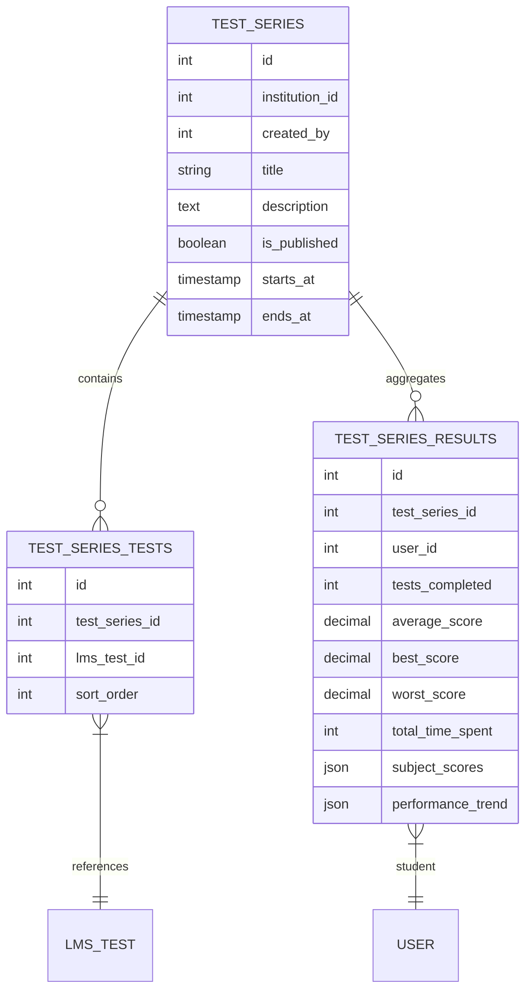

# 📝 Test Series & Performance Analytics

> **Module:** `test_series`
> **Scope:** Coaching / College / University
> **Permissions Workflow:** `test_series` (9 permissions)

---

## Overview

Test Series lets staff create curated bundles of LMS tests, track student performance across the series, and generate analytics (leaderboards, score distributions, subject-wise breakdowns).

---

## Data Model

---

## API Endpoints

| Method | Endpoint | Controller | Description |
|--------|----------|------------|-------------|
| `GET` | `/api/v1/test-series` | `TestSeriesController@index` | List with counts & filters |
| `POST` | `/api/v1/test-series` | `TestSeriesController@store` | Create + link tests |
| `GET` | `/api/v1/test-series/{id}` | `TestSeriesController@show` | Detail with stats |
| `PUT` | `/api/v1/test-series/{id}` | `TestSeriesController@update` | Update series |
| `DELETE` | `/api/v1/test-series/{id}` | `TestSeriesController@destroy` | Delete |
| `PATCH` | `/api/v1/test-series/{id}/toggle-publish` | `TestSeriesController@togglePublish` | Publish/unpublish |
| `GET` | `/api/v1/test-series/{id}/leaderboard` | `TestSeriesController@leaderboard` | Ranked students |
| `GET` | `/api/v1/test-series/{id}/analytics` | `TestAnalyticsController@seriesAnalytics` | Series dashboard |
| `GET` | `/api/v1/test-series/{id}/my-analytics` | `TestAnalyticsController@myAnalytics` | Personal analytics |
| `POST` | `/api/v1/test-series/{id}/recalculate` | `TestAnalyticsController@recalculate` | Rebuild results |

---

## Analytics Features

### Series Analytics Dashboard (`seriesAnalytics`)
- **Overview**: Total enrolled, completed, average score, pass rate
- **Score Distribution**: Histogram buckets (0–10, 10–20, …, 90–100)
- **Difficulty Breakdown**: Performance by subject

### Personal Analytics (`myAnalytics`)
- **Rank & Percentile**: Student's position vs. peers
- **Subject Scores**: Breakdown per subject over time
- **Performance Trend**: Score trajectory across tests

### Recalculation (`recalculate`)
Rebuilds `test_series_results` from raw `lms_test_attempts` data. Use when:
- Tests are added/removed from the series
- Test scores are updated after grading

---

## Permissions (9)

| Permission Key | Description |
|---------------|-------------|
| `create_test_series` | Create new test series |
| `view_test_series` | View test series listings |
| `edit_test_series` | Modify existing series |
| `delete_test_series` | Remove test series |
| `publish_test_series` | Toggle publish status |
| `view_test_series_analytics` | Access analytics dashboard |
| `view_test_series_leaderboard` | View leaderboard |
| `recalculate_test_results` | Trigger result recalculation |
| `manage_test_series_tests` | Add/remove tests from series |

---

## Frontend Files

| File | Purpose |
|------|---------|
| `lib/api/testSeriesApi.ts` | API module (CRUD + analytics) |
| `lib/querykey/testSeries.ts` | Query key factory |
| `lib/validations/testSeries.ts` | Zod schema |

---

## Key Models

| Model | File | Description |
|-------|------|-------------|
| `TestSeries` | `app/Models/TestSeries.php` | Series entity with scopes, relationships |
| `TestSeriesTest` | `app/Models/TestSeriesTest.php` | Pivot with sort order |
| `TestSeriesResult` | `app/Models/TestSeriesResult.php` | Aggregated student results |
