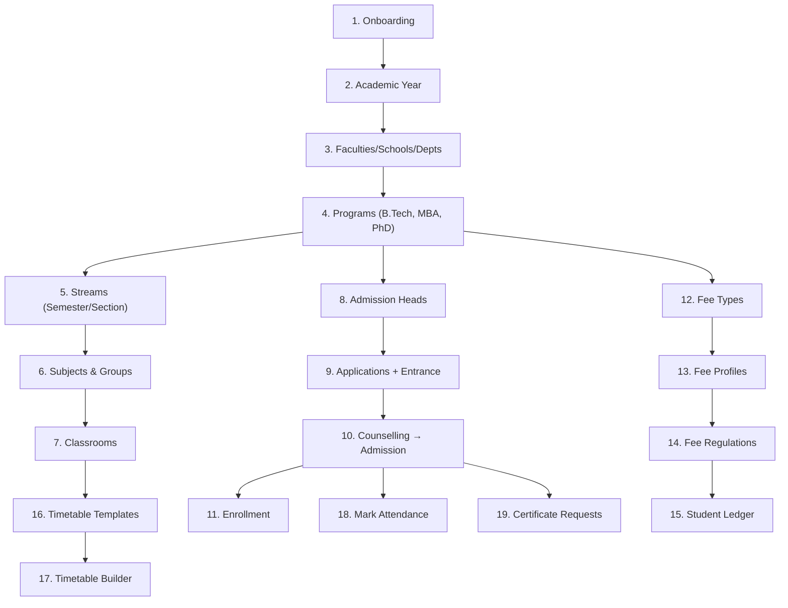

# 🏛️ University Workflow Guide

> **Scope Type:** `university` | **Platform:** PDS Education Education System Management
> 
> Complete step-by-step documentation of every admin and student workflow available for a **university** institution type.

---
> [!TIP]
> **Developing for PDS Education?** Check out the [🛠️ Developer Guide](./developer-guide.md) for architectural flows, logic diagrams, and implementation patterns.
---

## Table of Contents

1. [Onboarding & Initial Setup](#1-onboarding--initial-setup)
2. [Academic Setup (Faculties, Schools & Programs)](#2-academic-setup)
3. [Admission & Student Registry](#3-admission--student-registry)
4. [Treasury & Fee Management](#4-treasury--fee-management)
5. [Attendance](#5-attendance)
6. [Timetable & Scheduling](#6-timetable--scheduling)
7. [LMS (Classes & Content)](#7-lms-classes--content)
8. [Certificate Management](#8-certificate-management)
9. [Library](#9-library)
10. [Inventory](#10-inventory)
11. [Transport](#11-transport)
12. [Website & Public Relations](#12-website--public-relations)
13. [Redressal & Grievances](#13-redressal--grievances)
14. [Analytics & Admin Desk](#14-analytics--admin-desk)
15. [System Console](#15-system-console)
16. [Settings & Configuration](#16-settings--configuration)
17. [Student Portal](#17-student-portal)
18. [Parent Portal](#18-parent-portal)

---

## University vs College vs School — Key Differences

| Concept | School | College | **University** |
|---------|--------|---------|:--------------:|
| **Stream** label | Class | Stream | **Stream** |
| **Semester** label | Term | Semester | **Semester** |
| **Main Stream** label | Main Class | Main Stream | **Program** |
| **Head** label | Principal | Principal | **Vice Chancellor** |
| **Department** label | (Optional) | Department | **School / Faculty** |
| Departments | Optional | Many | **Multi-level (Faculty → School → Dept)** |
| Sessions | Manual | Manual | **Manual (Academic Year)** |
| Admission flow | Simple | Application + merit | **Application + entrance + counselling** |
| Fee structure | Annual/Monthly | Semester-wise | **Semester-wise + hostel + misc** |
| Affiliated colleges | ❌ | ❌ | **✅ Multi-college affiliation** |
| Research / PhD | ❌ | Limited | **✅ Full research programs** |
| Workflow variant | `_school` suffix | Base variant | **Base variant (same as college)** |
| Permission scope | `scope_type = school` | `scope_type = college` | **`scope_type = university`** |

> [!IMPORTANT]
> University uses the **same higher-ed workflow variants** as college and coaching:
> `admission_cell`, `office_registry`, `accounts_room`, `academic_setup`, `service_branch`, `system_console`, `student_portal`, `parent_portal`.
> It does NOT use the `_school` suffix variants.

---

## 1. Onboarding & Initial Setup

The onboarding flow creates a new organisation and institution of type `university`.

### Steps

| # | Screen | Route | Description |
|---|--------|-------|-------------|
| 1 | **Account Registration** | `/register` | Enter name, email, mobile, password. Creates inactive user + sends verification email. |
| 2 | **Email Verification** | `/onboarding/verify-notice` | "Check your inbox" page. Frontend polls for verification. Auto-redirects on verify. |
| 3 | **Plan Selection** | `/onboarding/plan` | Choose plan (Starter / Professional / Enterprise / Plus) + billing cycle (monthly/annual). |
| 4 | **Card Details** | `/onboarding/card` | Enter card info (AES-256 encrypted) or **Skip** to proceed without payment. |
| 5 | **Organisation & Institution Setup** | `/onboarding/setup` | Enter organisation name, institution name, select type = **"University"**, workspace slug. |
| 6 | **Data Import** | `/onboarding/data-import` | Auto-seed faculties, schools, departments, subjects, fee types for university, or upload CSV. |
| 7 | **Platform Setup** | `/onboarding/platform-setup` | Automated setup: seeds roles, permissions, workflows (higher-ed variants), and university defaults. |

### Key Behaviour (University Scope)
- Roles seeded: `institution_admin`, `vice_chancellor`, `registrar`, `dean`, `hod`, `teaching_staff`, `researcher`, `accountant`, `office_clerk`, `librarian`, `student`, `candidate`, `parent`
- Workflows: Uses **base/higher-ed** variants (same as college/coaching)
- Permissions include: full admission cell, fee heads, departments, research management, multi-campus support
- Landing page sections: **ProgramShowcase**, **ResearchHighlight**, **FacultySpotlight**, **SchoolDirectory**, **CampusTour**, **Rankings**, **Affiliations**

---

## 2. Academic Setup

> **Sidebar Group:** Academic | **Permission Group:** `academic_setup`

University has the most elaborate academic hierarchy: Faculties → Schools → Departments → Programs → Streams.

### 2.1 Sessions (Academic Years)
| Action | Route | Details |
|--------|-------|---------|
| List sessions | `/organization/sessions` | View all academic years (e.g., 2025-26) |
| Create session | `/organization/sessions/create` | Set name, start date, end date, mark as current |
| Edit session | `/organization/sessions/{id}/edit` | Modify session details |

### 2.2 Departments (Faculties / Schools / Departments)
| Action | Route | Details |
|--------|-------|---------|
| List departments | `/organization/departments` | All faculties/schools/departments (Engineering, Arts, Science, Law, Medicine, Management) |
| Create department | `/organization/departments/create` | Set name, code, Dean/HOD, parent department (for Faculty → School → Dept hierarchy) |
| View department | `/organization/departments/{id}` | Department with sub-departments, faculty, programs, streams |
| Edit department | `/organization/departments/{id}/edit` | Modify department |

### 2.3 Programs (Main Streams) & Streams
| Action | Route | Details |
|--------|-------|---------|
| List programs | `/organization/main-streams` | All degree programs (B.Tech, M.Tech, MBA, Ph.D, B.Sc, M.Sc, LLB, MBBS) |
| Create program | `/organization/main-streams/create` | Set name, department, duration (years), degree type (UG/PG/Doctoral) |
| List streams | `/organization/streams` | Individual sections (e.g., "B.Tech CSE Sem 5 Sec A", "MBA 2nd Year Sec B") |
| Create stream | `/organization/streams/create` | Set name, program, semester, capacity, class coordinator |

### 2.4 Subjects & Subject Groups
| Action | Route | Details |
|--------|-------|---------|
| Manage subjects | `/organization/subject` | List/create/edit subjects across all departments |
| Subject groups | `/organization/subject-groups` | Group subjects (e.g., "Core CS" = DSA + OS + DBMS + CN + TOC) |
| Subject categories | `/organization/subject-category` | Categories: Core, Departmental Elective, Open Elective, Lab, Research, Thesis |
| Category mapping | `/organization/subject-category-mapping` | Map subjects to categories |

### 2.5 Classrooms (LMS)
| Action | Route | Details |
|--------|-------|---------|
| List classes | `/lms/classes` | All classrooms across departments |
| View by stream | `/lms/classes/stream/{streamId}` | Classes for a specific stream/semester |
| Class detail | `/lms/classes/{id}` | Subject allocations, enrolled students, rooms, recordings |
| Subject detail | `/lms/classes/{id}/subjects/{allocationId}` | Subject-specific materials, syllabus, research papers |
| Room detail | `/lms/classes/{id}/rooms/{roomId}` | Real-time classroom with video playback |
| Courses | `/lms/courses` | Structured course catalog with prerequisites |

---

## 3. Admission & Student Registry

> **Sidebar Group:** Admission & Registry | **Permission Groups:** `admission_cell`, `office_registry`

University gets the **full** admission cell with entrance exams, counselling, merit lists, and multi-program application.

### 3.1 Candidates
| Action | Route | Details |
|--------|-------|---------|
| Candidate list | `/students/candidate` | Prospective students across all programs |

### 3.2 Admission Heads
| Action | Route | Details |
|--------|-------|---------|
| List heads | `/admission/heads` | Admission rounds (e.g., "B.Tech 2025 Round 1", "MBA 2025 CAT") |
| Create head | `/admission/heads/create` | Set program, session, capacity, fee structure, entrance papers, counselling dates |
| View head | `/admission/heads/{id}` | Applications with merit ranking, seat matrix |

### 3.3 Admission Applications
| Action | Route | Details |
|--------|-------|---------|
| List applications | `/admission/applications` | All applications with status filters |
| New application | `/admission/applications/new/{step}` | Multi-step: identity → address/guardian → medical/documents → program/entrance → preferences → payment → review |
| View application | `/admission/applications/{id}` | Full detail with approve/reject, entrance scores, counselling seat allotment |
| Payment | `/admission/applications/{id}/pay` | Process admission fee payment |

### 3.4 Student Management
| Action | Route | Details |
|--------|-------|---------|
| Analytics | `/students/analytics` | Department-wise, program-wise demographics |
| Student list | `/students/manage` | All enrolled students (filter by department, program, semester, hostel) |
| Student profile | `/students/manage/{id}` | Full detail (personal, academic, fee, attendance, research, placement) |
| Edit student | `/students/manage/{id}/edit` | Update student information |

### 3.5 Promotions
| Action | Route | Details |
|--------|-------|---------|
| Promotions | `/admission/promotions` | Semester-end promotions with backlog handling |
| Promotion analytics | `/admission/analytics/promotions` | Promotion, year-back, and dropout statistics |

### 3.6 Re-Admissions
| Action | Route | Details |
|--------|-------|---------|
| Re-admissions | `/admission/readmissions` | Re-admit year-back and returning students |

---

## 4. Treasury & Fee Management

> **Sidebar Group:** Treasury & Fees | **Permission Group:** `accounts_room`

### 4.1 Fee Heads
| Action | Route | Details |
|--------|-------|---------|
| Manage fee heads | `/fee-payment/manage-fee-head` | Tuition, Development, Lab, Library, Hostel, Examination, Convocation, Alumni |

### 4.2 Fee Types
| Action | Route | Details |
|--------|-------|---------|
| Manage fee types | `/accounts/fee-hub/fee-types` | Define fee items (semester-wise, annual, one-time, hostel per-month) |

### 4.3 Fee Profiles
| Action | Route | Details |
|--------|-------|---------|
| Manage profiles | `/accounts/fee-hub/profiles` | "B.Tech Day Scholar" vs "B.Tech Hosteller" vs "MBA" |

### 4.4 Fee Regulations
| Action | Route | Details |
|--------|-------|---------|
| List regulations | `/accounts/fee-hub/regulations` | Assign fee profiles to programs/streams |
| Program regulation | `/accounts/fee-hub/regulations/{id}` | View/edit fee rules |

### 4.5 Student Ledgers
| Action | Route | Details |
|--------|-------|---------|
| Student ledgers | `/accounts/fee-hub/students` | Per-student ledger with semester-wise history, scholarship adjustments |

### 4.6 Dues & Overdue
| Action | Route | Details |
|--------|-------|---------|
| Dues dashboard | `/accounts/fee-hub/dues` | Pending fees with department-wise breakdown, send reminders |

### 4.7 Collection Settings
| Action | Route | Details |
|--------|-------|---------|
| Settings | `/accounts/fee-hub/collection-settings` | Payment modes, late fees, scholarship rules, govt subsidy tracking |

---

## 5. Attendance

> **Permission Group:** `attendance`

| Action | Route | Details |
|--------|-------|---------|
| Overview | `/attendance` | Attendance dashboard |
| Mark attendance | `/attendance/mark` | Select stream/section, date, mark present/absent/late |
| Daily report | `/attendance/reports/daily` | Day-wise attendance |
| Summary report | `/attendance/reports/summary` | Semester attendance summary with minimum % compliance |

---

## 6. Timetable & Scheduling

> **Permission Group:** `timetable`

| Action | Route | Details |
|--------|-------|---------|
| Overview | `/timetable` | Master timetable across departments |
| Templates | `/timetable/templates` | Period structures (lectures, labs, tutorials, seminars) |
| Rooms | `/timetable/rooms` | Lecture halls, seminar rooms, computer labs, research labs, auditoriums |
| Daily view | `/timetable/daily` | Today's timetable |
| Substitutions | `/timetable/substitutions` | Faculty substitutions |
| Builder | `/timetable/{id}/builder` | Drag-and-drop timetable builder |

---

## 7. LMS (Classes & Content)

> **Permission Group:** `lms`

| Action | Route | Details |
|--------|-------|---------|
| All classes | `/lms/classes` | All classrooms across departments |
| Classes by stream | `/lms/classes/stream/{streamId}` | Classes for a specific stream/semester |
| Class detail | `/lms/classes/{id}` | Full LMS: materials, assignments, tests, live sessions, recordings |
| Subject content | `/lms/classes/{id}/subjects/{allocationId}` | Subject resources, research papers, reference materials |
| Live room | `/lms/classes/{id}/rooms/{roomId}` | Real-time classroom with video streaming |
| Courses | `/lms/courses` | Course catalog with prerequisites, credit system |

### Content Types in LMS
- **Materials**: Lecture notes, slides, PDFs, research papers
- **Assignments**: Semester projects, research reports, lab submissions
- **Tests/Quizzes**: Mid-term, end-term with auto/manual grading
- **Announcements**: Department-wide and program-wide notices
- **Live Sessions**: Guest lectures, seminars, workshops
- **Recordings**: Recorded lectures via Video Engine (HLS streaming)
- **Research Materials**: Thesis templates, publication guidelines

---

## 8. Certificate Management

> **Permission Group:** `service_branch`

| Action | Route | Details |
|--------|-------|---------|
| Certificate heads | `/certificates/manage-certificate-head` | TC, Migration, Bonafide, Character, Provisional, Degree, Convocation, Research Completion |
| Applications | `/certificates/applications` | All certificate requests |
| Application detail | `/certificates/applications/{id}` | Review and issue/reject |
| ID Cards | (via Service Branch) | Student/staff/research scholar ID cards |

---

## 9. Library

> **Permission Group:** `library`

| Action | Route | Details |
|--------|-------|---------|
| Books catalogue | `/library/books` | Textbooks, reference books, journals, periodicals, thesis |
| Book detail | `/library/books/{id}` | Info with copies, issue history |
| Copies | `/library/copies` | Accession register with barcodes |
| Issues & Returns | `/library/issues` | Issue to students/faculty/researchers |
| Overdue report | `/library/reports/overdue` | Overdue with fine calculation |

---

## 10–11. Inventory & Transport

Same as [College Workflow Guide](./college-workflows.md#10-inventory) — identical permission groups and routes.

---

## 12. Website & Public Relations

> **Permission Group:** `info_pr_hub`

| Action | Route | Details |
|--------|-------|---------|
| Notices | `/notice-management` | University-wide announcements |
| Sliders | `/website/sliders` | Hero banners for university website |
| Galleries | `/website/galleries` | Events, convocation, campus, research |
| Tickers | `/website/tickers` | Scrolling updates |
| News | `/website/news` | News, press releases, research publications |
| Faculties | `/website/faculties` | Faculty profiles with research interests |

### University-Specific Landing Sections
- **ProgramShowcase** — UG, PG, Doctoral programs with eligibility
- **ResearchHighlight** — Research centres, funded projects, publications
- **FacultySpotlight** — Faculty with h-index, publications, specializations
- **SchoolDirectory** — Faculties and schools with Deans
- **CampusTour** — Multi-campus infrastructure
- **Rankings** — NIRF, QS, NAAC rankings
- **Affiliations** — UGC, AICTE, NBA, MCI approvals

---

## 13–15. Redressal, Analytics, System Console

Same structure as [College Workflow Guide](./college-workflows.md#13-redressal--grievances) with identical permission groups and routes.

---

## 16. Settings & Configuration

### 16.1 Personal Settings
Same as college — Profile, Password, 2FA, Appearance.

> [!NOTE]
> **Forced Password Reset:** Users created via seeders (with system-generated passwords) are automatically redirected to `/settings/password` on first login. The flag is cleared after the password is changed.

### 16.2 Institute Identity
| Action | Route | Details |
|--------|-------|---------|
| Institution Profile | `/settings/institution` | University name, address, Chancellor, VC, Registrar |
| Digital Branding | `/settings/digital-presence` | Colors, favicon, subdomain |
| SEO | `/settings/seo` | Meta title, description, OG image |
| Landing Content | `/settings/landing-page-content` | VC's Message, Vision, History, Rankings, Research |
| Academics | `/settings/institutional-academics` | All academic programs |
| Schools & Faculties | `/settings/institutional-departments` | Faculty/School/Department descriptions |
| Facilities | `/settings/institutional-facilities` | Labs, library, hostel, sports, research centres |
| Placements | `/settings/institutional-placement` | Placement statistics |
| Approvals | `/settings/institutional-approvals` | UGC, AICTE, NAAC, NBA, NIRF |

### 16.3 Operational Rules
Same as college with additional university-specific configurations.

---

## 17–18. Student Portal & Parent Portal

Same routes as [College Workflow Guide](./college-workflows.md#17-student-portal) with identical permission groups. University students additionally see research and thesis sections.

---

## Workflow Dependency Order

---

## Permission & Workflow Summary

University shares the same **19 workflow groups (~234 permissions)** as college. See [College Workflow Guide](./college-workflows.md#permission--workflow-summary) for the full table.

---

### Links & Resources
- [🛠️ Developer Guide](./developer-guide.md)
- [🎓 School Workflow Guide](./school-workflows.md)
- [🏫 College Workflow Guide](./college-workflows.md)
- [🎯 Coaching Workflow Guide](./coaching-workflows.md)
