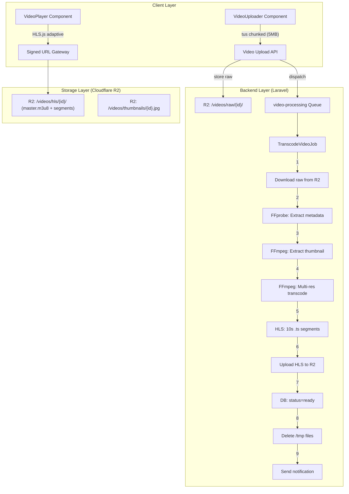
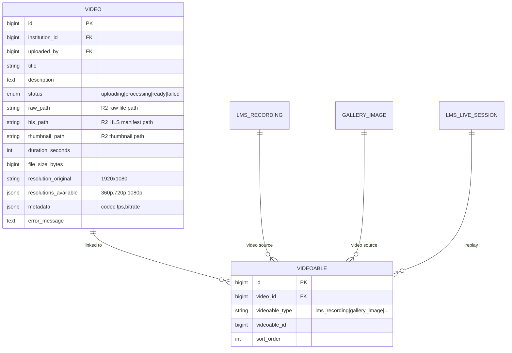
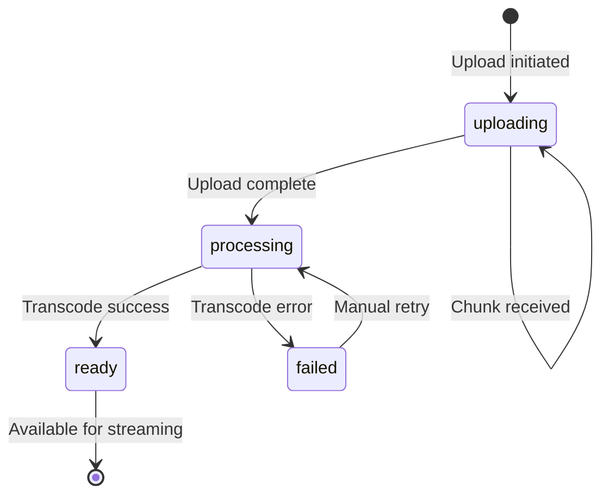
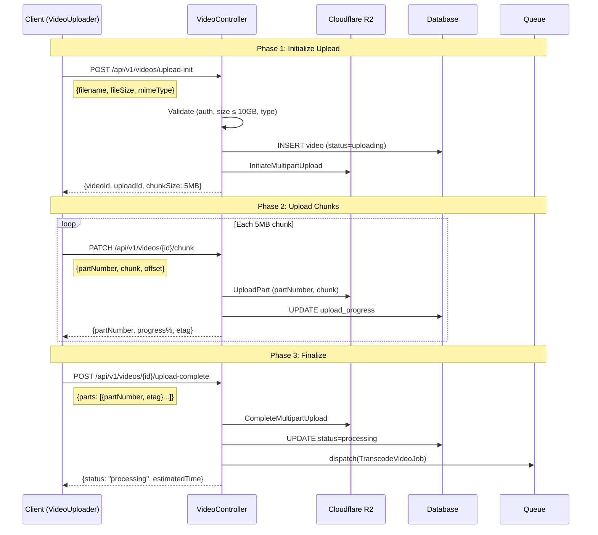
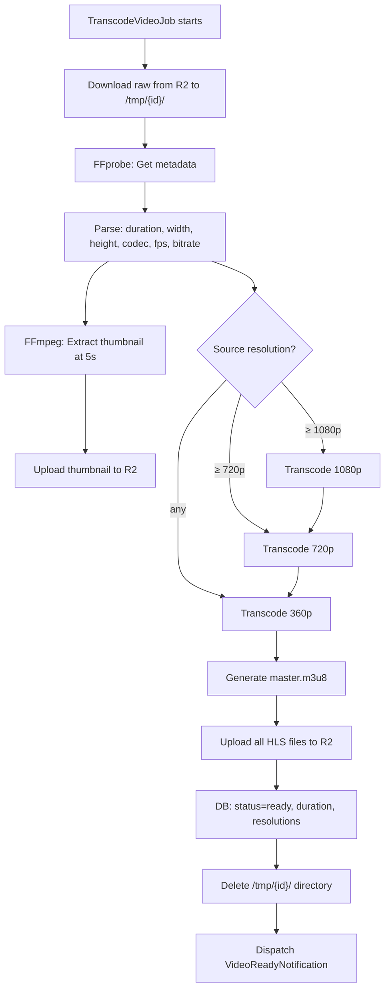
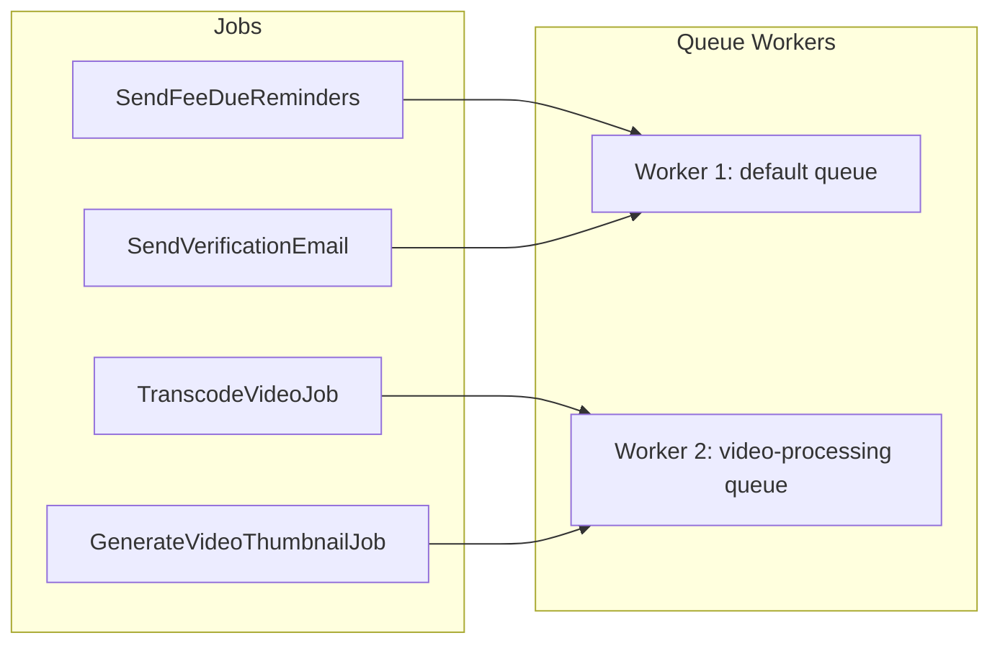
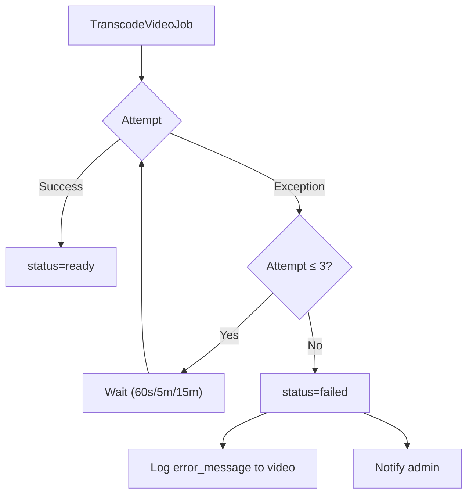
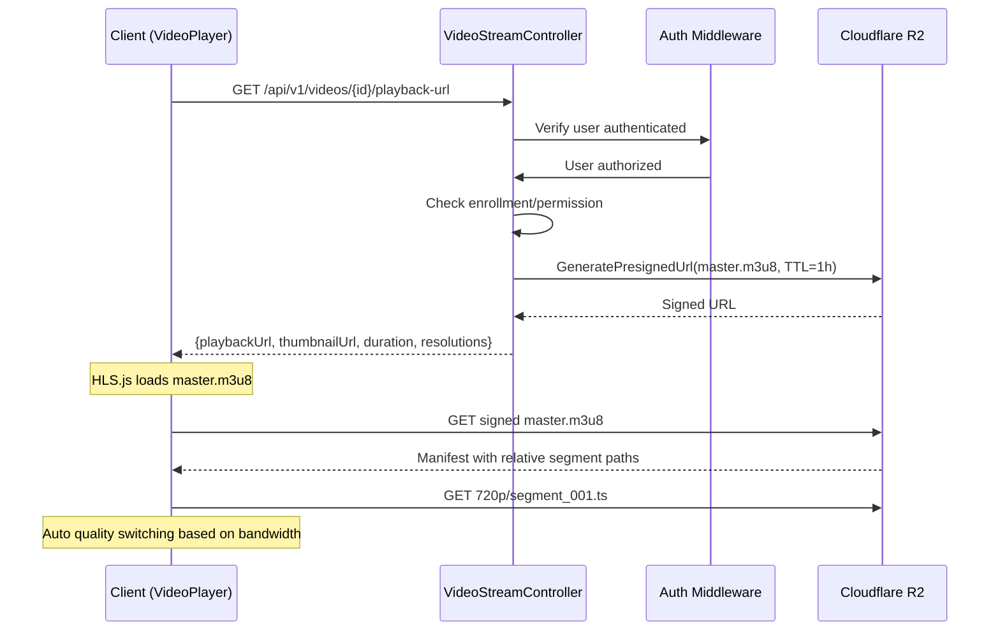
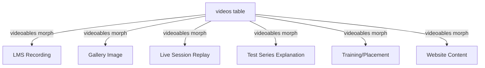

# 🎬 Video Streaming Engine — Developer Guide

> **Target Audience:** Backend & Frontend Engineers
> **Objective:** Complete reference for the platform's core video infrastructure — upload, transcode, stream, and integrate.
> **Status:** Core Engine (platform-level, reusable by all modules)

---

## 1. System Overview

The Video Engine is a **platform-level core service** that handles uploading, compressing, and streaming video content across all modules. It replaces external YouTube dependency with self-hosted, secure, adaptive video delivery.

### Architecture



### Design Principles

| Principle | Implementation |
|-----------|---------------|
| **Polymorphic** | `videoables` morph table — any model can link to a video |
| **Queue-first** | All heavy processing via `TranscodeVideoJob` — never block the request |
| **Multi-resolution** | Adaptive HLS: 360p, 720p, 1080p auto-selected by bandwidth |
| **Secure by default** | Private R2 bucket + time-limited signed URLs |
| **Chunked upload** | 5 MB chunks with pause/resume for reliable large-file transfers |
| **Scope-type aware** | Permissions via `$ALL_TYPES` — available to all institution types |

---

## 2. Data Model

### Entity Relationships



### Video Status Lifecycle



### Key Fields

| Field | Purpose |
|-------|---------|
| `raw_path` | Path to original uploaded file in R2 (`videos/raw/{id}/original.mp4`) |
| `hls_path` | Path to HLS master playlist (`videos/hls/{id}/master.m3u8`) |
| `thumbnail_path` | Auto-extracted thumbnail (`videos/thumbnails/{id}.jpg`) |
| `resolutions_available` | JSON array of completed resolutions (`["360p", "720p", "1080p"]`) |
| `metadata` | FFprobe output: codec, fps, bitrate, audio channels |
| `status` | State machine: `uploading` → `processing` → `ready` / `failed` |

---

## 3. Upload Pipeline

### Chunked Upload Flow (tus Protocol)



### Upload Validation Rules

| Rule | Value | Enforced At |
|------|-------|------------|
| **Max file size** | 10 GB | Client + server |
| **Allowed types** | `video/mp4, video/quicktime, video/x-msvideo, video/x-matroska, video/webm` | Client + server |
| **Allowed extensions** | `.mp4, .mov, .avi, .mkv, .webm` | Client + server |
| **Chunk size** | 5 MB (configurable) | Server config |
| **Max concurrent uploads** | 3 per user | Server middleware |
| **Max storage per institution** | 50 GB (configurable by tier) | Server check |
| **Auth required** | Yes | Middleware |

### R2 Storage Layout

```
videos/
├── raw/
│   └── {video_id}/
│       └── original.mp4          ← unchanged uploaded file
├── hls/
│   └── {video_id}/
│       ├── master.m3u8           ← adaptive manifest
│       ├── 360p/
│       │   ├── playlist.m3u8
│       │   ├── segment_000.ts
│       │   ├── segment_001.ts
│       │   └── ...
│       ├── 720p/
│       │   ├── playlist.m3u8
│       │   └── ...
│       └── 1080p/
│           ├── playlist.m3u8
│           └── ...
└── thumbnails/
    └── {video_id}.jpg            ← auto-extracted at 5s mark
```

---

## 4. Transcoding Pipeline

### FFmpeg Pipeline Flow



### Encoding Profiles

| Profile | Resolution | Video Bitrate | Audio | CRF | Use Case |
|---------|:----------:|:------------:|:-----:|:---:|----------|
| **360p** | 640×360 | 800 kbps | 96k AAC | 28 | Mobile/slow networks |
| **720p** | 1280×720 | 2,500 kbps | 128k AAC | 23 | Standard quality |
| **1080p** | 1920×1080 | 5,000 kbps | 192k AAC | 20 | HD quality |

### FFmpeg Commands

**Thumbnail extraction:**
```bash
ffmpeg -i input.mp4 -ss 00:00:05 -vframes 1 -vf "scale=640:360" thumbnail.jpg
```

**Per-resolution HLS transcode:**
```bash
# 720p example
ffmpeg -i input.mp4 \
  -vf "scale=1280:720" \
  -c:v libx264 -preset medium -crf 23 \
  -maxrate 2500k -bufsize 5000k \
  -c:a aac -b:a 128k -ac 2 -ar 44100 \
  -hls_time 10 \
  -hls_list_size 0 \
  -hls_segment_filename "720p/segment_%04d.ts" \
  -f hls 720p/playlist.m3u8
```

**Master playlist (`master.m3u8`):**
```m3u8
#EXTM3U
#EXT-X-VERSION:3

#EXT-X-STREAM-INF:BANDWIDTH=800000,RESOLUTION=640x360,NAME="360p"
360p/playlist.m3u8

#EXT-X-STREAM-INF:BANDWIDTH=2500000,RESOLUTION=1280x720,NAME="720p"
720p/playlist.m3u8

#EXT-X-STREAM-INF:BANDWIDTH=5000000,RESOLUTION=1920x1080,NAME="1080p"
1080p/playlist.m3u8
```

### Estimated Processing Times

| Source Duration | Source Resolution | Approx. Transcode Time | Temp Disk Needed |
|:-:|:-:|:-:|:-:|
| 1 hour | 1080p | ~15–25 min | ~8 GB |
| 2 hours | 1080p | ~30–50 min | ~16 GB |
| 3 hours | 1080p | ~45–75 min | ~24 GB |
| 4 hours | 1080p | ~60–100 min | ~32 GB |

---

## 5. Background Queue Architecture

### Queue Configuration



### Worker Command

```bash
# Dedicated video worker — separate from default queue
php artisan queue:work database \
  --queue=video-processing \
  --timeout=7200 \
  --memory=2048 \
  --tries=3 \
  --backoff=60,300,900 \
  --max-jobs=5 \
  --sleep=10
```

| Setting | Value | Why |
|---------|-------|-----|
| `timeout` | 7200s (2 hours) | 4-hour video on slow hardware |
| `memory` | 2048 MB | FFmpeg is memory-hungry |
| `tries` | 3 | Retry on transient failures (R2 timeout, OOM) |
| `backoff` | 60s, 5m, 15m | Exponential backoff between retries |
| `max-jobs` | 5 | Restart worker after 5 jobs (prevent memory leaks) |

### Error Handling



**Retry-safe design:**
- Each step checks if its output already exists before re-executing
- Partial HLS uploads are cleaned up before retry
- `/tmp` cleanup happens even on failure (`finally` block)

---

## 6. Playback & Security

### Signed URL Flow



### Security Layers

| Layer | Mechanism | Details |
|-------|-----------|---------|
| **Authentication** | Laravel auth middleware | Must be logged in |
| **Authorization** | Permission check | `view_videos` permission required |
| **Enrollment** | Business logic | For LMS: user must be enrolled in the class |
| **Signed URLs** | R2 presigned | 1-hour expiry, one-time generation per request |
| **CORS** | Headers | Restrict origins to institution's domain |
| **Rate limiting** | Throttle middleware | 100 playback URL requests/hour |

### VideoPlayer Component

```
┌─────────────────────────────────────────────┐
│  ┌─────────────────────────────────────────┐ │
│  │                                         │ │
│  │            VIDEO VIEWPORT               │ │
│  │         (HLS.js adaptive)               │ │
│  │                                         │ │
│  └─────────────────────────────────────────┘ │
│  ▶ ██████████░░░░░░░ 1:23:45 / 3:00:00     │
│  🔊 ████░░  |  ⚙ 720p ▾  |  ⛶ Fullscreen  │
│             ┌──────────┐                     │
│             │ ● 360p   │                     │
│             │ ● 720p ✓ │  ← quality picker   │
│             │ ● 1080p  │                     │
│             │ ● Auto   │                     │
│             └──────────┘                     │
└─────────────────────────────────────────────┘
```

**Features:**
- Adaptive bitrate switching (HLS.js)
- Manual quality selector (360p/720p/1080p/Auto)
- Playback speed control (0.5x–2x)
- Picture-in-picture
- Fullscreen
- Keyboard shortcuts (Space=pause, arrows=seek)
- Progress persistence (resume from where you left off)

---

## 7. Polymorphic Integration

### How Modules Connect



### Usage Pattern (Backend)

```php
// Video model — polymorphic relationships
class Video extends Model {
    public function videoables() {
        return $this->hasMany(Videoable::class);
    }
}

// LmsRecording — attach video
class LmsRecording extends Model {
    public function videos() {
        return $this->morphToMany(Video::class, 'videoable');
    }
}

// Usage in controller:
$recording = LmsRecording::find($id);
$recording->videos()->attach($videoId);

// Get playback URL:
$video = Video::findOrFail($videoId);
$url = VideoStorageService::getSignedPlaybackUrl($video->hls_path);
```

### Usage Pattern (Frontend)

```tsx
// Drop-in VideoUploader — any page can use it
<VideoUploader
  onUploadComplete={(video) => {
    // Link video to your model via API
    RecordingApi.attachVideo(recordingId, video.id);
  }}
  maxSizeGB={10}
  allowedTypes={['mp4', 'mov', 'mkv']}
/>

// Drop-in VideoPlayer — any page can use it
<VideoPlayer
  videoId={recording.video_id}
  thumbnail={recording.thumbnail_url}
  autoPlay={false}
/>
```

---

## 8. File Map

### Backend

```
app/
├── Models/
│   ├── Video.php                           # Core video model
│   └── Videoable.php                       # Polymorphic pivot
├── Http/Controllers/Api/V1/Video/
│   ├── VideoController.php                 # Upload CRUD
│   └── VideoStreamController.php           # Playback URLs
├── Jobs/
│   ├── TranscodeVideoJob.php               # Main pipeline job
│   └── GenerateVideoThumbnailJob.php       # Thumbnail extraction
├── Services/
│   ├── VideoTranscoder.php                 # FFmpeg wrapper
│   └── VideoStorageService.php             # R2 operations + signed URLs
config/
└── video.php                               # Engine configuration
database/migrations/
└── xxxx_create_videos_table.php            # videos + videoables tables
```

### Frontend

```
resources/js/
├── components/shared/
│   ├── VideoUploader.tsx                    # Chunked upload with progress
│   └── VideoPlayer.tsx                      # HLS adaptive player
├── lib/
│   ├── api/videoApi.ts                      # API calls
│   ├── querykey/video.ts                    # Query key factory
│   └── validations/video.ts                 # Zod schemas
├── constants/
│   └── shared/video.ts                      # Config constants
└── types/
    └── index.d.ts                           # Video, VideoUploadState types
```

---

## 9. Configuration Reference

### `config/video.php`

| Key | Default | Description |
|-----|---------|-------------|
| `max_file_size` | `10737418240` (10 GB) | Max upload size in bytes |
| `chunk_size` | `5242880` (5 MB) | Upload chunk size |
| `allowed_mimes` | `['video/mp4', ...]` | Allowed MIME types |
| `allowed_extensions` | `['mp4', 'mov', ...]` | Allowed file extensions |
| `max_concurrent_uploads` | `3` | Per-user concurrent upload limit |
| `max_storage_per_institution` | `53687091200` (50 GB) | Storage quota |
| `queue_name` | `video-processing` | Laravel queue name |
| `temp_directory` | `/tmp/video-engine` | Temp dir for transcoding |
| `thumbnail_at_seconds` | `5` | Thumbnail extraction timestamp |
| `segment_duration` | `10` | HLS segment duration in seconds |
| `profiles` | `[360p, 720p, 1080p]` | Transcoding profiles |
| `signed_url_ttl` | `3600` | Playback URL expiry in seconds |

### Encoding Profiles Config

```php
'profiles' => [
    '360p' => ['width' => 640,  'height' => 360,  'bitrate' => '800k',  'audio' => '96k',  'crf' => 28],
    '720p' => ['width' => 1280, 'height' => 720,  'bitrate' => '2500k', 'audio' => '128k', 'crf' => 23],
    '1080p' => ['width' => 1920, 'height' => 1080, 'bitrate' => '5000k', 'audio' => '192k', 'crf' => 20],
],
```

---

## 10. API Reference

### Upload Endpoints

| Method | Route | Description | Auth |
|:------:|-------|-------------|:----:|
| `POST` | `/api/v1/videos/upload-init` | Initialize chunked upload | ✅ |
| `PATCH` | `/api/v1/videos/{id}/chunk` | Upload a chunk | ✅ |
| `POST` | `/api/v1/videos/{id}/upload-complete` | Finalize upload, start transcode | ✅ |
| `DELETE` | `/api/v1/videos/{id}/upload-abort` | Cancel in-progress upload | ✅ |

### Management Endpoints

| Method | Route | Description | Auth |
|:------:|-------|-------------|:----:|
| `GET` | `/api/v1/videos` | List institution's videos | ✅ |
| `GET` | `/api/v1/videos/{id}` | Get video details + status | ✅ |
| `DELETE` | `/api/v1/videos/{id}` | Delete video + all R2 files | ✅ |
| `POST` | `/api/v1/videos/{id}/retry` | Retry failed transcode | ✅ |

### Playback Endpoints

| Method | Route | Description | Auth |
|:------:|-------|-------------|:----:|
| `GET` | `/api/v1/videos/{id}/playback-url` | Get signed HLS playback URL | ✅ |
| `GET` | `/api/v1/videos/{id}/thumbnail` | Get signed thumbnail URL | ✅ |

### Permissions

| Key | Name | Module |
|-----|------|--------|
| `upload_videos` | Upload Videos | `video_engine` |
| `view_videos` | View/Stream Videos | `video_engine` |
| `delete_videos` | Delete Videos | `video_engine` |
| `view_video_analytics` | View Video Analytics | `video_engine` |

---

## 11. Server Requirements

| Requirement | Minimum | Recommended |
|-------------|---------|-------------|
| **FFmpeg** | 5.0+ with libx264, aac | 6.0+ |
| **Disk (temp)** | 50 GB | 100 GB SSD |
| **RAM per worker** | 2 GB | 4 GB |
| **CPU per worker** | 2 cores | 4 cores |
| **Queue workers** | 1 dedicated | 2–3 for concurrent processing |
| **R2 bucket** | Standard | Standard (no public access) |
| **Podman/Docker** | FFmpeg in image | Alpine + FFmpeg static |

### Dockerfile Addition

```dockerfile
# Add to existing Dockerfile
RUN apk add --no-cache ffmpeg
```

---

## 12. Monitoring & Observability

### Video Processing Dashboard (Admin)

| Metric | Source |
|--------|--------|
| Total videos | `videos` count |
| Processing queue depth | `jobs` table where queue = `video-processing` |
| Average transcode time | `videos.updated_at - created_at` for `status=ready` |
| Failed transcodes | `videos` where `status=failed` |
| Storage used per institution | `SUM(file_size_bytes)` grouped by `institution_id` |
| Most viewed videos | Future: view count tracking |

### Logs

```
[VIDEO] Upload initiated: id=42, size=2.1GB, user=15, institution=10
[VIDEO] Chunk received: id=42, part=3/420, progress=0.7%
[VIDEO] Upload complete: id=42, dispatching TranscodeVideoJob
[VIDEO] Transcode started: id=42, source=1920x1080, profiles=[360p,720p,1080p]
[VIDEO] Transcode 360p complete: id=42, time=180s
[VIDEO] Transcode 720p complete: id=42, time=340s
[VIDEO] Transcode 1080p complete: id=42, time=520s
[VIDEO] HLS upload complete: id=42, segments=648, total_size=1.8GB
[VIDEO] Ready: id=42, duration=7200s, resolutions=[360p,720p,1080p]
```

---

### Links & Resources
- [🛠️ Developer Guide](./developer-guide.md)
- [🎓 School Workflow Guide](./school-workflows.md)
- [🎯 Coaching Workflow Guide](./coaching-workflows.md)
