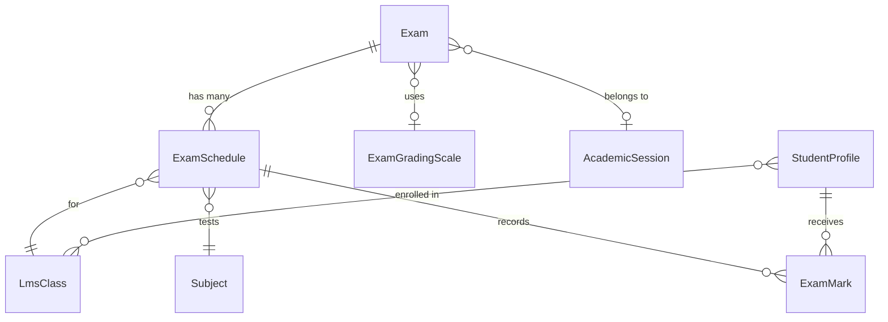
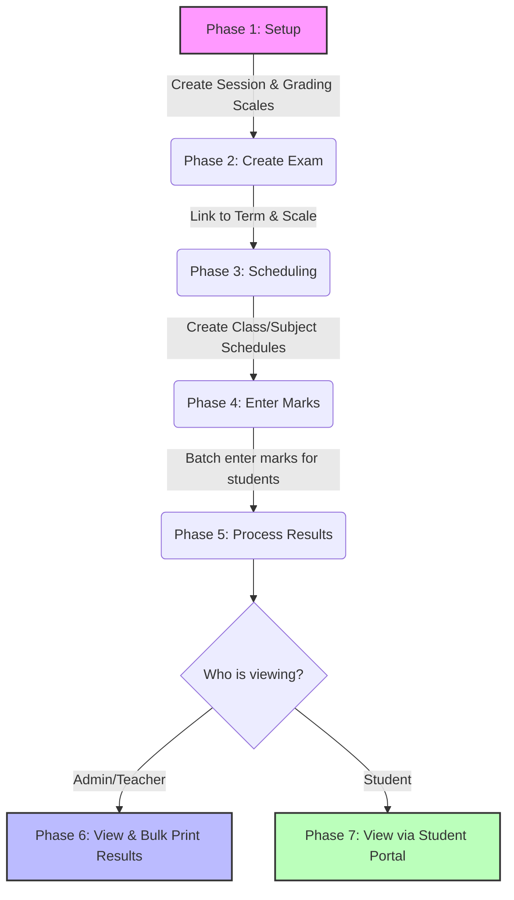

# Examination Module Workflow

This document explains the end-to-end architecture and workflow of the Examination module in the school management system.

## 1. Core Architecture and Relationships

The examination system is built around a few core models. The diagram below illustrates how data is connected:

- **Exam (`App\Models\Exam`)**: The central entity representing a testing event (e.g., "Mid-Term Exam"). It belongs to an Academic Session and optionally an Exam Term and Grading Scale.
- **ExamSchedule (`App\Models\ExamSchedule`)**: Connects an Exam to a specific Class (`LmsClass`) and Subject. It dictates *when* the exam happens, the *full marks*, and *pass marks*.
- **ExamMark (`App\Models\ExamMark`)**: Stores the actual marks obtained by a specific student (`StudentProfile`) for a specific `ExamSchedule`.
- **ExamGradingScale (`App\Models\ExamGradingScale`)**: Contains grading rules (e.g., 90-100% = A+, 80-89% = A) which are applied to marks to determine a student's grade.

---

## 2. Step-by-Step Workflow

Here is the operational workflow from setup to printing results:

### Phase 1: Setup & Configuration
Before exams can be conducted, the baseline academic structure must exist:
1. **Create an Academic Session** (e.g., 2026-2027).
2. **Create Grading Scales** (via `Examination -> Grading Scales`). This defines your institution's letter grading logic (A, B, C, F) and grade points based on percentage bounds.
3. **Ensure Classes and Subjects exist** in the Academics module, and students are enrolled in classes (`LmsClassEnrollment`).

### Phase 2: Exam Creation
1. Navigate to **Examination -> Exams** in the sidebar.
2. Click **Add Exam**.
3. Fill in the details: Name, Dates, Term, and select the appropriate Grading Scale.

### Phase 3: Scheduling
*Currently, schedules are either seeded or managed via backend logic, as the frontend schedule builder is likely in development.*
- A schedule must be created for each subject a class is taking.
- For example: *Class 10A - Mathematics - 100 Full Marks - 40 Pass Marks*.

### Phase 4: Entering Marks
1. Go to the **Exams** list and click the **Eye (View)** icon on the exam.
2. You will see a list of all Schedules (Class + Subject).
3. Click the **Enter Marks** button on a schedule.
4. You are presented with a data grid containing all students enrolled in that specific class.
5. Enter the marks for each student (or mark them Absent). The data is batch-saved to the database (`MarksEntryController@saveBatch`).

### Phase 5: Processing Results
Results are generated dynamically on-the-fly by the `ExaminationService`.
- It takes the marks obtained, divides by the `full_marks` of the schedule, and calculates the percentage.
- It then looks up the `ExamGradingScale` attached to the exam to assign the appropriate Letter Grade.

### Phase 6: Viewing and Printing Marksheets
1. From the sidebar, click **Examination -> Results**.
2. Select the Exam you want to view.
3. You will see a comprehensive list of all students, their total marks, overall percentages, overall grades, and a Pass/Fail status.
4. **Individual View**: Click "View" next to a student to see their detailed report card.
5. **Bulk Print**: Select multiple students using the checkboxes and click "Print Selected" to generate a layout-free, print-optimized document containing all selected report cards with automatic page breaks.

### Phase 7: Student Portal
Once an Exam is marked as `is_published = true`, students can log into their portal, navigate to their Results section, and view/download their own digital report card (`MarksheetController@studentView`).
