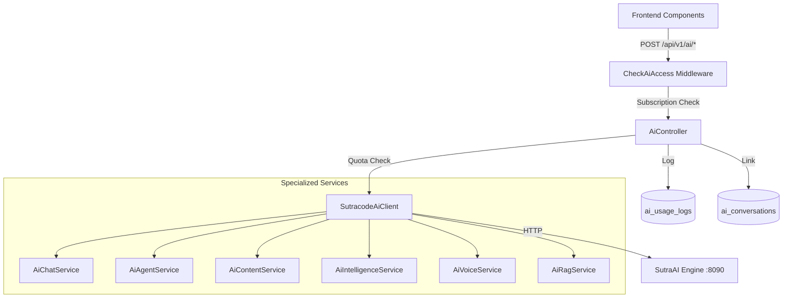

# SutraAI × EMS Integration — Walkthrough

## What Was Built

Full integration of the **SutraAI Engine** into the PDS Education EMS platform, making AI features available as a **subscription-gated** capability.

---

## Architecture Overview



---

## Files Changed

### Config (3 files)
| File | Change |
|------|--------|
| [.env](file:///Users/piyushprashant/Documents/personal-projects/education-system-management/.env) | Added `SUTRA_AI_URL`, `SUTRA_AI_API_KEY` |
| [.env.example](file:///Users/piyushprashant/Documents/personal-projects/education-system-management/.env.example) | Added placeholder env vars |
| [services.php](file:///Users/piyushprashant/Documents/personal-projects/education-system-management/config/services.php) | Added `sutra_ai` config block |

### Backend Services (7 new files)
| File | Purpose |
|------|---------|
| [SutracodeAiClient.php](file:///Users/piyushprashant/Documents/personal-projects/education-system-management/app/Services/Ai/SutracodeAiClient.php) | Base HTTP client with auth, quota, and logging |
| [AiChatService.php](file:///Users/piyushprashant/Documents/personal-projects/education-system-management/app/Services/Ai/AiChatService.php) | Chat + conversations |
| [AiAgentService.php](file:///Users/piyushprashant/Documents/personal-projects/education-system-management/app/Services/Ai/AiAgentService.php) | Specialized agent runs |
| [AiContentService.php](file:///Users/piyushprashant/Documents/personal-projects/education-system-management/app/Services/Ai/AiContentService.php) | Email, repurpose, landing page |
| [AiIntelligenceService.php](file:///Users/piyushprashant/Documents/personal-projects/education-system-management/app/Services/Ai/AiIntelligenceService.php) | Sentiment, language, SEO |
| [AiVoiceService.php](file:///Users/piyushprashant/Documents/personal-projects/education-system-management/app/Services/Ai/AiVoiceService.php) | Transcription, TTS |
| [AiRagService.php](file:///Users/piyushprashant/Documents/personal-projects/education-system-management/app/Services/Ai/AiRagService.php) | RAG document upload + query |

### Controller & Middleware (2 new files)
| File | Purpose |
|------|---------|
| [CheckAiAccess.php](file:///Users/piyushprashant/Documents/personal-projects/education-system-management/app/Http/Middleware/CheckAiAccess.php) | Subscription + API key check |
| [AiController.php](file:///Users/piyushprashant/Documents/personal-projects/education-system-management/app/Http/Controllers/Api/V1/Ai/AiController.php) | Proxy with quota + usage logging |

### Database (4 new files)
| File | Purpose |
|------|---------|
| [AiUsageLog.php](file:///Users/piyushprashant/Documents/personal-projects/education-system-management/app/Models/AiUsageLog.php) | Token tracking model |
| [AiConversation.php](file:///Users/piyushprashant/Documents/personal-projects/education-system-management/app/Models/AiConversation.php) | Conversation thread model |
| [create_ai_usage_logs](file:///Users/piyushprashant/Documents/personal-projects/education-system-management/database/migrations/2026_03_21_190758_create_ai_usage_logs_table.php) | Migration |
| [create_ai_conversations](file:///Users/piyushprashant/Documents/personal-projects/education-system-management/database/migrations/2026_03_21_190758_create_ai_conversations_table.php) | Migration |

### Subscription & Error Codes (2 modified files)
| File | Change |
|------|--------|
| [SubscriptionTier.php](file:///Users/piyushprashant/Documents/personal-projects/education-system-management/app/Enums/SubscriptionTier.php) | Added `ai_assistant` module + [maxAiTokensPerMonth()](file:///Users/piyushprashant/Documents/personal-projects/education-system-management/app/Enums/SubscriptionTier.php#192-202) |
| [api_error_maps.php](file:///Users/piyushprashant/Documents/personal-projects/education-system-management/config/api_error_maps.php) | Added `ai.not_available`, `ai.quota_exceeded`, `ai.provider_error`, `ai.invalid_agent` |

### Cron Commands (2 new files)
| File | Schedule |
|------|----------|
| [AiSyncUsageCommand.php](file:///Users/piyushprashant/Documents/personal-projects/education-system-management/app/Console/Commands/AiSyncUsageCommand.php) | Daily at midnight |
| [AiResetQuotaCommand.php](file:///Users/piyushprashant/Documents/personal-projects/education-system-management/app/Console/Commands/AiResetQuotaCommand.php) | 1st of each month |

### Frontend (4 new files + 3 modified)
| File | Purpose |
|------|---------|
| [aiApi.ts](file:///Users/piyushprashant/Documents/personal-projects/education-system-management/resources/js/lib/api/aiApi.ts) | **[NEW]** API module for 8 AI endpoints |
| [ai.ts](file:///Users/piyushprashant/Documents/personal-projects/education-system-management/resources/js/lib/querykey/ai.ts) | **[NEW]** Query keys |
| [ai-assist-button.tsx](file:///Users/piyushprashant/Documents/personal-projects/education-system-management/resources/js/components/ui/ai-assist-button.tsx) | **[NEW]** Sparkle atom with gradient text |
| [AiAssistPopover.tsx](file:///Users/piyushprashant/Documents/personal-projects/education-system-management/resources/js/components/shared/AiAssistPopover.tsx) | **[NEW]** Prompt → Generate → Accept molecule |
| [BaseInputRenderers.tsx](file:///Users/piyushprashant/Documents/personal-projects/education-system-management/resources/js/components/shared/form/renderers/BaseInputRenderers.tsx) | **[MOD]** Textarea gets AI popover |
| [richTextEditor.tsx](file:///Users/piyushprashant/Documents/personal-projects/education-system-management/resources/js/components/richTextEditor.tsx) | **[MOD]** New AI toolbar button |
| [animations.css](file:///Users/piyushprashant/Documents/personal-projects/education-system-management/resources/css/animations.css) | **[MOD]** AI shimmer animation |
| [api.php](file:///Users/piyushprashant/Documents/personal-projects/education-system-management/routes/api.php) | **[MOD]** 9 AI endpoints registered |

---

## Token Quotas

| Tier | Monthly Tokens |
|------|---------------|
| Starter | 0 (add-on only) |
| Professional | 50,000 |
| Enterprise | 200,000 |
| Plus | 1,000,000 |

---

## API Routes (9 endpoints)

All under `POST /api/v1/ai/*` with [CheckAiAccess](file:///Users/piyushprashant/Documents/personal-projects/education-system-management/app/Http/Middleware/CheckAiAccess.php#17-53) middleware:

| Method | Endpoint | Controller |
|--------|----------|------------|
| POST | `/ai/chat` | `AiController@chat` |
| POST | `/ai/agents/{type}/run` | `AiController@runAgent` |
| POST | `/ai/agents/batch` | `AiController@batchRun` |
| POST | `/ai/content/email-template` | `AiController@emailTemplate` |
| POST | `/ai/intelligence/sentiment` | `AiController@sentiment` |
| POST | `/ai/voice/transcribe` | `AiController@transcribe` |
| POST | `/ai/rag/upload` | `AiController@uploadDocument` |
| POST | `/ai/rag/query` | `AiController@queryKnowledge` |
| GET | `/ai/usage` | `AiController@usage` |

---

## How to Use in Form Configs

```tsx
// In any form config file:
{
  name: "description",
  type: FORM_TYPE.TEXTAREA,
  label: "Notice Description",
  aiAssist: {
    agentType: "copywriter",
    context: { purpose: "Write a school notice" },
    hasAccess: true, // check from subscription
  },
}
```

---

## Pending

> [!NOTE]
> - Run `php artisan migrate` when PostgreSQL is available
> - Register cron commands in `app/Console/Kernel.php` scheduler
> - Ensure `@radix-ui/react-popover` and `lucide-react` are installed
